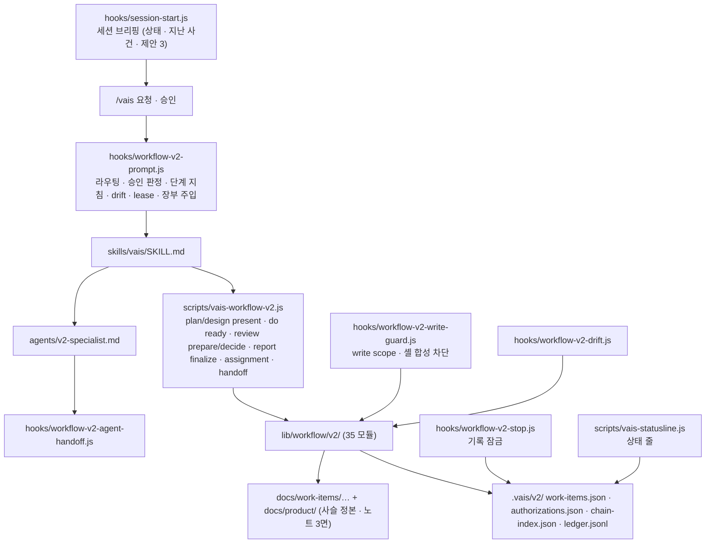

# VAIS Code — Onboarding (5분 읽기)

> **이 파일의 책임**: 처음 본 AI 또는 사람이 이 repo 의 목적·구조·진입점을 5분 안에 파악하게 한다.
> 더 깊이: `CLAUDE.md` (Claude Code 지침) · `README.md` (사용법) · `skills/vais/SKILL.md` (`/vais` 진입 규칙).

## 1. 무엇인가 (1분)

**비개발자가 개발자처럼 웹 앱을 만들게 해주는 Claude Code 하네스 플러그인.**

- 사용자는 `/vais <말>` 로 시키고, "고르기" 와 "확인" 두 곳에서만 결정한다.
- 플러그인은 Plan → Design → Do → Review → Report 를 hook + 상태 머신으로 **강제**하고, 결정·증거를 **기록**하며, 결과를 **보여준다**.
- 모델(Claude)이 바뀌어도 유지되는 것은 코드로 못 박은 규칙(승인·범위·기록·증거·고장 알림)이고, 바뀌면 줄이는 것은 데이터(역할 카드·양식·지시문)다.

**4.0.1 상태 (2026-09-17)**: 2026-09-15 에 Legacy(C-Suite 에이전트 85개, 템플릿, 구 hook·lib·문서 ≈ 40,000줄)를 전부 제거하고(롤백 태그 `v3.0.1-legacy`), 그 위에 로드맵 H1~H8 로 새 하네스를 올렸다. 쓰이지 않던 디자인 시스템 MCP·vendor 는 H8 에서 삭제했다. 설계 정본은 `docs/harness/design.md`, 순서는 `docs/harness/roadmap.md`.

## 2. 처음 읽는 순서 (2분)

1. **입구** — `ONBOARDING.md`(지금) → `CLAUDE.md`(원칙·enforce 규칙·자기 수정 주의) → `skills/vais/SKILL.md`(`/vais` 가 hook 컨텍스트를 따르는 규칙) → `hooks/workflow-v2-prompt.js`(단계 지침이 실제로 주입되는 곳)
2. **상태 머신·승인** — `lib/workflow/v2/state-machine.js` + `router.js`(상태 전이·승인 문법·명령 패턴), `contracts/v2-role-cards.json`(역할 경계)
3. **제품 사슬** — `contracts/chain-stages.json` + `contracts/work-kinds.json`(10단계·kind 14, 데이터) → `lib/workflow/v2/id-chain.js`(ID·부모·stale) → `citation.js`(기능·버그의 인용·신규·구현됨)
4. **기록** — `lib/workflow/v2/ledger.js` + `product-note.js` + `proposal.js`(장부·노트 3면·제안) 와 이를 보이는 `hooks/session-start.js`·`hooks/workflow-v2-stop.js`·`scripts/vais-statusline.js`
5. **화면** — `lib/workflow/v2/screen-capture.js` + `diff-summary.js` + `review-page.js` + `app-runner.js`(스크린샷·회차 diff·검수 페이지·앱 기동), 정지점 `do/waiting-user`
6. **명령·검증** — `lib/workflow/v2/briefing.js` + `explain.js` + `vcs.js`, `contracts/glossary.json`(상태·설명·저장·되돌리기), `tests/regression/`(설계 §11 장면 A~F + 명령 표, 준비 코드는 `helpers.js`)

## 3. 동작 흐름 (1분)



## 4. 진입점 표 (1분)

| 파일 | 대상 | 역할 |
|---|---|---|
| `CLAUDE.md` | Claude Code | 세션 시작 시 자동 로드. 원칙·규칙·구조 |
| `skills/vais/SKILL.md` | Claude Code (skill) | `/vais` 호출 시 로드. hook 컨텍스트를 정본으로 따르는 규칙 |
| `skills/brief/SKILL.md` | Claude Code (skill) | `/vais brief` 임원 보고서. 워크플로우 독립 |
| `hooks/hooks.json` | Claude Code | SessionStart · UserPromptSubmit · PreToolUse · PostToolUse · Stop 등록 |
| `scripts/vais-statusline.js` | Claude Code statusline | `~/.claude/settings.json > statusLine` 에 등록하면 상태 줄 표시 (`/vais doctor` 가 안내) |
| `docs/product/{README,roadmap,decisions}.md` | 사용자 | 제품 노트 현재·다음·왜 (자동 생성) |
| `vais.config.json` | runtime | `workflowV2.mode` (`enforce` 정본 / `disabled` 하네스 수리용) · `ui` (앱 위치: appRoot·entry·url, 기동: run {command[], url}) |
| `contracts/v2-role-cards.json` | runtime | 역할 정본 |

## 5. 개발 루프

```bash
npm test && npm run regression && npm run lint && npm run validate   # 로컬 검증
npm run doctor                                                       # 하네스 건강검진
```

커밋은 `/vais 저장` → 제안 확인 → `/vais 저장 확인` 으로 한다(영어 `commit` → `commit 확인`; runtime 이 `.gitignore` 를 존중해 `git add`·`commit`, `.vais/` 는 제외, push 는 사람). 실패하면 "스테이지 N개 됨 · 커밋 안 됨 · 원인" 이 그대로 보이고 runtime 은 재시도하지 않는다. 하네스 자체를 고칠 때: 사용자가 `workflowV2.mode` 를 `disabled` 로 내림(또는 `VAIS_HARNESS_OFF=1`) → 수정 → 검증 → 커밋 → `enforce` 복귀. mode 값이 잘못되면 열리지 않고 닫힘으로 실패하며 매 프롬프트에 경고가 뜬다. 실행 중 플러그인은 마켓플레이스 캐시 사본이라 push · 버전 bump · 업데이트 뒤에 반영된다.

> 변경 이력: `CHANGELOG.md`
