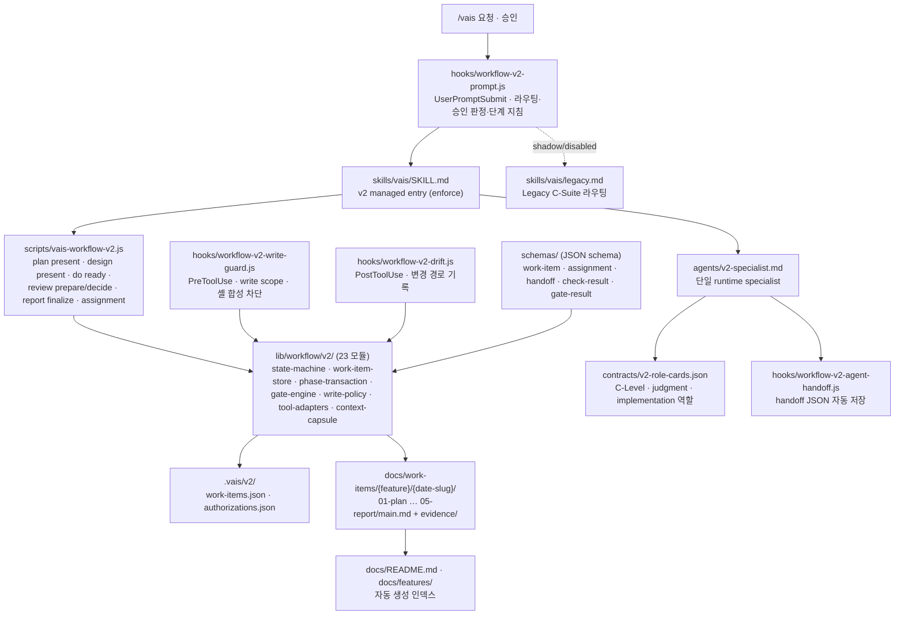

# VAIS Code — Onboarding (5분 읽기)

> **이 파일의 책임**: 처음 본 AI 또는 사람이 본 repo 의 구조·진입점·워크플로우를 5분 안에 파악하도록 돕는 가이드.
> 더 깊이 파야 하면 → `CLAUDE.md` (Claude Code 지침) / `README.md` (사용법 전체) / `skills/vais/SKILL.md` (`/vais` managed entry).

---

## 1. What This Is (1분)

**VAIS Code** = Claude Code 플러그인. 자연어 요청 하나(`/vais …`)를 받으면 가상 C-Suite 조직이 **Plan → Design → Do → Review → Report** 다섯 단계를 순서대로 진행하고, 사용자는 **Plan 승인 · Design 승인 · 최종 승인** 세 번만 결정한다.

| 핵심 컨셉 | 설명 |
|----------|------|
| **단일 `/vais` 진입** | C-Level·phase를 사용자가 고르지 않는다. `/vais <요청>`, `/vais status`, `/vais pause|resume|cancel`, 승인 문구가 전부 |
| **5단계 상태 머신** | `lib/workflow/v2/state-machine.js`. 규모(compact/standard/extended)와 무관하게 다섯 단계 정본을 남기고, 허용 목록 밖 전이는 runtime이 거부 |
| **승인 Gate 3개** | Plan / Design / 최종. `/vais plan 승인`, `/vais design 승인`, `/vais 최종 승인`. 모호한 답(`좋아`)·조건부 승인은 무효 |
| **Design 승인 후 자동 진행** | Do → Readiness Gate → Review evidence → 독립 AI QA 결과 제시까지 사용자 진행 요청 없이 이어진다 |
| **독립 QA** | `independent-qa`가 clean-room·read-only로 PASS/FAIL/BLOCKED 판정. FAIL은 Design으로 복귀(최대 3회) |
| **runtime 역할 카드** | C-Level·specialist는 `contracts/v2-role-cards.json` 정본. 위임은 단일 Agent `v2-specialist` + 구조화 assignment/handoff JSON |
| **Work item / Feature** | Feature = 장기 기능, Work item = 한 번의 변경. `docs/work-items/{feature}/{date-slug}/0N-*/main.md` 다섯 정본 + `docs/README.md` Master 인덱스 |
| **runtime guard** | hook이 write scope 밖 쓰기, 셸 합성, `.vais/v2` 직접 수정, Gate 우회를 차단. `/vais` 없는 대화는 읽기 전용 |

현재 버전: **v3.0.1** — `vais.config.json > workflowV2.mode: enforce`. `shadow`로 바꾸면 Legacy C-Suite 라우팅(`skills/vais/legacy.md`)이 복원된다. 상세: `CHANGELOG.md`.

---

## 2. Quick Start (1분)

### 시나리오 A — 사용자가 새 기능을 만들고 싶을 때

```text
/vais 비밀번호 재설정 기능 추가해줘   # 이력 검색 → Feature 관계·규모 확인 → Plan 제시
/vais plan 승인                        # → Design 제시
/vais design 승인                      # → Do → Readiness → 독립 QA → 결과·화면 제시
/vais 최종 승인                        # → Report 작성·동결
```

중간 수정은 `/vais <수정 내용>`, 상태 확인은 `/vais status`, 진행 중 다른 요청은 `/vais 새 작업: <요청>`(pending 큐)으로 보낸다.

### 시나리오 B — 코드 읽기 (이 repo 처음 본 AI)

1. 본 `ONBOARDING.md` (지금) — 5분 진입
2. `CLAUDE.md` — Claude Code 전용 지침 (v3 enforce 규칙 + Project Structure)
3. `skills/vais/SKILL.md` — `/vais` managed entry 8줄 규칙
4. `hooks/workflow-v2-prompt.js` — 단계별 지침이 실제로 어떻게 주입되는지
5. `lib/workflow/v2/state-machine.js` + `router.js` — 상태 전이와 승인 문법 정본
6. `contracts/v2-role-cards.json` — 역할·경계·위임 관계

### 시나리오 C — 디자인 시스템 사용

`design-system/INDEX.md` 에 등록된 brand 카탈로그 확인 (brand-first — 71 brand DESIGN.md, default 5 사전 박제 + lazy import). UI 설계가 필요한 Design에서 ui-designer 역할이 brand 를 선택하고 `brands/{slug}/DESIGN.md` 를 정본으로 참조한다.

---

## 3. Architecture (1분, Mermaid)



부속 폴더 (그래프 외):
- `agents/{c-level}/` — Legacy C-Level·sub-agent 본문 + `knowledge/` 19 MD (역할 카드의 `knowledge` 필드가 lazy-load 대상으로 참조)
- `templates/` — Legacy PDCA 문서 템플릿 (shadow 모드)
- `skills/brief/` — `/vais brief` 임원 보고서 (워크플로우 독립)
- `mcp/` + `vendor/ui-ux-pro-max` — design-system MCP 서버와 BM25 검색 엔진 (직접 수정 금지)
- `scripts/evaluation/`, `tests/v2-*.test.js` — Legacy/v2 formal 비교 체계

---

## 4. 진입점 역할 표 (1분)

| 파일 | 대상 | 역할 | 언제 보나 |
|------|------|------|-----------|
| `ONBOARDING.md` | 모든 AI/사람 (처음) | 진입 가이드 — 5분 파악 | 처음 1번 |
| `README.md` | 사용자 | 사용법 전체 — 명령·승인 문법·5단계·규모·역할·문서 구조·설정 | 사용법이 궁금할 때 |
| `CLAUDE.md` | Claude Code | 프로젝트 지침 — v3 enforce 규칙 + Structure + shadow 모드 Legacy 규칙 | 세션 시작 시 자동 로드 |
| `skills/vais/SKILL.md` | Claude Code (skill) | `/vais` managed entry — hook 컨텍스트를 runtime 정본으로 따르는 규칙 | `/vais` 호출 시 자동 로드 |
| `skills/vais/legacy.md` | Claude Code (skill) | shadow/disabled 모드 Legacy 라우팅 | `workflowV2.mode ≠ enforce` 일 때 |
| `contracts/v2-role-cards.json` | runtime | 역할 카드 정본 | 위임·역할 경계 확인 시 |

---

## 5. Next Steps (1분)

### 워크플로우 1개 예시 — "social-login-integration"

```text
1. /vais 소셜 로그인 연동 추가해줘
   → 관련 Work item 검색 → Feature 관계(new/existing)·규모 확인 (AskUserQuestion)
   → CPO Plan 제시 → docs/work-items/{feature}/{date}-{slug}/01-plan/main.md

2. /vais plan 승인
   → CTO Design 제시 (REQ별 동작·TC, write scope, readiness/review check, specialist 선택)
   → UI 가 있으면 ui-designer 역할이 brand 선택 → design-system/brands/{slug}/DESIGN.md 정본

3. /vais design 승인
   → Do: Design 이 고른 specialist 에 assignment 발급 → 구현 → do ready (readiness check)
   → Review: review prepare (Tool evidence) → independent-qa 1회 → review decide
   → 결과·스크린샷·제한 제시

4. /vais 최종 승인
   → report finalize → 05-report/main.md 동결 · docs/README.md 갱신

5. 커밋은 별도 요청 — 문서 3개·코드 변경을 확인한 뒤 commit
```

### 더 알아보기

| 주제 | 위치 |
|------|------|
| 승인 문법 정규식 | `lib/workflow/v2/router.js` |
| 단계별 지침·owner 카드 주입 | `hooks/workflow-v2-prompt.js > phaseGuidance` |
| 문서 예산·필수 섹션 | `lib/workflow/v2/document-quality.js`, `phase-check.js` |
| Tool check 9종 | `lib/workflow/v2/tool-adapters.js` |
| write scope·명령 허용 정책 | `lib/workflow/v2/write-policy.js` |
| v3 전환 근거 (Review Attempt 18) | `docs/work-items/vais-workflow/2026-08-31-workflow-redesign/05-report/main.md` |
| Plugin 구조 검증 | `node scripts/vais-validate-plugin.js` |

---

## Legacy 참고 — Agent Teams (shadow 모드 전용)

> 기본값: `agentTeams.enabled=false` (강제 X, 안내 O). `enabled=false` 는 sequential 모드이며, `enabled=true` 이지만 env flag 가 없을 때만 simulation fallback 이 동작한다.

`orchestration.agentTeams.enabled` 와 `CLAUDE_CODE_EXPERIMENTAL_AGENT_TEAMS=1` 로 활성화하는 대화-합성 모델은 **Legacy(shadow/disabled) 모드에서만** 의미가 있다. enforce 모드의 v2 runtime 은 단일 `v2-specialist` 위임과 구조화 handoff 만 사용하며 Agent Teams 설정을 읽지 않는다. 상세: `contracts/agent-teams.md`.

---

> 변경 이력: 누적 변경 사항은 `CHANGELOG.md` 참조.
