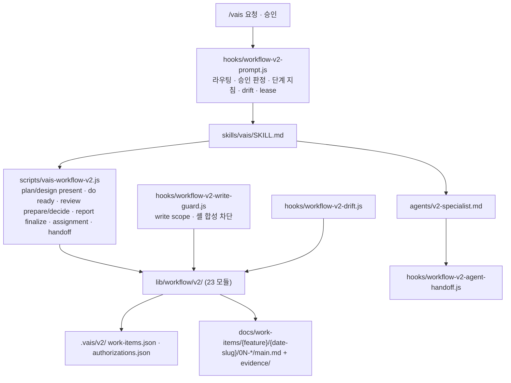

# VAIS Code — Onboarding (5분 읽기)

> **이 파일의 책임**: 처음 본 AI 또는 사람이 이 repo 의 목적·구조·진입점을 5분 안에 파악하게 한다.
> 더 깊이: `CLAUDE.md` (Claude Code 지침) · `README.md` (사용법) · `skills/vais/SKILL.md` (`/vais` 진입 규칙).

## 1. 무엇인가 (1분)

**비개발자가 개발자처럼 웹 앱을 만들게 해주는 Claude Code 하네스 플러그인.**

- 사용자는 `/vais <말>` 로 시키고, "고르기" 와 "확인" 두 곳에서만 결정한다.
- 플러그인은 Plan → Design → Do → Review → Report 를 hook + 상태 머신으로 **강제**하고, 결정·증거를 **기록**하며, 결과를 **보여준다**.
- 모델(Claude)이 바뀌어도 유지되는 것은 코드로 못 박은 규칙(승인·범위·기록·증거·고장 알림)이고, 바뀌면 줄이는 것은 데이터(역할 카드·양식·지시문)다.

**2026-09-15 상태**: Legacy(C-Suite 에이전트 85개, 템플릿, 구 hook·lib·문서 ≈ 40,000줄)를 전부 제거했다. 남은 것은 v2 runtime 커널 ≈ 8,000줄과 `brief` 스킬. 새 하네스 설계는 이 커널 위에서 `/vais` 로 진행한다. 롤백은 git 태그 `v3.0.1-legacy`.

## 2. 처음 읽는 순서 (2분)

1. `ONBOARDING.md` — 지금
2. `CLAUDE.md` — 설계 원칙 + enforce 규칙 15개 + 자기 수정 주의
3. `skills/vais/SKILL.md` — `/vais` 가 hook 컨텍스트를 어떻게 따르는가
4. `hooks/workflow-v2-prompt.js` — 단계별 지침이 실제로 주입되는 곳
5. `lib/workflow/v2/state-machine.js` + `router.js` — 상태 전이와 승인 문법 정본
6. `contracts/v2-role-cards.json` — 역할 경계

## 3. 동작 흐름 (1분)



## 4. 진입점 표 (1분)

| 파일 | 대상 | 역할 |
|---|---|---|
| `CLAUDE.md` | Claude Code | 세션 시작 시 자동 로드. 원칙·규칙·구조 |
| `skills/vais/SKILL.md` | Claude Code (skill) | `/vais` 호출 시 로드. hook 컨텍스트를 정본으로 따르는 규칙 |
| `skills/brief/SKILL.md` | Claude Code (skill) | `/vais brief` 임원 보고서. 워크플로우 독립 |
| `hooks/hooks.json` | Claude Code | UserPromptSubmit · PreToolUse · PostToolUse 등록 |
| `vais.config.json` | runtime | `workflowV2.mode` (`enforce` 정본 / `disabled` 하네스 수리용) |
| `contracts/v2-role-cards.json` | runtime | 역할 정본 |

## 5. 개발 루프

```bash
npm test && npm run lint && npm run validate   # 로컬 검증 (하네스 밖에서)
```

하네스 자체를 고칠 때: 사용자가 `workflowV2.mode` 를 `disabled` 로 내림 → 수정 → 검증 → 커밋 → `enforce` 복귀. 실행 중 플러그인은 마켓플레이스 캐시 사본이라 push · 버전 bump · 업데이트 뒤에 반영된다.

> 변경 이력: `CHANGELOG.md`
