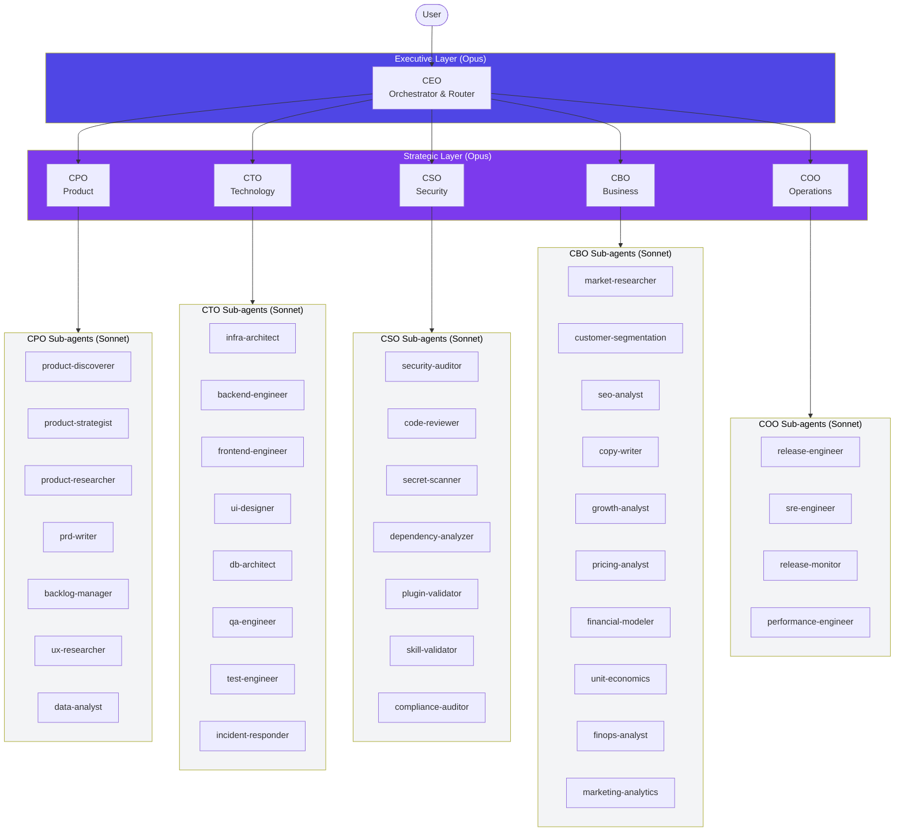
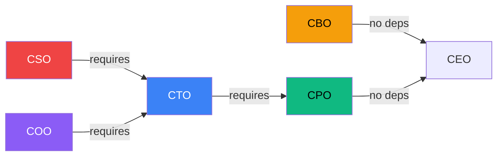
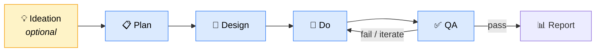
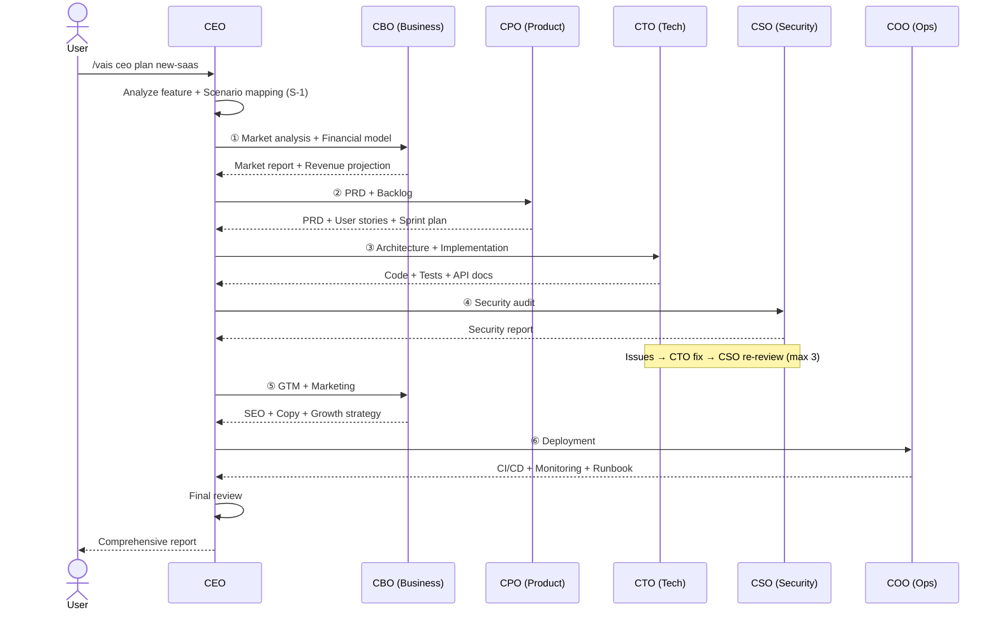
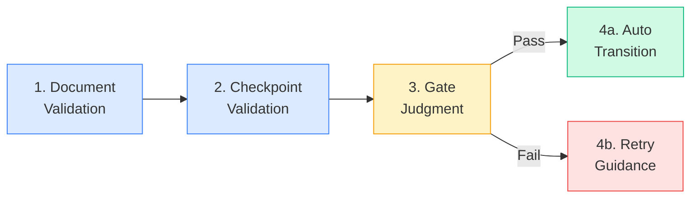

<p align="center">
  
  
  
  
  
</p>

# VAIS Code

**Virtual AI C-Suite for Software Development**

> CEO에게 지시하면 6명의 C-Level 팀이 제품 기획부터 개발, 보안 검토, 마케팅, 배포까지 자율 실행합니다.

---

## Overview

VAIS Code는 Claude Code 위에서 동작하는 **AI C-Suite 조직 시뮬레이션 플러그인**입니다. CEO가 Product Owner로서 피처의 성격과 산출물 상태를 분석하여 적합한 C-Level에 업무를 위임하고, 각 C-Level은 전문 sub-agent 팀을 지휘하여 PDCA 워크플로우를 실행합니다.

### Key Features

| Feature | Description |
|---------|-------------|
| **6 C-Level Virtual Team** | CEO, CPO, CTO, CSO, CBO, COO — 각자 전문 도메인을 담당하는 Opus 에이전트 |
| **38 Specialized Sub-agents** | Sonnet 기반 실행 에이전트. 코드 작성, SEO 감사, 재무 모델링, 보안 스캔 등 |
| **Optional Ideation Phase** | 아이디어가 모호할 때 산출물 없이 자유 대화 → 요약 후 plan 자동 참조 |
| **Advisor Tool (M-24)** | 모든 Sonnet sub-agent에 Opus reviewer 내장. 작업 중 전략 조언 자동 수신 |
| **4-Step Harness Gate** | Document → Checkpoint → Gate Judgment → Transition 자동 검증 파이프라인 |
| **10+1 Scenario Mapping** | S-0 Ideation ~ S-10 Operations. CEO가 상황을 인식하여 최적 흐름 추천 |
| **Migration Engine** | v0.49 상태 파일을 v0.50으로 자동 변환 (backup 포함) |

---

## Architecture

### C-Suite Organization



### C-Level Roles

| C-Level | Role | Sub-agents | Domain |
|---------|------|------------|--------|
| **CEO** | Top-level orchestrator, dynamic routing, 10+1 scenario mapping | absorb-analyzer, skill-creator | Strategy |
| **CPO** | Product definition, PRD, roadmap, backlog | product-discoverer, product-strategist, product-researcher, prd-writer, backlog-manager, ux-researcher, data-analyst | Product |
| **CTO** | Technical architecture, full dev lifecycle orchestration | infra-architect, backend-engineer, frontend-engineer, ui-designer, db-architect, qa-engineer, test-engineer, incident-responder | Technology |
| **CSO** | Security audit, code review, secret scan, dependency analysis | security-auditor, code-reviewer, secret-scanner, dependency-analyzer, plugin-validator, skill-validator, compliance-auditor | Security |
| **CBO** | Market research, GTM, pricing, financial modeling, unit economics | market-researcher, customer-segmentation-analyst, seo-analyst, copy-writer, growth-analyst, pricing-analyst, financial-modeler, unit-economics-analyst, finops-analyst, marketing-analytics-analyst | Business |
| **COO** | CI/CD, deployment, monitoring, performance benchmarks | release-engineer, sre-engineer, release-monitor, performance-engineer | Operations |

### Dependencies



---

## Workflow

### PDCA Phases



| Phase | Required | Description |
|-------|----------|-------------|
| **Ideation** | Optional | 자유 대화 모드. 산출물 강제 없이 아이디어 숙성. 종료 시 요약 저장 → plan 자동 참조 |
| **Plan** | Mandatory | 요구사항 정의, 범위 설정, 타임라인 |
| **Design** | Mandatory | 아키텍처 설계, 기술 스택 선택 |
| **Do** | Mandatory | 구현. Sub-agent 병렬 실행 (frontend + backend + test) |
| **QA** | Mandatory | Gap 분석, 코드 리뷰, 보안 검증. Match rate ≥ 90% 통과 |
| **Report** | Optional | 최종 리포트, 회고, KPI 정리 |

### CEO Dynamic Routing (Service Launch)



### 10+1 Scenarios

| ID | Trigger | Flow |
|----|---------|------|
| **S-0** | Vague idea, exploration needed | CEO ideation → Recommended C-Level |
| **S-1** | New service, full development | CBO(market) → CPO → CTO → CSO → CBO(GTM) → COO |
| **S-2** | Add feature to existing service | CPO → CTO → CSO → COO |
| **S-3** | Bug fix / UX improvement / Refactor | CTO (branch by type) |
| **S-4** | Production incident | CTO(incident-responder) → CSO → COO |
| **S-5** | Performance / Cost optimization | CTO(perf) or CBO(finops) |
| **S-6** | Security audit / Compliance | CSO ↔ CTO loop (max 3 iterations) |
| **S-7** | Marketing campaign / GTM | CPO → CBO → (CTO) |
| **S-8** | Market analysis / Business report | CBO → (CPO) |
| **S-9** | Internal skill/agent creation | CEO(skill-creator) → CSO |
| **S-10** | Regular ops / Tech debt | CTO or COO |

---

## Quick Start

### Installation

```bash
# Clone the repository
git clone https://github.com/ghlee3401/vais-claude-code.git
cd vais-claude-code

# Set up development environment (symlink to Claude Code plugins)
bash scripts/setup-dev.sh

# Reload plugins in Claude Code
/reload-plugins

# Verify installation
/vais help
```

### Usage

```bash
# Start with an idea (optional ideation phase)
/vais ceo ideation pricing-strategy

# Jump straight to planning (ideation auto-referenced if exists)
/vais cpo plan pricing-strategy

# Technical implementation only
/vais cto do payment-integration

# Full service launch (CEO orchestrates all C-Levels)
/vais ceo plan online-bookstore

# Security audit
/vais cso plan my-feature

# Business analysis
/vais cbo plan market-entry

# Check status
/vais status

# Next step recommendation
/vais next
```

### Three Entry Points

| Entry Point | When to Use |
|-------------|-------------|
| `/vais ceo {feature}` | New service launch — full C-Level pipeline |
| `/vais cto {feature}` | Technical implementation only — plan/PRD already exists |
| `/vais {c-level} {feature}` | Direct delegation to specific C-Level |

---

## Harness System

### 4-Step Gate Pipeline

Every sub-agent execution is validated through a 4-step pipeline at `SubagentStop`:



| Step | Check | On Failure |
|------|-------|------------|
| **Document** | Required output files exist (≥ 500B) | List missing files |
| **Checkpoint** | AskUserQuestion checkpoints recorded | Flag missing approvals |
| **Gate** | Documents ✅ + Checkpoints ✅ + Tool calls > 0 | Aggregate failure reasons |
| **Transition** | Auto-advance to next phase (or ask user) | Provide retry guidance with debug tips |

### Advisor Tool (M-24)

All Sonnet sub-agents have a built-in Opus advisor for mid-generation strategic guidance:

- **When**: Early plan (1x) → Stuck (1x) → Final review (1x) = max 3 calls per request
- **Cost control**: Monthly budget cap → auto-degrade to Sonnet-only (no interruption)
- **Caching**: Ephemeral 5-minute TTL for cost efficiency

### Hooks

| Hook | Script | Role |
|------|--------|------|
| SessionStart | `session-start.js` | Session init + dashboard render + advisor support check |
| PreToolUse:Bash | `bash-guard.js` | Block destructive commands (DROP TABLE, git push --force) |
| PostToolUse:Write\|Edit | `doc-tracker.js` | Track document writes → auto-update workflow state |
| Stop | `stop-handler.js` | Progress summary + next step guidance |
| SubagentStart | `agent-start.js` | Agent observability (role/phase whitelist validation) |
| SubagentStop | `agent-stop.js` | **4-step gate pipeline** |

---

## Document Structure

```
docs/
├── 00-ideation/                    # (optional) Ideation summaries
│   └── {role}_{topic}.md
├── 01-plan/
│   └── {role}_{feature}.plan.md    # Requirements, scope, timeline
├── 02-design/
│   └── {role}_{feature}.design.md  # Architecture, tech stack
├── 03-do/
│   └── {role}_{feature}.do.md      # Implementation log
├── 04-qa/
│   └── {role}_{feature}.qa.md      # QA report, gap analysis
└── 05-report/
    └── {role}_{feature}.report.md  # Final report, retrospective
```

---

## Project Structure

```
vais-claude-code/
├── agents/                  # 6 C-Level directories + _shared guards
│   ├── ceo/                 #   CEO + absorb-analyzer + skill-creator
│   ├── cpo/                 #   CPO + 7 sub-agents (product/backlog/UX/data)
│   ├── cto/                 #   CTO + 8 sub-agents (infra/dev/qa/debug)
│   ├── cso/                 #   CSO + 7 sub-agents (security/review/compliance)
│   ├── cbo/                 #   CBO + 10 sub-agents (market/growth/finance)
│   ├── coo/                 #   COO + 4 sub-agents (release/SRE/perf)
│   └── _shared/             #   advisor-guard.md, ideation-guard.md
├── skills/vais/             # /vais skill entry + phase routers + utilities
├── hooks/                   # 6 hooks (session/bash-guard/doc-tracker/stop/agent)
├── lib/                     # Core libraries
│   ├── advisor/             #   Opus advisor wrapper + prompt builder
│   ├── control/             #   Cost monitor, automation controller
│   ├── core/                #   State machine, migration engine
│   ├── observability/       #   Event logger, schema, rotation
│   ├── quality/             #   Gate manager, template validator
│   ├── registry/            #   Agent registry (includes merge)
│   └── validation/          #   Document validator, checkpoint guard
├── scripts/                 # CLI tools (bash-guard, agent-start/stop, validators)
├── templates/               # PDCA document templates (plan/design/do/qa/report/ideation)
├── docs/                    # Feature outputs (01-plan ~ 05-report + 00-ideation)
├── vais.config.json         # Plugin configuration (workflow, C-Suite, gates, advisor)
└── package.json             # Plugin manifest
```

---

## Configuration

Key settings in `vais.config.json`:

| Setting | Default | Description |
|---------|---------|-------------|
| `workflow.phases` | `[ideation, plan, design, do, qa, report]` | PDCA phases (ideation is optional) |
| `workflow.mandatoryPhases` | `[plan, design, do, qa]` | Phases that cannot be skipped |
| `dependencies` | `{cto:[cpo], cso:[cto], ...}` | C-Level dependency map |
| `gapThreshold` | `0.90` | QA pass threshold (90%) |
| `advisor.enabled` | `true` | Opus advisor for all Sonnet sub-agents |
| `advisor.max_uses_per_request` | `3` | Max advisor calls per sub-agent request |
| `advisor.monthly_budget_usd` | `200` | Monthly advisor cost cap (auto-degrade on exceed) |
| `automation.level` | `L2` | Automation level (L0 manual ~ L4 full-auto) |

---

## Observability

All agent activity is automatically logged:

| File | Content |
|------|---------|
| `.vais/agent-state.json` | Current active agents, pipeline state |
| `.vais/event-log.jsonl` | All events (18 types: session, agent, phase, gate, ideation, advisor, ...) |
| `.vais/advisor-spend.json` | Advisor cost tracking (session + monthly) |
| `.vais/hook-log.jsonl` | Hook execution log |

Auto-rotation: 10MB or 30 days → `.vais/archive/`

---

## Migration from v0.49

If you have existing `.vais/status.json` from v0.49:

1. First run auto-detects v0.49 state
2. `migration-engine.js` converts `cmo_*` / `cfo_*` features → `cbo_*`
3. Removes `retrospective-writer` / `technical-writer` records
4. Backup created at `.vais/_backup/v049-{timestamp}.tar.gz`
5. Dry-run first, then user approval before actual migration

**Breaking changes**:
- `/vais cmo` → use `/vais cbo` instead
- `/vais cfo` → use `/vais cbo` instead

---

## Testing

```bash
npm test          # Run all tests (174 pass)
```

Test coverage:
- State machine transitions (ideation + 5 mandatory phases)
- Migration engine (cmo/cfo → cbo conversion + backup)
- Agent registry (includes merge + circular prevention)
- Gate manager (5-case decision table + ideation skip)
- Advisor integration (prompt builder + cost monitor + degrade)
- Scenario verification (S-0, S-1, S-2, S-9 structural validation)

---

## References

- [C-Suite Roles v2](./guide/csuite-roles-v2.md) — Detailed role definitions, boundaries, handoff rules
- [Scenarios v2](./guide/csuite-scenarios-v2.md) — 10+1 scenario step-by-step flows
- [Agent Mapping v2](./guide/agent-mapping-v2.md) — Per-phase agent participation matrix
- [Harness Plan v2](./guide/harness-plan-v2.md) — Hook system, FSM, gate pipeline design
- [CHANGELOG](./CHANGELOG.md) — Full version history

---

## License

MIT

---

<p align="center">
  <sub>Built with <a href="https://claude.ai/claude-code">Claude Code</a> · Powered by Claude Opus 4.6 + Sonnet 4.6</sub>
</p>
