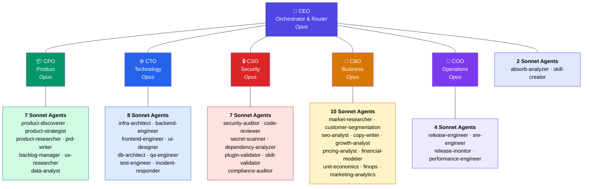
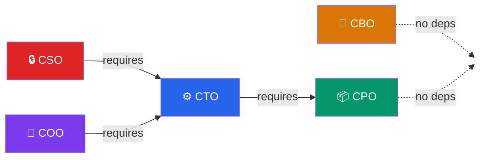
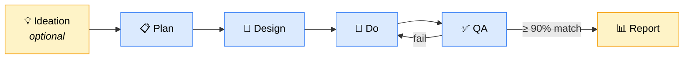
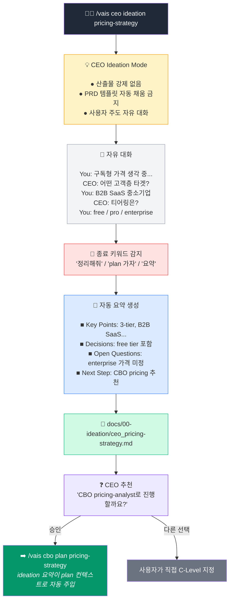
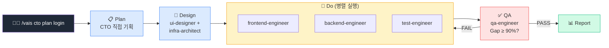
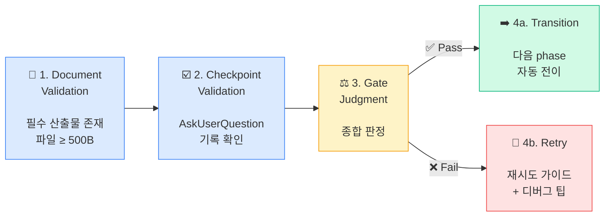
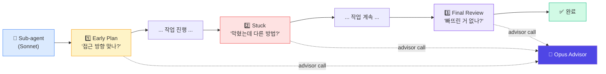

<p align="center">
  
  
  
  
  
</p>

# VAIS Code

**Virtual AI C-Suite for Software Development**

> CEO에게 지시하면 6명의 C-Level 팀이 제품 기획부터 개발, 보안 검토, 마케팅, 배포까지 자율 실행합니다.

---

## How It Works

사용자가 `/vais ceo plan online-bookstore` 를 입력하면 CEO가 피처를 분석하고, 필요한 C-Level을 순서대로 호출합니다.

```mermaid
flowchart TD
    User["🧑‍💻 User<br/>/vais ceo plan online-bookstore"] --> CEO

    CEO["🎯 CEO<br/>피처 분석 → S-1 시나리오 판별<br/>CBO → CPO → CTO → CSO → CBO → COO 결정"]

    CEO -->|"① 시장 분석"| CBO1
    CBO1 -->|"✅ 시장 보고서 + 재무 모델"| CEO2["🎯 CEO<br/>시장 분석 완료. 제품 기획으로"]

    CEO2 -->|"② 제품 기획"| CPO
    CPO -->|"✅ PRD + 백로그 + Sprint Plan"| CEO3["🎯 CEO<br/>PRD 완성. 기술 구현으로"]

    CEO3 -->|"③ 기술 구현"| CTO
    CTO -->|"✅ 코드 + 테스트 + API 문서"| CEO4["🎯 CEO<br/>구현 완료. 보안 검토"]

    CEO4 -->|"④ 보안 검토"| CSO
    CSO -->|"✅ 보안 승인"| CEO5["🎯 CEO<br/>보안 통과. GTM 준비"]

    CEO5 -->|"⑤ GTM + 마케팅"| CBO2
    CBO2 -->|"✅ GTM Plan + 카피 + SEO"| CEO6["🎯 CEO<br/>GTM 완료. 배포"]

    CEO6 -->|"⑥ 배포"| COO
    COO -->|"✅ CI/CD + 모니터링 + Runbook"| CEO7["🎯 CEO<br/>Final Review → 📊 종합 리포트"]

    CEO7 --> Done["✅ 완료<br/>docs/05-report/ceo_online-bookstore.report.md"]

    subgraph CBO1["💼 CBO ① — Business Analysis"]
        CBO1_mr["market-researcher<br/>TAM, PEST, Porter 5F"]
        CBO1_cs["customer-segmentation<br/>페르소나, RFM"]
        CBO1_pa["pricing-analyst<br/>가격 전략, tier 설계"]
        CBO1_fm["financial-modeler<br/>3-Statement, DCF"]
    end

    subgraph CPO["📦 CPO — Product"]
        CPO_pd["product-discoverer<br/>기회 발굴"]
        CPO_ps["product-strategist<br/>전략 수립"]
        CPO_pw["prd-writer<br/>PRD 작성"]
        CPO_bm["backlog-manager<br/>User Story + Sprint"]
    end

    subgraph CTO["⚙️ CTO — Technology"]
        CTO_ia["infra-architect<br/>DB + 환경"]
        CTO_fe["frontend-engineer<br/>UI 구현"]
        CTO_be["backend-engineer<br/>API + 로직"]
        CTO_te["test-engineer<br/>테스트 코드"]
        CTO_qa["qa-engineer<br/>Gap 분석 ≥90%"]
    end

    subgraph CSO["🔒 CSO — Security"]
        CSO_sa["security-auditor<br/>OWASP Top 10"]
        CSO_cr["code-reviewer<br/>독립 리뷰"]
        CSO_ss["secret-scanner<br/>키/토큰 탐지"]
        CSO_da["dependency-analyzer<br/>CVE + 라이선스"]
    end

    subgraph CBO2["📢 CBO ② — GTM & Marketing"]
        CBO2_seo["seo-analyst<br/>SEO 감사"]
        CBO2_cw["copy-writer<br/>랜딩/이메일 카피"]
        CBO2_ga["growth-analyst<br/>GTM + growth loop"]
        CBO2_ma["marketing-analytics<br/>채널 ROI"]
    end

    subgraph COO["🚀 COO — Operations"]
        COO_re["release-engineer<br/>CI/CD + Docker"]
        COO_sre["sre-engineer<br/>모니터링 + 알림"]
        COO_pe["performance-engineer<br/>벤치마크"]
    end

    style User fill:#1F2937,color:#fff,stroke:#6B7280
    style CEO fill:#4F46E5,color:#fff
    style CEO2 fill:#4F46E5,color:#fff
    style CEO3 fill:#4F46E5,color:#fff
    style CEO4 fill:#4F46E5,color:#fff
    style CEO5 fill:#4F46E5,color:#fff
    style CEO6 fill:#4F46E5,color:#fff
    style CEO7 fill:#4F46E5,color:#fff
    style Done fill:#059669,color:#fff
    style CBO1 fill:#FEF3C7,stroke:#F59E0B
    style CPO fill:#D1FAE5,stroke:#10B981
    style CTO fill:#DBEAFE,stroke:#3B82F6
    style CSO fill:#FEE2E2,stroke:#EF4444
    style CBO2 fill:#FEF3C7,stroke:#F59E0B
    style COO fill:#EDE9FE,stroke:#8B5CF6
```



---

## C-Suite Organization



### Dependencies



---

## Workflow Phases



| Phase | Required | Description | Output |
|-------|----------|-------------|--------|
| **Ideation** | Optional | 자유 대화. 산출물 강제 없음. "정리해줘"로 종료 | `docs/00-ideation/{role}_{topic}.md` |
| **Plan** | **Mandatory** | 요구사항 정의, 범위 설정, 타임라인 | `docs/01-plan/{role}_{feature}.plan.md` |
| **Design** | **Mandatory** | 아키텍처 설계, 기술 스택, DB 스키마 | `docs/02-design/{role}_{feature}.design.md` |
| **Do** | **Mandatory** | 구현. Sub-agent 병렬 실행 | `docs/03-do/{role}_{feature}.do.md` |
| **QA** | **Mandatory** | Gap 분석, 보안 검증. ≥ 90% 통과 | `docs/04-qa/{role}_{feature}.qa.md` |
| **Report** | Optional | 최종 리포트, 회고, KPI | `docs/05-report/{role}_{feature}.report.md` |

---

## Ideation Flow (Phase 0)



---

## CTO Standalone Flow



---

## 10+1 Scenarios

| ID | Trigger | Who Gets Called |
|----|---------|----------------|
| **S-0** | 아이디어가 모호할 때 | `CEO ideation` → 추천 C-Level |
| **S-1** | 신규 서비스 풀 개발 | `CBO①` → `CPO` → `CTO` → `CSO` → `CBO②` → `COO` |
| **S-2** | 기존 서비스에 기능 추가 | `CPO` → `CTO` → `CSO` → `COO` |
| **S-3** | 버그 수정 / UX 개선 | `CTO` (branch by type) |
| **S-4** | 프로덕션 장애 | `CTO`(incident-responder) → `CSO` → `COO` |
| **S-5** | 성능 / 비용 최적화 | `CTO`(perf) or `CBO`(finops) |
| **S-6** | 보안 감사 / 컴플라이언스 | `CSO` ↔ `CTO` loop (max 3) |
| **S-7** | 마케팅 캠페인 / GTM | `CPO` → `CBO` → (`CTO`) |
| **S-8** | 시장 분석 / 사업 분석 | `CBO` → (`CPO`) |
| **S-9** | 스킬 / 에이전트 생성 | `CEO`(skill-creator) → `CSO` |
| **S-10** | 정기 운영 / 기술부채 | `CTO` or `COO` |

---

## 4-Step Harness Gate



---

## Advisor Tool (M-24)

모든 Sonnet sub-agent에 Opus reviewer가 내장되어, 작업 중 자동으로 전략 조언을 수신합니다.



> max 3회 호출. 월 예산($200) 초과 시 자동 비활성화 — Sonnet 단독으로 정상 계속.

---

## Quick Start

```bash
# 1. Clone
git clone https://github.com/ghlee3401/vais-claude-code.git
cd vais-claude-code

# 2. Setup (symlink to Claude Code plugins)
bash scripts/setup-dev.sh

# 3. Reload in Claude Code
/reload-plugins

# 4. Try it
/vais help
```

### Usage

```bash
/vais ceo ideation pricing-strategy     # 아이디어 숙성 (자유 대화)
/vais cpo plan pricing-strategy         # 제품 기획 (ideation 자동 참조)
/vais cto do payment-integration        # 기술 구현
/vais ceo plan online-bookstore         # 풀 서비스 런칭
/vais cso plan my-feature               # 보안 감사
/vais cbo plan market-entry             # 시장 분석 + 재무 모델
/vais status                            # 진행 현황
/vais next                              # 다음 단계 추천
```

### Three Entry Points

| Entry Point | When to Use |
|-------------|-------------|
| `/vais ceo {feature}` | 새 서비스 런칭 — 전체 C-Level 파이프라인 |
| `/vais cto {feature}` | 기술 구현만 — plan/PRD 이미 있을 때 |
| `/vais {c-level} {feature}` | 특정 C-Level 직접 호출 |

---

## Project Structure

```
vais-claude-code/
├── agents/                  # 6 C-Level + _shared guards (38 sub-agents)
├── skills/vais/             # /vais 스킬 진입점 + phase routers + utilities
├── hooks/                   # 6 hooks (session/bash-guard/doc-tracker/stop/agent)
├── lib/                     # advisor, core, quality, observability, registry, validation
├── scripts/                 # CLI tools (bash-guard, agent-start/stop, validators)
├── templates/               # PDCA document templates (plan/design/do/qa/report/ideation)
├── docs/                    # Feature outputs (00-ideation ~ 05-report)
├── vais.config.json         # Plugin configuration
└── package.json             # Plugin manifest
```

---

## Configuration

| Setting | Default | Description |
|---------|---------|-------------|
| `workflow.phases` | ideation, plan, design, do, qa, report | PDCA phases (ideation optional) |
| `dependencies` | `{cto:[cpo], cso:[cto], coo:[cto], cbo:[]}` | C-Level 의존성 |
| `gapThreshold` | `0.90` | QA 통과 기준 (90%) |
| `advisor.enabled` | `true` | Opus advisor 활성화 |
| `advisor.monthly_budget_usd` | `200` | 월 예산 캡 (초과 시 자동 비활성화) |
| `automation.level` | `L2` | L0(수동) ~ L4(전자동) |

---

## Migration from v0.49

| v0.49 | v0.50 |
|-------|-------|
| 7 C-Level (CMO + CFO 별도) | 6 C-Level (CBO로 통합) |
| 5 phases | 6 phases (+ideation) |
| `/vais cmo ...` | `/vais cbo ...` |
| `/vais cfo ...` | `/vais cbo ...` |

기존 `.vais/status.json`의 `cmo_*` / `cfo_*` 항목은 첫 실행 시 자동 변환됩니다.
백업: `.vais/_backup/v049-{timestamp}.tar.gz`

---

## Testing

```bash
npm test    # 174 pass, 0 fail
```

---

## References

- [C-Suite Roles v2](./guide/csuite-roles-v2.md) — 역할 정의, 경계, 핸드오프 규칙
- [Scenarios v2](./guide/csuite-scenarios-v2.md) — 10+1 시나리오 단계별 명세
- [Agent Mapping v2](./guide/agent-mapping-v2.md) — Phase별 에이전트 참여 매트릭스
- [Harness Plan v2](./guide/harness-plan-v2.md) — Hook 시스템, FSM, 게이트 파이프라인
- [CHANGELOG](./CHANGELOG.md)

## License

MIT

<p align="center">
  <sub>Built with <a href="https://claude.ai/claude-code">Claude Code</a> · Powered by Claude Opus 4.6 + Sonnet 4.6</sub>
</p>
