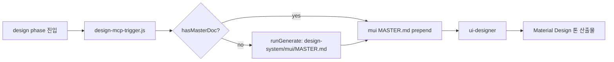
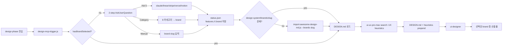

# Architecture — Brand-First UI Design Flow

## Before / After Flow

### Before (mui-based, current)



문제: Material Design 톤이 default → 모든 산출물 비슷한 미감.

### After (brand-first, target)



## Component Responsibility Matrix

| Component | Before | After | 변경 |
|-----------|--------|-------|------|
| `hooks/design-mcp-trigger.js` | hasMasterDoc → runGenerate | hasBrandSelected → 2-step AskUQ + lazy import | 재작성 |
| `lib/mcp-validator.js` | hasMasterDoc / runGenerate | hasBrandSelected / loadBrandDesign | brand-aware 재작성 또는 deprecate + 신규 `lib/brand-validator.js` |
| `lib/status.js` | (brand 없음) | `setBrand(feature, slug)` / `getBrand(feature)` 헬퍼 | 메서드 추가 |
| `scripts/import-mui-design-system.js` | mui 카탈로그 박제 | (삭제) | 제거 |
| `scripts/import-awesome-design-md.js` | (없음) | brand DESIGN.md → `design-system/brands/{slug}/` 박제 | 신규 |
| `agents/cto/ui-designer.md` | "DS 자동 선택" (mui) | "Brand 선택 + DESIGN.md 참조" | 본문 재작성 |
| `agents/cto/cto.md` | design phase 위임 단순 | design 위임 시 brand 선택 절차 포함 | 1 섹션 추가 |
| `design-system/INDEX.md` | mui 섹션 | brands 섹션 (71 brands, 8 카테고리) | 섹션 교체 |
| `design-system/mui/` | 19 컴포넌트 + 94 토큰 박제 | (삭제) | 완전 제거 |
| `design-system/brands/` | (없음) | DESIGN.md 박제 + INDEX.md + LICENSE.md | 신규 디렉토리 |
| `vendor/ui-ux-pro-max/` | design phase MCP | (변경 없음) | design start + qa 양쪽 호출만 변경 |

## Hook 재설계 — design-mcp-trigger.js

### 신규 시그니처

```javascript
// hooks/design-mcp-trigger.js (after)
async function trigger({ feature, agent }) {
  if (agent !== 'ui-designer') return { allow: true };
  if (!feature) return { allow: true };

  const brandSlug = getBrand(feature);  // lib/status.js
  if (brandSlug) {
    return { allow: true, contextFiles: [brandDesignPath(brandSlug)] };
  }

  // brand 미선택 → 2-step AskUserQuestion 유도
  if (process.env.VAIS_DEFAULT_BRAND) {
    setBrand(feature, process.env.VAIS_DEFAULT_BRAND);
    return { allow: true, contextFiles: [brandDesignPath(process.env.VAIS_DEFAULT_BRAND)] };
  }

  const cfg = readConfig('vais.config.json');
  if (cfg?.designSystem?.defaultBrand) {
    setBrand(feature, cfg.designSystem.defaultBrand);
    return { allow: true, contextFiles: [brandDesignPath(cfg.designSystem.defaultBrand)] };
  }

  return {
    allow: false,
    message: 'brand 가 선택되지 않았습니다. /vais cto design {feature} 실행 후 2-step AskUserQuestion 으로 brand 를 선택하세요. CI 환경은 VAIS_DEFAULT_BRAND 환경변수 또는 vais.config.json > designSystem.defaultBrand 설정 사용.',
  };
}
```

### 2-step AskUserQuestion 정책

- **Step 1**: question="brand 선택 방식?", options=
  1. `자주 쓰는 5` — claude/linear/stripe/vercel/notion 중 선택 (Recommended)
  2. `카테고리 검색` — 8 카테고리 → brand 2-step
  3. `직접 입력` — slug 입력 (자동완성 없음)
  4. `default 사용` — config.defaultBrand 또는 "claude"
- **Step 2 (Category 선택 시)**: question="카테고리?", options=8 카테고리 중 4개씩 페이지네이션 — 카테고리 선택 후 다시 brand 4개씩 페이지네이션.

### Hook 실행 위치

| 호출 시점 | 동작 |
|----------|------|
| ui-designer Agent 직전 (PreToolUse) | hasBrandSelected 체크 + DESIGN.md prepend |
| qa-engineer 산출물 검토 시 | ui-ux-pro-max search (heuristics 재확인) |

## Lib 재설계 — mcp-validator.js vs brand-validator.js

**선택**: `lib/mcp-validator.js`는 mui 전제로 작성되어 hasMasterDoc / runGenerate 의존. brand-first 모델은 fundamentally 다르므로 **deprecate + 신규 `lib/brand-validator.js` 작성**.

```javascript
// lib/brand-validator.js (신규)
const path = require('path');
const fs = require('fs');

const BRAND_ROOT = path.join(process.cwd(), 'design-system', 'brands');

function brandDesignPath(slug) {
  return path.join(BRAND_ROOT, slug, 'DESIGN.md');
}

function brandExists(slug) {
  return fs.existsSync(brandDesignPath(slug));
}

function listBakedBrands() {
  if (!fs.existsSync(BRAND_ROOT)) return [];
  return fs.readdirSync(BRAND_ROOT).filter(d => brandExists(d));
}

function loadBrandDesign(slug) {
  if (!brandExists(slug)) {
    throw new Error(`brand "${slug}" 미박제 — scripts/import-awesome-design-md.js --brands ${slug} 실행 필요`);
  }
  return fs.readFileSync(brandDesignPath(slug), 'utf-8');
}

module.exports = { brandDesignPath, brandExists, listBakedBrands, loadBrandDesign };
```

`lib/mcp-validator.js`는 `// @deprecated v1.1.0 — replaced by brand-validator.js` 주석 + export 유지 (backwards-compat 6 개월), v1.2.0에서 삭제.

## ui-ux-pro-max 통합 패턴

| 단계 | 호출 | 컨텍스트 |
|------|------|----------|
| design start (PreToolUse ui-designer) | `vendor/ui-ux-pro-max/scripts/search.py` heuristics search | brand DESIGN.md + UX 가드레일 prepend |
| qa (qa-engineer 산출물 검토) | 동일 search | 산출물의 컴포넌트/패턴이 heuristics 위반 여부 검증 |

호출 인자 변경 없음 — 본체 `vendor/` 보호.

## CTO 검토 노트

- **R1 (repo size)**: lazy + default 5 → 즉시 박제 ~3MB (5 × 540 line × ~80 byte ≈ 220KB 코드 + Asset reference). 71 전체 박제 시 4.7M. lazy 채택으로 95% 절감.
- **R3 (brand 선택 UX 부담)**: 2-step + Hot 5 shortcut으로 average 1.5 clicks (Hot 5 = 1 click, Category = 2 clicks).
- **R6 (semver)**: design-system 구조 큰 변경 + mui 제거 = breaking change → minor 1.1.0 (사용자 facing API 변경 없음, internal flow만).
- **R7 (license)**: `design-system/brands/LICENSE.md`에 MIT (VoltAgent 2026) 박제 + 각 brand 출처 URL `INDEX.md`에 명시.

---

| version | date | change |
|---------|------|--------|
| v1.0 | 2026-05-23 | 초기 작성 — Before/After flow + 컴포넌트 책임 매트릭스 + hook 재설계 + lib 재설계 (brand-validator 신설) + ui-ux-pro-max 통합 |
