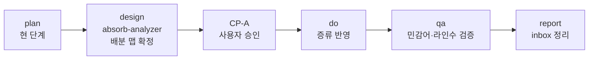

# CEO Plan — external-refs-absorb-distill

> **목적**: `references/_inbox/ncai-add/` 레퍼런스 중 에이전트 강화에 유효한 지식을 **증류(distillation)** 방식으로 흡수. md 파일 비대화 방지와 민감 정보 제외가 핵심 제약.

---

## 1. 배경 및 문제 정의

`references/_inbox/ncai-add/` 에 36개 파일·약 5,400줄의 외부 레퍼런스가 대기 중. 이 중 VAIS Code 에이전트 강화에 유효한 요소가 다수 존재하나, 다음 세 가지 제약이 동시에 걸려있다:

1. **절대 볼륨 과다** — 원본을 그대로 옮기면 기존 에이전트/스킬 md가 비대해져 컨텍스트 비용 증가·가독성 하락
2. **민감어 제외 필수** — `NC AI / nc ai / varco / 바르코 / nano / 나노` 등 브랜드 고유명사는 흡수 금지
3. **나노 인증(OIDC) 스코프 제외** — `skills/skill_nano_oidc_integration/` 전체는 대상에서 제외

## 2. 성공 기준 (KPI)

| 지표 | 목표 |
|------|------|
| 순 증가 라인 수 | ≤ 800 lines (원본 5,400 대비 ≤ 15%) |
| 민감어 유출 | 0건 (자동 grep 검증) |
| 흡수 원본 정리 | `_inbox/ncai-add/` 100% 삭제 또는 reject 마킹 |
| 기존 에이전트 단일 파일 크기 증가분 | 각 파일 ≤ +100 lines |

## 3. 제외 범위 (Out-of-Scope)

| 대상 | 이유 |
|------|------|
| `skills/skill_nano_oidc_integration/` 전체 (6 파일) | 사용자 명시 제외 — 나노 인증 불필요 |
| 원본 내 고유명사 토큰 `NC AI / varco / nano / 바르코 / 나노` | 민감어, 치환·제거 대상 |
| `docs/tech_stack.md` (NC AI 특정 스택) | 브랜드 색채 강함, 일반화 곤란 |
| 원본 `SKILL.md` (최상위, NC 브랜드 엔트리 포인트) | VAIS에 이미 `skills/vais/` 존재, 대체 불필요 |

## 4. 후보 분류 및 처리 방침 (Pre-Triage)

absorb-analyzer 공식 분석 전, CEO 수준에서 1차 분류한 결과:

### 4.1 고가치 · 증류 흡수 (distill)

| # | 원본 | 라인 | 대상 에이전트/스킬 | 증류 방식 | 예상 추가 |
|---|------|-----|------------------|----------|----------|
| 1 | `rules/plan.mdc` | 180 | `cto/cto.md` 또는 `cto/infra-architect.md` | Epic/Ticket/Task 3계층 개념 + `context_in/out` 체이닝 아이디어만 추출 (JSON 스키마 제외) | ~40 lines |
| 2 | `rules/execute.mdc` | 96 | `cto/dev-backend.md` + `cto/dev-frontend.md` | 4-Layer Eval Loop 개념 + 우선순위 체계(PRD>TRD>SDD) 압축 | ~30 lines (각 15) |
| 3 | `docs/rules/prd_rules.md` | 163 | `cpo/pm-prd.md` | 163개 항목 → 카테고리별 체크리스트 20줄로 압축 | ~25 lines |
| 4 | `docs/templates/prd_template.md` 외 3종 (sdd/srd/trd) | 232 | `templates/` (신규 `prd.template.md` 등) 또는 pm-prd 참조 링크 | 기존 템플릿과 중복 검증 후 **신규 1개만** (TRD 또는 SDD) 선별 | ~80 lines |
| 5 | `skills/skill_frontend/skills/karpathy-guidelines/SKILL.md` | 72 | `cto/qa-validator.md` 또는 `CLAUDE.md` 원칙 섹션 | 6개 원칙 제목+한줄 요약만 (본문 제외) | ~15 lines |
| 6 | `rules/fe_react.mdc` + `fe_general.mdc` | 177 | `cto/dev-frontend.md` | React 베스트 프랙티스 핵심 10개 항목만 | ~20 lines |
| 7 | `rules/be_general.mdc` | 96 | `cto/dev-backend.md` | 핵심 10개 항목만 | ~15 lines |
| 8 | `skills/skill_deploy/SKILL.md` + `rules/rules.md` | 219 | `cto/deploy-ops.md` or `coo/deploy-ops.md` | 배포 체크리스트 + env 매핑 원칙만 (특정 플랫폼 코드 제외) | ~30 lines |

**소계**: 약 255 lines 추가 (목표 800 이내)

### 4.2 중간 가치 · merge 또는 보류 (merge/defer)

| # | 원본 | 대상 | 방침 |
|---|------|------|------|
| 9 | `skills/skill_frontend/skills/form-guide/` (228 lines) | `cto/dev-frontend.md` | 접근성·검증 원칙만 5줄 merge |
| 10 | `error-handling-guide/` (191) | `cto/dev-frontend.md` + `qa-validator.md` | 에러 UX 패턴 3줄 merge |
| 11 | `design-qa/` (202) | `cto/ui-designer.md` | QA 체크포인트 5줄 merge |
| 12 | `i18n-guide/` (189) | **보류** — 현재 VAIS 다국어 스코프 아님 | defer |
| 13 | `routing-guide/` (204), `navigation-guide/` (339), `url-params-guide/` (266), `layout-guide/` (421), `landing-page-guide/` (436), `project-structure-guide/` (523), `msw-guide/` (269), `asset-guard/` (147) | — | **reject** — React/특정 프레임워크 종속, VAIS 일반화 곤란, 볼륨 과다 |
| 14 | `skill_frontend/rules/skills-poc.mdc`, `page-generation.mdc`, `general.mdc`, `react.mdc` | `cto/dev-frontend.md` | 4번과 중복 영역, merge 시 dedupe |
| 15 | `code-reviewer/` (18), `ui-v3-guard/` (18) | 스터브 수준, 가치 낮음 | reject |
| 16 | `docs/guides/document_generation_flow.md` (126) | `cpo/pm-prd.md` 또는 `ceo/ceo.md` | 플로우 다이어그램 3줄 merge |

**소계**: 약 25 lines 추가

### 4.3 명시 제외 (reject)

| 원본 | 사유 |
|------|------|
| `skills/skill_nano_oidc_integration/**` (6 파일) | 사용자 제외 지시 |
| `docs/tech_stack.md` | NC 브랜드 스택 명시 |
| 최상위 `SKILL.md`, `.gitignore`, `rules/README.md` | 메타 파일, 흡수 가치 없음 |

## 5. 증류 원칙 (Distillation Rules)

**"원문 → 원칙 → 체크리스트" 3단계 압축**을 기본 원칙으로 한다.

1. **원문 복사 금지** — 문단 단위 복붙 금지. 반드시 *요약·재진술*
2. **체크리스트화** — 설명문 → 3~10개 bullet 체크리스트
3. **출처 주석 1줄** — 각 흡수 블록 상단에 `<!-- distilled from: references/_inbox/ncai-add/{path} -->` (Rule 7 참조 투명성)
4. **민감어 치환 사전**:
   - `NC AI / varco / nano` → (삭제 또는 "내부 플랫폼")
   - 고유 API/엔드포인트 이름 → 일반 예시로 치환
5. **dedupe 선행** — 기존 에이전트에 이미 있는 개념은 흡수 금지 (예: VAIS `docs/01-plan/` vs ncai `docs/plan.json` — 구조만 차용, 파일 포맷 차용 금지)
6. **단일 파일 증가 상한** — 기존 에이전트 md 1개당 `+100 lines` 초과 금지. 초과 시 별도 스킬로 분리

## 6. 작업 단계 (Phases)



| Phase | 담당 | 산출물 | 핵심 체크 |
|-------|------|--------|----------|
| **plan** ✅ | CEO | 본 문서 | 범위·제외·KPI 확정 |
| **design** | absorb-analyzer | `docs/02-design/ceo_external-refs-absorb-distill.design.md` (배분 테이블) | 파일별 action (distill/merge/reject) + 점수 + 대상 경로 |
| **CP-A** | 사용자 | — | 배분 테이블 승인 / 수정 / 취소 |
| **do** | CEO (직접 편집) | 기존 에이전트 md 수정분 | 증류 원칙 준수, 단일 파일 +100 이내 |
| **qa** | qa-validator | 검증 리포트 | 민감어 grep, 라인수 diff, 중복 검출 |
| **report** | CEO | `docs/05-report/` + `docs/absorption-ledger.jsonl` | inbox 비우기, ledger 기록 |

## 7. QA 체크리스트 (qa phase에서 실행)

```bash
# (1) 민감어 유출 검사 — 결과 0건이어야 함
grep -rniE "nc[ -]?ai|varco|바르코|nano|나노" agents/ skills/ CLAUDE.md templates/

# (2) 라인수 증가분 검증 — base 대비 diff
git diff --stat main -- agents/ skills/ templates/

# (3) 단일 파일 +100 라인 초과 여부
git diff --numstat main -- agents/ | awk '$1 > 100'

# (4) 흡수 원본 정리 확인
ls references/_inbox/ncai-add/ 2>&1 | grep -q "No such"

# (5) 출처 주석 존재 확인
grep -r "distilled from: references/_inbox/ncai-add" agents/ skills/ | wc -l
```

## 8. 리스크 및 대응

| 리스크 | 영향 | 대응 |
|--------|------|------|
| 증류 과정에서 원문 의미 훼손 | 중 | CP-A 단계에서 사용자 검수 + QA 샘플링 |
| 라인수 800 초과 | 중 | 증류 강도 상향 또는 4.2 항목 일부 reject로 전환 |
| 민감어 누락 탐지 실패 | 고 | grep 정규식 한/영 병용, 3중 검증 (do 후, qa 후, report 전) |
| 에이전트 md 파일 비대화 | 중 | 100 lines 상한 강제, 초과 시 분리 스킬화 검토 |
| skills-poc.mdc 등 규칙 중복 | 저 | 4번+14번 dedupe 매트릭스 사전 작성 |

## 9. 의존성 및 전제

- 본 작업은 **CEO absorb 모드** 로 진행 (`/vais ceo design external-refs-absorb-distill` → absorb-analyzer 위임)
- CTO/CPO 위임 불필요 — 문서·에이전트 md 편집만 수행
- Plan → Do 직접 편집 규칙 유지 (Rule 12): plan 단계에서는 agents/·skills/ 일체 수정 없음
- 흡수 원장(`docs/absorption-ledger.jsonl`) 에 파일별 action 기록 필수

## 10. 다음 단계

1. **사용자 승인** — 본 plan의 범위·KPI·제외 항목 확인
2. `/vais ceo design external-refs-absorb-distill` 실행 → absorb-analyzer가 4장 pre-triage를 정밀 검증, 파일별 점수·대상 경로 확정
3. CP-A 에서 배분 테이블 최종 승인
4. `do` 단계 진입

---

## 변경 이력

| version | date | change |
|---------|------|--------|
| v1.0 | 2026-04-07 | 초기 작성 — ncai-add 인박스 증류 흡수 계획, 민감어·나노 인증 제외 정책 수립 |
