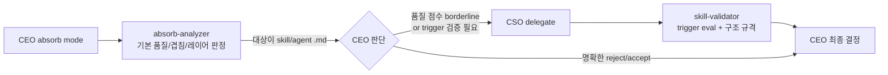

# skill-validator-absorption - 기획서

## Executive Summary

| Perspective | Content |
|-------------|---------|
| **Problem** | 스킬/에이전트 .md 파일의 **의미적·행동적 품질**을 측정할 수단이 없음. absorb-analyzer의 평가는 heuristic 점수뿐이며, CSO validate-plugin은 구조/배포 규격만 검사 |
| **Solution** | Anthropic `skill-creator`의 **평가 인프라만 선별 흡수**하여 CSO 하위 `skill-validator` 에이전트 신설 (absorb-analyzer는 기존 heuristic 평가 유지, 관점이 달라 중복 허용) |
| **Function/UX Effect** | 흡수·신규 스킬/에이전트 작성 시 description trigger accuracy, SKILL.md 구조 규격, 서브리소스 배치가 objective하게 검증됨 |
| **Core Value** | 품질 게이트가 자동화되어 "작성했지만 트리거 안 되는 스킬" / "progressive disclosure 위반 에이전트"를 조기 차단 |

---

## Context Anchor

| Key | Value |
|-----|-------|
| **WHY** | 사용자 요청: absorb 과정에서 agent/skill .md 검증·평가 자동화 필요. 현재 absorb-analyzer가 점수만 산출하고 실제 trigger eval/구조 규격 검증은 수작업 |
| **WHO** | CEO(흡수 결정), CSO(품질 게이트), 스킬 작성자(CTO/CPO) |
| **RISK** | skill-creator 통째 흡수 시 VAIS phase 모델과 맞지 않는 eval 루프 인프라(iteration 디렉토리, 서브에이전트 spawning, eval-viewer 서버)까지 유입되어 부채 증가 |
| **SUCCESS** | ① CSO skill-validator 에이전트가 `/vais cso` 플로우에서 스킬/에이전트 .md 검증 수행 ② scripts/skill-eval/ 2개 스크립트(quick_validate, improve_description) 동작 ③ absorb-analyzer는 변경 없음 (기존 heuristic 평가 유지) |
| **SCOPE** | **선별 흡수만**. eval-viewer, run_loop, aggregate_benchmark는 scope 제외 |

---

## 0. 사용자 아이디어에 대한 비판적 검토 (Critical Review)

사용자 원안: *"skill-creator를 skill-validator로 CEO 아래에 흡수하여 CEO → absorb-analyzer → skill-validator 체인 구성"*

### 🔴 이슈 1: 도메인 불일치 — skill-creator는 validator가 아님

`references/skills/skills/skill-creator/` 실측:

| 구성 요소 | 실제 역할 | validator와의 관계 |
|-----------|-----------|---------------------|
| `SKILL.md` (486줄) | skill 작성 가이드 + eval 루프 워크플로우 | 작성 가이드 부분은 이미 `skills/vais/utils/skill-creator.md`로 흡수 완료 (`ceo_skill-creator-utility.plan.md` 참조) |
| `agents/analyzer.md` | 블라인드 비교 승자 post-hoc 분석 | A/B eval 기반. VAIS 단일 흐름에 부적합 |
| `agents/comparator.md` | 블라인드 A/B 비교 심판 | eval-viewer와 결합된 UI 의존 |
| `agents/grader.md` | assertion 채점 | **선별 흡수 가치 있음** |
| `scripts/quick_validate.py` | SKILL.md frontmatter/구조 quick check | **선별 흡수 가치 있음** |
| `scripts/improve_description.py` | description trigger accuracy train/test 최적화 | **선별 흡수 가치 있음** |
| `scripts/run_eval.py`, `run_loop.py`, `aggregate_benchmark.py` | iteration 기반 eval 루프 | VAIS phase 모델과 충돌 — 제외 |
| `eval-viewer/` | 로컬 HTML 뷰어 서버 | VAIS 범위 밖 — 제외 |

**결론**: skill-creator 전체의 ~30%만 validation 도메인. 통째 흡수 = 부채 유입.

### 🔴 이슈 2: CEO 하위 배치는 레이어 위반

CLAUDE.md 및 현재 구조 원칙:
- CEO = 전략 오케스트레이터 (Product Owner). 하위 agent는 CEO 고유 업무(absorb, retro)만 둠
- 품질/보안 검증은 **CSO 도메인** — 이미 `cso/validate-plugin.md`, `cso/code-review.md`, `cso/security-auditor.md` 존재
- skill-validator를 CEO 하위에 두면 CSO와 역할 경합 + "전략 레이어에 실행 에이전트" 위반

**결론**: `agents/cso/skill-validator.md`로 배치. CEO는 absorb-analyzer 호출 후 필요 시 CSO에 delegate.

### 🔴 이슈 3: absorb-analyzer와 겉보기 중복 — 실제로는 관점 차이

`agents/ceo/absorb-analyzer.md` **142~161줄**에 이미 다음이 존재:
- Description 최적화 평가 (3인칭, what+when, 1024자, trigger 키워드)
- 스킬 구조 검증 (500줄, progressive disclosure)
- Eval 방법론 초안 (20 쿼리, 60/40 train/test, 5회 반복)

처음엔 중복 제거를 위해 공유 참조 파일을 두려 했으나, **두 에이전트의 평가 관점이 다름**을 확인:

| 에이전트 | 평가 시점 | 평가 방식 |
|----------|-----------|-----------|
| absorb-analyzer | 흡수 여부 판단 시점 | Heuristic 점수 (100점 만점) — 읽기만 하고 실행 안 함 |
| skill-validator (신규) | 작성/개선 품질 게이트 | `improve_description.py` 실제 실행 — API 호출 + train/test |

**결론**: 중복 제거 강행 금지. 각 agent 파일 안에 필요한 내용을 직접 서술. absorb-analyzer는 **변경하지 않음**.

> ⚠️ 애초에 `skills/vais/references/` 서브폴더는 존재하지도 않으며, repo root `/references/`는 gitignored 외부 인박스 용도라 혼동 소지가 있어 공유 참조 파일 접근 자체를 폐기.

### 🔴 이슈 4: 기존 `ceo_skill-creator-utility.plan.md`와의 관계

이전 plan은 **작성 가이드 텍스트**를 `skills/vais/utils/skill-creator.md`에 유틸리티로 흡수 완료. 본 plan은 **평가 인프라(scripts + 검증 방법론)**를 흡수하는 **상보적** 작업. 중복 아님.

---

## 1. 최종 설계 (Revised Proposal)

### 1.1 흡수 체인 재설계 — **조건부 delegation**



**원칙**: hard pipeline 아님. CEO가 absorb-analyzer 결과를 보고 **필요할 때만** CSO에 위임. 단순 텍스트 문서 흡수는 skill-validator 불필요.

### 1.2 산출물 목록

| # | 파일 | 유형 | 설명 |
|---|------|------|------|
| 1 | `agents/cso/skill-validator.md` | 신규 | CSO 하위 validator 에이전트 — 구조 검증 + heuristic description 평가 + 수정안 제안 |
| 2 | `scripts/skill_eval/quick_validate.py` | 선별 흡수 | SKILL.md/agent .md 구조·frontmatter 검증 |
| 3 | `scripts/skill_eval/utils.py` | 선별 흡수 | frontmatter 파서 (quick_validate 의존) |
| 4 | `agents/cso/cso.md` | 수정 | Gate B에 skill-validator delegation 조건 추가 |
| 5 | `docs/absorption-ledger.jsonl` | 기록 | 본 흡수 이벤트 추가 (source: `references/skills/skills/skill-creator/`, decision: `partial-merge`) |

> **`improve_description.py` 제외** — eval 루프 없이 단독 실행 불가하고, heuristic 규칙으로 agent 내부에서 처리 가능. `run_eval.py`도 함께 제외하여 claude CLI 의존성 제거.
> `agents/ceo/absorb-analyzer.md`는 **변경 없음**.

### 1.3 scripts 선별 흡수 근거

| 원본 script | 흡수 여부 | 사유 |
|-------------|-----------|------|
| `quick_validate.py` | ✅ | 독립 실행, 외부 의존 없음 (PyYAML만), VAIS SKILL.md 규격과 호환 |
| `utils.py` | ✅ | quick_validate 의존성 |
| `improve_description.py` | ❌ | `run_eval.py` 없이 단독 실행 불가 (eval_results JSON 필수 입력). heuristic 평가로 대체 |
| `run_eval.py` | ❌ | claude CLI 서브프로세스 반복 호출 (쿼리 20개 × 3회 = 60회) — 단순 검증 범위 초과 |
| `run_loop.py` | ❌ | iteration 디렉토리 관리 (workspace/iteration-N/) — VAIS docs/ 구조와 이원화 |
| `aggregate_benchmark.py` | ❌ | run_eval 결과 의존 |
| `generate_report.py` | ❌ | eval-viewer 전용 |
| `package_skill.py` | ❌ | distribution용, 현재 VAIS는 marketplace 자체 빌드 사용 |

### 1.4 agents/cso/skill-validator.md 핵심 구조 (초안)

```yaml
---
name: skill-validator
version: 1.0.0
description: |
  Validates skill and agent markdown files for description trigger accuracy,
  SKILL.md structural compliance, and progressive disclosure adherence.
  Use when: delegated by CSO for semantic/behavioral quality check of new or
  absorbed skills/agents (distinct from validate-plugin's deployment structure check).
model: sonnet
tools: [Read, Glob, Grep, Bash, TodoWrite]
---
```

**검증 단계**:
1. `quick_validate.py` 실행 → frontmatter/구조 quick pass
2. `skills/vais/references/skill-eval.md` 참조 → description 규격 체크 (3인칭, what+when, 1024자)
3. Progressive disclosure 위반 탐지 (SKILL.md > 500줄 or 2단계 이상 깊이)
4. (선택) `improve_description.py` 실행 — description borderline일 때만
5. 결과 리포트 → CSO → CEO

### 1.5 기존 CSO `validate-plugin`과의 구분

| 에이전트 | 검증 대상 | 검증 관점 |
|----------|-----------|-----------|
| `cso/validate-plugin` | 플러그인 전체 (package.json, plugin.json, 전체 SKILL.md 목록) | **배포 규격** — 마켓플레이스 publishing readiness |
| `cso/skill-validator` (신규) | 개별 skill/agent .md 파일 | **의미·행동 품질** — triggering accuracy, 가독성, progressive disclosure |

중복 없음. validate-plugin은 publishing 게이트, skill-validator는 작성/흡수 게이트.

---

## 2. MVP 범위

### 포함 (Must)
- [x] agents/cso/skill-validator.md 작성 (구조 검증 + heuristic description 평가 + 수정안 제안)
- [x] scripts/skill_eval/ 2개 파일 이식 (quick_validate, utils)
- [x] cso.md Gate B delegation 조건 추가
- [x] absorption-ledger 기록

### 제외 (Won't)
- ❌ eval-viewer, run_eval, run_loop, aggregate_benchmark, improve_description 인프라
- ❌ blind comparison (comparator.md) 방법론, A/B 비교 일체
- ❌ claude CLI 서브프로세스 기반 trigger eval (비용·시간 부담 + 복잡도 증가)
- ❌ Before/After polishing 비교 기능 — 사용자 결정으로 범위 축소
- ❌ CEO 하위 신규 에이전트 신설 (레이어 위반)
- ❌ 기존 `skills/vais/utils/skill-creator.md` 수정 (작성 가이드는 그대로)
- ❌ `skills/vais/references/` 등 신규 공유 참조 폴더 생성 — `/references/`와 혼동 방지
- ❌ `agents/ceo/absorb-analyzer.md` 수정 — 관점이 다른 중복은 허용

---

## 3. 실행 단계 (Do Phase Preview)

| 순서 | 작업 | 담당 | 결과물 |
|------|------|------|--------|
| 1 | scripts/skill_eval/ 2파일 이식 (quick_validate, utils) | CTO/dev-backend | 스크립트 동작 검증 |
| 2 | agents/cso/skill-validator.md 작성 (heuristic 규칙 + 수정안 제안 워크플로우) | CSO | 에이전트 frontmatter + 워크플로우 |
| 3 | cso.md Gate B 업데이트 | CSO | delegation 조건 추가 |
| 4 | validate-plugin.js 재실행 | QA | 플러그인 구조 검증 통과 |
| 5 | absorption-ledger 기록 | CEO | 흡수 완료 로그 |

---

## 4. 리스크 & 대응

| 리스크 | 영향 | 대응 |
|--------|------|------|
| skill-validator vs validate-plugin 혼동 | 중 | 두 agent 상단에 "구분" 섹션 명시 + cso.md에서 호출 시점 명확화 |
| absorb-analyzer와 skill-validator의 description 평가 로직 분기 | 낮 | 관점이 다른 의도적 중복 — absorption-ledger 주석에 명시 |
| Heuristic 평가라 실제 trigger accuracy는 측정 안 됨 | 낮 | 규격 위반(3인칭 아님, >1024자, what+when 누락)만 정확히 잡는 것으로 충분. 정밀 측정 필요해지면 향후 재흡수 가능 |
| 선별 흡수로 인해 향후 전체 eval 루프 필요 시 재흡수 부담 | 낮 | absorption-ledger에 "partial-merge, excluded: [improve_description, run_eval, ...]" 명시 |

---

## 5. 성공 기준

1. ✅ `agents/cso/skill-validator.md`가 CSO에서 delegation 가능
2. ✅ `python -m scripts.skill_eval.quick_validate skills/vais/SKILL.md` 정상 동작
3. ✅ `python -m scripts.skill_eval.quick_validate agents/cso/skill-validator.md` 단일 agent .md 검증 정상 동작
4. ✅ skill-validator가 규격 위반 시 **구체적 수정안**(before/after 문자열)을 리포트에 포함
5. ✅ `node scripts/vais-validate-plugin.js` 통과
6. ✅ docs/absorption-ledger.jsonl에 본 흡수 이벤트 기록 (partial-merge, excluded 목록 포함)

---

## 변경 이력

| version | date | change |
|---------|------|--------|
| v1.0 | 2026-04-07 | 초기 작성 — 사용자 원안 비판 검토 후 대안 설계 (CSO 배치, 선별 흡수, 공유 references) |
| v1.1 | 2026-04-07 | 공유 references 폴더 계획 폐기 — `/references/`(gitignored 외부 인박스)와 혼동 소지. 각 agent가 관점별로 자체 서술, absorb-analyzer 변경 제외 |
| v1.2 | 2026-04-07 | 범위 축소 — `improve_description.py` 제외 (eval_results 의존으로 단독 실행 불가), A/B polishing 비교 기능 제외. skill-validator는 구조 검증 + heuristic description 평가 + 수정안 제안만 수행. 흡수 파일 3개→2개 |
