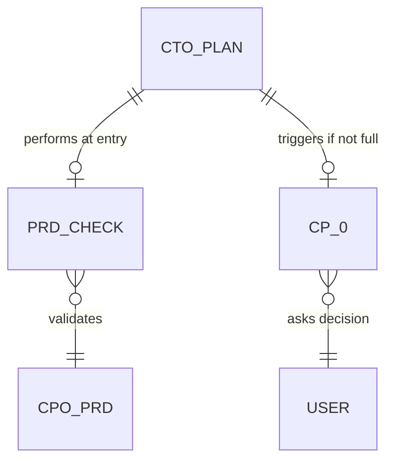

# cto-plan-prd-consumption - 기획서

> ⛔ **Plan 단계 범위**: 이 문서는 분석과 결정만 기록합니다. 프로덕트 파일 생성·수정은 Do 단계에서 수행하세요.

## Executive Summary

| Perspective | Content |
|-------------|---------|
| **Problem** | CTO plan과 CPO plan/do(PRD)가 "요구사항 탐색"을 중복 수행한다. CPO 선행 시 CTO가 요구사항을 다시 캐는 비효율, CTO 단독 진입 시 PRD 부재가 조용히 무시되는 일관성 공백이 동시에 존재한다. |
| **Solution** | CTO plan을 "PRD 소비형"으로 재정의한다. plan 진입 시 PRD 존재/완성도를 검사하고, 없거나 부실하면 CP-0 체크포인트로 4가지 선택지를 사용자에게 제시한다. |
| **Function/UX Effect** | CPO→CTO 핸드오프가 매끄러워지고, CTO 단독 진입 사용자는 PRD 부재 리스크를 명시적으로 인지·결정한다. CTO plan 문서 길이가 평균 단축된다. |
| **Core Value** | 책임 분리 강화(CPO=What, CTO=How) + User Sovereignty(Rule 11) + CEO 동적 라우팅 사상과의 일관성. |

---

## Context Anchor

| Key | Value |
|-----|-------|
| **WHY** | plan 중복 + CTO 단독 진입 시 PRD 부재 무시. 기획-기술 책임 경계가 흐림. |
| **WHO** | VAIS 사용자 전체. 특히 CPO→CTO를 순차로 타는 사용자, CTO만 직접 호출하는 사용자. |
| **RISK** | (1) CP-0 추가로 CTO 단독 사용자가 마찰을 느낄 수 있음 (2) "PRD 완성도 판정" 휴리스틱이 잘못되면 false positive로 멈춤 (3) 기존 plan 문서를 가진 피처와의 호환성 |
| **SUCCESS** | CPO 선행 피처에서 CTO plan 문서 평균 분량 30% 이상 축소, PRD 부재 시 CP-0 발동률 100%, CP-0에서 사용자 결정 후 워크플로우 중단 없이 진행 |
| **SCOPE** | `agents/cto/cto.md`의 Plan 책임 재정의 + CP-0 신설 + `templates/plan.template.md`에 PRD 입력 섹션 추가 + `vais.config.json` gate 설정 옵션 추가. CPO 측 변경은 핸드오프 컨텍스트 명시 1줄 정도. |

---

## 0. 아이디어 개요

### 아이디어 한 줄 설명
> CTO plan은 PRD가 있으면 그것을 "기술 변환"하고, 없으면 CP-0 체크포인트로 사용자에게 결정권을 넘긴다.

### 배경 (왜 필요한지)
- **현재 문제**:
  1. CPO plan/do는 PRD를 만들고, CTO plan은 다시 요구사항을 탐색한다 → 같은 문서를 두 번 생산
  2. CTO 단독 진입(`/vais cto {feature}`) 시 PRD가 없는 것이 문제로 인지되지 않음
  3. PRD가 부실/stale한 경우 어디서도 검출되지 않음
- **기존 해결책의 한계**:
  - CEO 동적 라우팅(commit `803a7cd`)이 CPO→CTO 순서를 추천하지만, CTO 직접 호출은 여전히 막지 않음
  - Mandatory phase 규칙(plan→design→do→qa)은 같은 C-Level 내부에서만 작동, C-Level 간 의존성은 강제 안 함
- **이 아이디어가 필요한 이유**:
  - 책임 경계 명확화: CPO=What/Why, CTO=How
  - 중복 작업 제거 → 사용자 시간 절약
  - User Sovereignty: AI가 멋대로 CPO를 트리거하지 않고 사용자에게 묻기

### 타겟 사용자
- **주요 사용자**: VAIS로 풀 워크플로우(CPO→CTO→…)를 타는 사용자
- **보조 사용자**: CTO만 직접 호출하는 기술 중심 사용자
- **현재 Pain Point**:
  - "CPO에서 PRD를 만들었는데 CTO plan에서 또 같은 질문을 받음"
  - "PRD 없이 CTO를 돌렸더니 CTO가 짐작으로 plan을 짰음"

### 사용자 시나리오

**시나리오 A — CPO 선행 케이스**
1. 상황: 사용자가 `/vais cpo plan login`, `/vais cpo do login`으로 PRD를 만들었다
2. 행동: `/vais cto plan login` 실행
3. 결과: CTO가 PRD를 자동 로드하고, 요구사항 탐색을 생략한 채 기술 변환 plan만 작성. plan 문서가 짧고 PRD 참조 섹션을 가짐

**시나리오 B — CTO 단독 진입, PRD 없음**
1. 상황: 사용자가 PRD 없이 바로 `/vais cto plan dashboard-realtime-chart` 실행
2. 행동: CTO가 `docs/03-do/cpo_dashboard-realtime-chart.do.md` 부재를 감지 → CP-0 발동
3. 결과: 사용자가 4개 선택지(A: CPO 먼저 / B: 강행 / C: 직접 PRD 제공 / D: 중단) 중 선택. 선택에 따라 분기 진행

**시나리오 C — PRD 부실/stale**
1. 상황: PRD 파일은 있지만 8개 섹션 중 3개만 채워짐
2. 행동: CTO가 완성도 검사 → 임계치 미달 → CP-0 발동
3. 결과: 사용자에게 부실 항목을 보여주고 CPO 보강 vs 강행 선택받음

## 0.5 MVP 범위

### 핵심 기능 브레인스토밍 (중요도/난이도 매트릭스)

| 기능 | 중요도 (1-5) | 난이도 (1-5) | MVP 포함 |
|------|------------|------------|---------|
| F1. CTO plan PRD 자동 로드 | 5 | 2 | Y |
| F2. PRD 존재 검사 | 5 | 1 | Y |
| F3. CP-0 체크포인트 (4 옵션) | 5 | 3 | Y |
| F4. PRD 완성도 휴리스틱 검증 | 4 | 4 | Y (간단 버전) |
| F5. CEO 핸드오프 컨텍스트 (`prd_skip_reason`) | 3 | 3 | N (V2) |
| F6. `vais.config.json`의 `requirePrd` 옵션 | 3 | 2 | Y |
| F7. CTO plan 템플릿 PRD 참조 섹션 | 4 | 1 | Y |
| F8. PRD 휴리스틱 권장(피처명 모호도 분석) | 3 | 4 | N (V2) |

### MVP 포함 기능
- F1: PRD 파일 존재 시 자동 Read하여 plan 입력으로 사용
- F2: `docs/03-do/cpo_{feature}.do.md` 존재 여부 검사
- F3: CP-0 — 4개 선택지 (CPO 먼저 / 강행 / 직접 제공 / 중단)
- F4: 완성도 검사 — 8개 섹션 헤더 grep으로 카운트, ≥6개면 통과 (간단 휴리스틱)
- F6: `gates.cto.plan.requirePrd: "ask" | "strict" | "skip"` (기본 `"ask"`)
- F7: 템플릿에 "0.7 PRD 입력" 섹션 추가 — PRD 경로/요약/부재 시 사유

### 이후 버전으로 미룰 기능
- F5: CEO 핸드오프 메모리 컨텍스트 (`lib/memory.js` 변경 필요, 별도 작업)
- F8: 피처명 의미 분석 기반 자동 권장 (LLM 호출 추가, 비용)

## 0.6 경쟁/참고 분석

| 서비스 | 유사 기능 | 장점 | 단점 | 차별화 포인트 |
|-------|---------|------|------|------------|
| Linear/Jira PRD 템플릿 | 티켓에 PRD 링크 강제 | 강제력 강함 | 워크플로우 외부에 의존 | VAIS는 파일 시스템 단일 진실원 |
| GitHub Issue Forms | 체크리스트 강제 | 사용자 친화 | 부분 입력 검증 약함 | CP-0 4 옵션으로 명시적 결정 유도 |
| Anthropic Skill chaining | skill 간 의존 자동 처리 | 자동 | 사용자 결정권 약함 | User Sovereignty 우선 |

## 1. 개요

### 1.1 기능 설명
CTO plan 단계 진입 시 CPO PRD(`docs/03-do/cpo_{feature}.do.md`) 존재와 완성도를 검사하고, 부재/부실 시 CP-0 체크포인트로 사용자에게 4가지 선택지를 제시한다. PRD가 충분하면 자동 로드하여 plan 작성 시 입력으로 사용한다.

### 1.2 목적
- **해결하려는 문제**: CTO plan과 CPO plan/do의 요구사항 탐색 중복
- **기대 효과**: CPO→CTO 핸드오프 매끄러움, CTO 단독 사용자에게 명시적 결정 제공
- **대상 사용자**: 모든 VAIS 사용자

## 2. Plan-Plus 검증

### 2.1 의도 발견
> 이 기능이 정말 해결하려는 근본 문제는 무엇인가?

**중복 작업이 아니라 책임 경계 흐림이 본질이다.** CPO와 CTO가 같은 layer(요구사항)에서 일하면 둘 중 하나는 잉여다. CTO plan을 "PRD 소비형"으로 정의하면 책임 경계가 명확해지고 중복은 자동으로 사라진다.

### 2.2 대안 탐색

| # | 대안 | 장점 | 단점 | 채택 여부 |
|---|------|------|------|----------|
| 1 | CTO plan 제거 (사용자 안1) | 가장 단순, 중복 완전 제거 | Mandatory phase 위반, CTO 단독 진입 불가, 기술 타당성 검증 공백 | ❌ |
| 2 | CTO plan 경량화 + CP-0 (B안) | 책임 경계 명확, User Sovereignty 유지, CEO 라우팅과 호환 | CP-0 추가로 마찰 약간 증가 | ✅ |
| 3 | 훅으로 PRD 부재 사전 차단 | 강제력 강함 | 완성도 판정 못함, 컨벤션 깨짐, 두 진실원 | ❌ |
| 4 | CTO가 CPO를 직접 호출 | 자동화 매끄러움 | CEO 라우팅 무력화, User Sovereignty 위반, 무거운 작업 무단 트리거 | ❌ |
| 5 | CPO plan을 통합 plan으로 격상 | 단일 plan | 책임 경계 더 흐려짐 | ❌ |

**채택**: 대안 2 (B안 + CP-0)

### 2.3 YAGNI 리뷰
- [x] 현재 필요한 기능만 포함했는가? — 완성도 휴리스틱은 간단 버전(섹션 헤더 카운트)만
- [x] 미래 요구사항을 위한 과잉 설계가 없는가? — F5(메모리 컨텍스트), F8(LLM 권장)은 V2로 미룸
- [x] 제거할 수 있는 기능이 있는가?
- 제거 후보: F4 완성도 검사도 V2로 미룰 수 있음(존재 검사만 V1) → CP-1에서 사용자가 범위 결정

## 3. 사용자 스토리

| # | As a... | I want to... | So that... |
|---|---------|-------------|------------|
| 1 | CPO→CTO 풀 워크플로우 사용자 | CTO plan이 PRD를 자동으로 읽고 중복 질문을 안 하기 | 같은 정보를 두 번 입력하지 않을 수 있다 |
| 2 | CTO만 직접 호출하는 사용자 | PRD가 없으면 명시적으로 알림받고 결정하기 | 모르는 사이에 짐작 plan이 만들어지지 않는다 |
| 3 | PRD가 머릿속에만 있는 사용자 | 직접 PRD 파일을 제공하는 옵션 | CPO 풀 파이프라인을 안 돌려도 된다 |
| 4 | 시간 압박이 있는 사용자 | 강행 옵션 | 잘 정의된 피처는 빠르게 진행할 수 있다 |

## 4. 기능 요구사항

### 4.1 기능 목록

| # | 기능 | 설명 | 관련 화면 | 관련 파일 | 우선순위 | 구현 상태 |
|---|------|------|----------|----------|---------|----------|
| 1 | PRD 파일 존재 검사 | plan 진입 시 `docs/03-do/cpo_{feature}.do.md` 존재 확인 | - | `agents/cto/cto.md` | Must | 미구현 |
| 2 | PRD 완성도 휴리스틱 | 8개 섹션 헤더 카운트 ≥6 시 통과 | - | `agents/cto/cto.md` | Must | 미구현 |
| 3 | PRD 자동 로드 | 통과 시 Read 후 plan 입력으로 사용 | - | `agents/cto/cto.md` | Must | 미구현 |
| 4 | CP-0 체크포인트 | 4개 선택지 AskUserQuestion | - | `agents/cto/cto.md` | Must | 미구현 |
| 5 | Plan 템플릿 PRD 참조 섹션 | "0.7 PRD 입력" 신설 | - | `templates/plan.template.md` | Must | 미구현 |
| 6 | requirePrd config 옵션 | `gates.cto.plan.requirePrd` 추가 | - | `vais.config.json` | Must | 미구현 |
| 7 | CPO 핸드오프 안내 | CPO 완료 시 "다음: /vais cto plan {feature}" 안내 | - | `agents/cpo/cpo.md` | Nice | 미구현 |
| 8 | CP 출력 템플릿 표 펜스 밖으로 분리 | CP-1/CP-D/CP-2/CP-Q 모든 표가 마크다운 렌더링되도록 ``` 밖으로 이동 | - | `agents/cto/cto.md` | Must | 미구현 |
| 9 | AskUserQuestion 도구 호출 강제 | 텍스트 출력으로 CP 갈음 금지, 도구 호출 필수 명시 | - | `agents/cto/cto.md` | Must | 미구현 |

### 4.2 기능 상세

#### F1. PRD 파일 존재 검사
- **트리거**: CTO plan phase 진입 직후, 요구사항 탐색 전
- **정상 흐름**: Glob/Read로 `docs/03-do/cpo_{feature}.do.md` 확인 → 존재 시 F2로 → 미존재 시 F4로
- **예외 흐름**: docs 폴더 자체가 없으면 미존재로 간주
- **산출물**: 내부 boolean `prdPresent`

#### F2. PRD 완성도 휴리스틱
- **트리거**: F1 통과 후
- **정상 흐름**: PRD 파일 Read → `## ` 헤더 grep → 8개 표준 섹션 중 N개 매칭 → N≥6 통과
- **예외 흐름**: N<6 → "부실"로 분류, F4로
- **산출물**: 내부 enum `prdQuality: full | partial | missing`
- **8개 표준 섹션**: 1.개요, 2.사용자 스토리, 3.기능 요구사항, 4.정책, 5.비기능 요구사항, 6.Success Criteria, 7.Impact Analysis, 8.기술 스택

#### F3. PRD 자동 로드
- **트리거**: `prdQuality = full`
- **정상 흐름**: PRD 내용을 plan 컨텍스트에 주입 → CTO plan은 "기술 변환"만 수행 (요구사항 탐색 생략)
- **산출물**: plan 문서의 "0.7 PRD 입력" 섹션에 PRD 경로 + 핵심 결정 3줄 요약

#### F4. CP-0 체크포인트
- **트리거**: `prdQuality ∈ {partial, missing}` 또는 `requirePrd = "strict"` + `partial`
- **정상 흐름**: 부재/부실 사유 출력 → AskUserQuestion 4 옵션
  - A. CPO 먼저 실행 (`/vais cpo {feature}` 안내 + CTO 자동 종료)
  - B. PRD 없이 강행 (CTO 기존 plan 로직 진행, plan 문서에 "강행 모드" 표시)
  - C. 사용자가 직접 PRD 제공 (CTO 종료, 사용자가 파일 작성 후 재진입)
  - D. 중단
- **예외 흐름**: `requirePrd = "skip"` 시 CP-0 자체 생략, 자동 강행
- **산출물**: 사용자 결정에 따른 분기

#### F5. Plan 템플릿 "0.7 PRD 입력" 섹션
- **트리거**: 템플릿 사용 시 항상 포함
- **포맷**:
  ```markdown
  ## 0.7 PRD 입력
  
  | Key | Value |
  |-----|-------|
  | PRD 경로 | `docs/03-do/cpo_{feature}.do.md` 또는 "없음 (강행 모드)" |
  | 완성도 | full / partial / missing |
  | 핵심 결정 1 | (PRD에서 추출) |
  | 핵심 결정 2 | |
  | 핵심 결정 3 | |
  ```

#### F6. requirePrd config 옵션
- **위치**: `vais.config.json > gates.cto.plan.requirePrd`
- **값**: `"ask"` (기본, CP-0 발동) / `"strict"` (PRD 없으면 자동 거부) / `"skip"` (CP-0 생략 자동 강행)

## 5. 정책 정의

### 5.1 비즈니스 규칙

| # | 정책 | 규칙 | 비고 |
|---|------|------|------|
| 1 | PRD 검사 시점 | CTO plan phase 진입 직후, 다른 작업 전 | CP-1보다 먼저 |
| 2 | 완성도 임계치 | 8개 표준 섹션 중 6개 이상 헤더 존재 | 휴리스틱, V2에서 정교화 |
| 3 | CP-0 기본 동작 | `requirePrd = "ask"` | 사용자가 명시적 변경 가능 |
| 4 | 강행 모드 표식 | plan 문서 0.7 섹션에 "강행 모드" 명기 | 추적 가능성 |
| 5 | CPO 자동 호출 금지 | A 옵션은 안내만, CTO가 CPO를 직접 호출하지 않음 | User Sovereignty |
| 6 | 기존 피처 호환성 | 기존 plan 문서가 있으면 CP-0 생략, plan 재실행 모드로 진입 | breaking change 방지 |

### 5.2 권한 정책
이 피처는 시스템 내부 동작 변경이므로 권한 정책은 해당 없음.

### 5.3 유효성 검증 규칙

| 필드 | 타입 | 필수 | 규칙 | 에러 메시지 |
|------|------|------|------|-----------|
| feature | string | Y | kebab-case | "피처명은 kebab-case여야 합니다" |
| requirePrd | enum | N | ask/strict/skip | "requirePrd는 ask/strict/skip 중 하나여야 합니다" |

## 6. 비기능 요구사항

| 항목 | 요구사항 | 기준 |
|------|---------|------|
| 성능 | PRD 검사로 plan 진입 지연 최소 | <500ms (Read 1회 + grep) |
| 호환성 | 기존 plan 문서 보존 | 기존 피처 영향 0건 |
| 명시성 | 강행 모드는 plan 문서에 추적 가능 | 0.7 섹션 필수 기재 |
| 회귀 안전 | CTO 단독 워크플로우 동작 유지 | requirePrd=skip로 기존 동작 복원 가능 |

## Success Criteria

| ID | Criterion | Verification |
|----|-----------|--------------|
| SC-01 | PRD 존재 + 완성 시 CP-0 생략, plan 문서에 PRD 경로 자동 기재 | 테스트 피처로 CPO→CTO 풀 플로우 실행 → plan 문서 0.7 섹션 확인 |
| SC-02 | PRD 부재 시 CP-0가 4 옵션과 함께 발동 | `/vais cto plan {신규피처}` 실행 → AskUserQuestion 호출 확인 |
| SC-03 | CP-0 A 옵션 선택 시 CTO 종료, CPO 안내 출력 | 시뮬레이션 또는 실제 실행 |
| SC-04 | CP-0 B 옵션 선택 시 강행 모드 plan 작성, 0.7 섹션에 "강행 모드" 표시 | plan 문서 grep |
| SC-05 | requirePrd=skip 설정 시 CP-0 발동하지 않음 | config 변경 후 실행 |
| SC-06 | 기존 plan 문서를 가진 피처는 CP-0 영향 없음 | 기존 피처 5개로 회귀 테스트 |

## Impact Analysis

### Changed Resources

| Resource | Type | Change Description |
|----------|------|-------------------|
| `agents/cto/cto.md` | modify | Plan 책임 재정의 + CP-0 신설 (Checkpoint 섹션 + Context Load 섹션) |
| `templates/plan.template.md` | modify | "0.7 PRD 입력" 섹션 추가 |
| `vais.config.json` | modify | `gates.cto.plan.requirePrd` 옵션 추가 |
| `agents/cpo/cpo.md` | modify | 완료 후 핸드오프 안내에 CTO plan 경로 명시 (Nice) |
| `docs/01-plan/cto_cto-plan-prd-consumption.plan.md` | create | (이 문서) |

### Current Consumers

| Resource | Operation | Code Path | Impact |
|----------|-----------|-----------|--------|
| `agents/cto/cto.md` | Read | CTO 에이전트 호출 시 | 동작 변경: plan 진입 시 PRD 검사 단계 추가 |
| `templates/plan.template.md` | Read | CTO/CPO/기타 C-Level plan phase | 모든 plan 문서에 0.7 섹션 등장 (CTO만 채움, 다른 C-Level은 빈 섹션 또는 N/A) |
| `vais.config.json` | Read | 모든 에이전트 세션 시작 | 신규 키 추가 — 기존 키 영향 없음 |

### Verification
- [ ] 모든 consumer 확인 완료
- [ ] breaking change 없음 확인 — 기존 plan 문서, 기존 피처 동작 영향 없음
- [ ] 기본값 `requirePrd = "ask"` — 명시 안 하면 동작 변경됨, README 안내 필요

## 7. 기술 스택

이 피처는 신규 코드 작성이 거의 없는 **에이전트 프롬프트 + 템플릿 + config 변경** 작업이다.

| 영역 | 기술 | 이유 |
|------|------|------|
| 에이전트 정의 | Markdown (frontmatter + 본문) | 기존 컨벤션 |
| 템플릿 | Markdown | 기존 컨벤션 |
| 설정 | JSON | `vais.config.json` 기존 포맷 |
| 도구 호출 | Read, Glob, AskUserQuestion | 에이전트 내장 |

### 7.1 UI 컴포넌트 라이브러리
해당 없음 (UI 없음).

## 8. 화면 목록 (예상)

해당 없음 (CLI 워크플로우 변경).

CP-0 출력 예시는 텍스트 블록으로 정의:

```
──────────────────────────────────────
⚠️ PRD 검사 결과
──────────────────────────────────────
📂 기대 경로: docs/03-do/cpo_{feature}.do.md
📊 상태: missing | partial({N}/8 섹션)
💡 CTO plan은 PRD를 입력으로 동작하도록 설계되어 있습니다.

[CP-0] 어떻게 진행할까요?

A. CPO 먼저 실행 (권장)
   → 종료 후 `/vais cpo {feature}` 실행
   → 비용: pm-* 서브 에이전트, 약 N분
B. PRD 없이 CTO plan 강행
   → 피처명 + 코드베이스만으로 plan 작성
   → 리스크: 요구사항 가정 오류 가능성
C. 사용자가 직접 PRD 제공
   → docs/03-do/cpo_{feature}.do.md 작성 후 CTO 재진입
D. 중단
──────────────────────────────────────
```

## 데이터 모델 개요

### 엔티티 목록

해당 없음 (DB 스키마 변경 없음). 다만 내부 상태 모델:

| 엔티티 | 설명 | 주요 필드 | 관계 |
|-------|------|---------|------|
| PRDCheckResult | CTO plan 진입 시 검사 결과 | prdPath, exists, sectionCount, quality(full/partial/missing) | - |

### ER 다이어그램



## API 엔드포인트 개요

해당 없음 (HTTP API 없음). 에이전트 내부 동작이므로 "Agent Interface"로 정의:

| Method | Path | Description | Auth |
|--------|------|-------------|------|
| (internal) | `cto.plan.checkPRD(feature)` | PRD 존재/완성도 검사 | N |
| (internal) | `cto.plan.loadPRD(feature)` | PRD Read 후 컨텍스트 주입 | N |
| (internal) | `cto.plan.runCP0()` | AskUserQuestion 4 옵션 | N |

## 9. 일정 (예상)

| 단계 | 산출물 |
|------|--------|
| 기획 | 이 plan 문서 |
| 설계 | `docs/02-design/cto_cto-plan-prd-consumption.design.md` — CP-0 텍스트 정확한 워딩, 에이전트 지침 위치, config 스키마 |
| Do | `agents/cto/cto.md` 수정, `templates/plan.template.md` 수정, `vais.config.json` 수정, (선택) `agents/cpo/cpo.md` 수정 |
| QA | 회귀 테스트 (기존 피처 5개), 신규 시나리오 3개 검증 |
| Report | `docs/05-report/cto_cto-plan-prd-consumption.report.md` |

> 다음 단계: `/vais cto design cto-plan-prd-consumption`

---

## 변경 이력

| version | date | change |
|---------|------|--------|
| v1.0 | 2026-04-07 | 초기 작성 — B안 + CP-0 4 옵션 채택 |
| v1.1 | 2026-04-07 | F8, F9 추가 — CP 출력 표 펜스 밖 분리 + AskUserQuestion 도구 호출 강제 (실행 버그 반영) |
