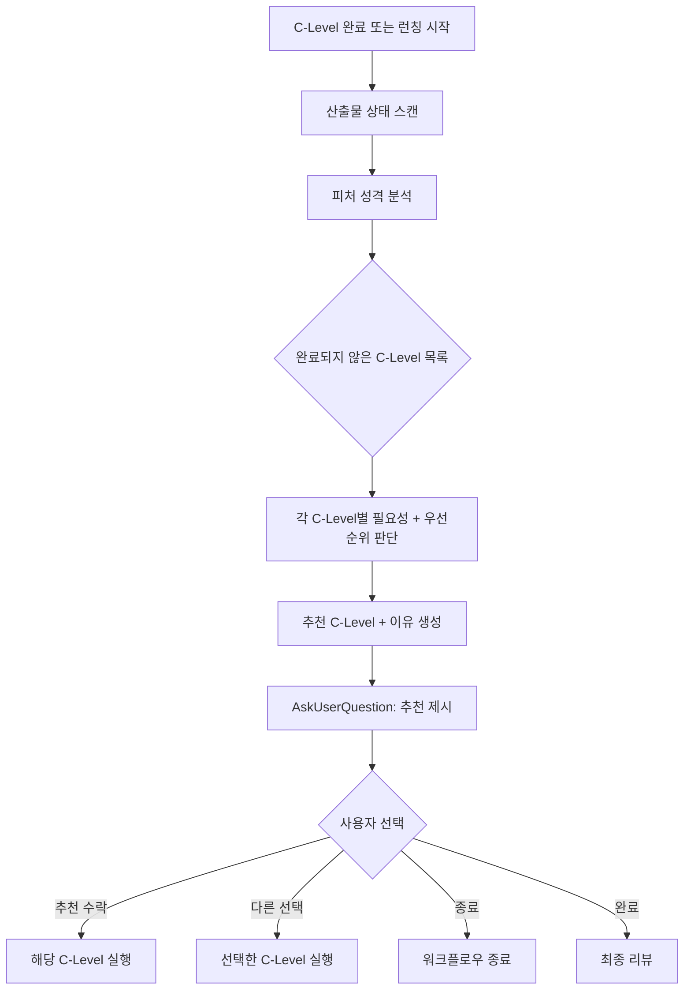
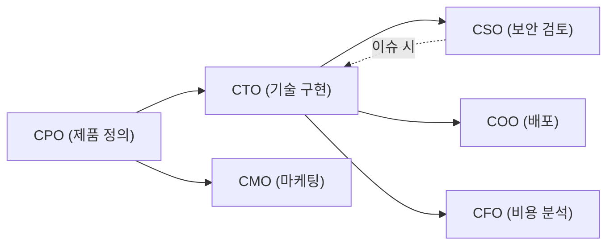

# ceo-dynamic-routing - 설계

> :no_entry: **Design 단계 범위**: 이 문서는 설계 결정만 기록합니다. 프로덕트 파일 생성·수정은 Do 단계에서 수행하세요.
> 참조 문서: `docs/01-plan/cto_ceo-dynamic-routing.plan.md`

## Context Anchor

| Key | Value |
|-----|-------|
| **WHY** | 하드코딩 파이프라인은 피처 성격 무관하게 동일 순서 강제 → 비효율 |
| **WHO** | VAIS Code 사용자 전체 |
| **RISK** | CEO 판단 품질, 기존 호환성 |
| **SUCCESS** | CEO가 맥락 기반 추천 + 사용자 승인/수정 가능 |
| **SCOPE** | CEO 라우팅 로직 + C-Level 완료 후 추천 트리거 |

---

## Architecture Options

### Option A — Minimal Changes
CEO 에이전트(`agents/ceo/ceo.md`)의 서비스 런칭 섹션에서 하드코딩 순서만 동적 판단 텍스트로 교체. C-Level phase 파일은 변경하지 않음. `vais.config.json`의 `launchPipeline.order`는 유지하되 "참고용"으로 표시.

### Option B — Clean Architecture
CEO 에이전트에 완전한 판단 프레임워크 추가. `vais.config.json`에 피처 성격 분류 체계 + 각 성격별 추천 가중치 행렬을 JSON으로 정의. 각 C-Level phase 파일에 독립적인 CEO 추천 로직 삽입.

### Option C — Pragmatic Balance
CEO 에이전트에 판단 프롬프트 추가 + `vais.config.json` 구조 간소화 + C-Level phase 파일 아웃로에 CEO 추천 트리거 추가. config에는 판단 기준만 선언하고, 실제 판단은 CEO AI에게 위임.

### Comparison

| 기준 | A: Minimal | B: Clean | C: Pragmatic |
|------|:----------:|:--------:|:------------:|
| 복잡도 | 낮음 | 높음 | 중간 |
| 유지보수 | 낮음 (개별 호출 미지원) | 높음 (config 복잡) | 중간 |
| 구현 속도 | 빠름 | 느림 | 중간 |
| 리스크 | 중간 (개별 호출 누락) | 낮음 | 낮음 |
| 파일 수정 | ~2개 | ~12개 + config 대폭 변경 | ~10개 |

### Selected: Option C

**Rationale**: AI 에이전트의 판단 능력을 활용하되, config에 판단 기준을 선언적으로 제공하여 일관성 확보. C-Level phase 파일 아웃로 수정으로 개별 호출도 커버.

---

## Part 1: CEO 동적 라우팅 설계

### 1.1 판단 흐름



### 1.2 피처 성격 분석 기준

CEO가 다음 정보를 종합하여 피처 성격을 파악합니다:

| 분석 대상 | 소스 | 판단 내용 |
|----------|------|----------|
| 피처명 | feature 인자 | 도메인 힌트 (예: `security-*` → 보안 중심) |
| 사용자 요청 | 초기 컨텍스트 | 내부 도구 / 사용자 서비스 / 인프라 등 |
| 기존 산출물 | `docs/` 폴더 스캔 | 어떤 C-Level이 이미 완료했는지 |
| config 힌트 | `vais.config.json` `autoKeywords` | 키워드 기반 C-Level 매칭 |

### 1.3 추천 판단 로직 (CEO 프롬프트 내)

CEO가 다음 C-Level을 추천할 때 고려하는 우선순위:

```
1. 핸드오프 이슈가 있으면 → 해당 C-Level 최우선 (기존 메커니즘)
2. 필수 전제 조건 미충족 → 전제가 되는 C-Level (예: CTO 구현 없이 CSO 불가)
3. 피처 성격 기반 필요성 판단 → 필요한 C-Level만 추천
4. 이미 완료된 C-Level은 제외 (재실행은 사용자 명시적 선택으로만)
5. 모든 필요 C-Level이 완료되면 → "최종 리뷰" 또는 "종료" 추천
```

### 1.4 C-Level 간 의존성 맵

CEO 판단 시 참조하는 논리적 의존성:



| 의존성 | 의미 |
|--------|------|
| CPO → CTO | PRD가 있어야 구현 가능 (PRD 없으면 CTO가 자체 plan) |
| CTO → CSO | 구현물이 있어야 보안 검토 가능 |
| CTO → COO | 구현물이 있어야 배포 가능 |
| CTO → CFO | 구현 스택이 결정되어야 비용 산정 가능 |
| CPO → CMO | 제품 정의가 있어야 마케팅 전략 수립 가능 |

> 이 의존성은 **hard dependency**가 아닌 **추천 가이드**. CEO가 컨텍스트에 따라 유연하게 판단. 예: 기존 코드가 있으면 CPO 없이 바로 CTO 가능.

---

## Part 2: config 구조 변경

### 2.1 현재 구조 (제거 대상)

```json
"launchPipeline": {
  "order": ["cpo", "cto", "cso", "cmo", "coo", "cfo"],
  "reviewLoops": {
    "cso-cto": { "maxIterations": 3, "trigger": "critical > 0" }
  },
  "finalReview": { "maxIterations": 2 }
}
```

### 2.2 새 구조

```json
"launchPipeline": {
  "routing": "dynamic",
  "dependencies": {
    "cso": ["cto"],
    "coo": ["cto"],
    "cfo": ["cto"],
    "cmo": ["cpo"]
  },
  "reviewLoops": {
    "cso-cto": { "maxIterations": 3, "trigger": "critical > 0" }
  },
  "finalReview": { "maxIterations": 2 }
}
```

**변경 사항:**
- `order` 배열 → 제거
- `routing: "dynamic"` → CEO 동적 판단 모드 선언
- `dependencies` → C-Level 간 논리적 의존성 (CEO 판단 참조용)
- `reviewLoops`, `finalReview` → 기존 유지

---

## Part 3: CEO 에이전트 변경 설계

### 3.1 서비스 런칭 모드 변경

**현재**: 고정 순서 파이프라인 설명 + `CP-L2`에서 "다음 단계로 진행할까요?"
**변경 후**: 매 C-Level 완료 시 CEO가 상황 분석 후 다음 C-Level 추천

#### 추천 UX 형식 (CP-L2 변경)

```
──────────────────────────────────────
🔀 CEO 추천 — 다음 단계
──────────────────────────────────────
📊 현재 상태:
  ✅ CPO — 제품 정의 완료
  ✅ CTO — 기술 구현 완료
  ⬜ CSO, CMO, COO, CFO — 미실행

📋 피처 분석:
  - 성격: {내부 도구 / 사용자 서비스 / ...}
  - 핵심 도메인: {기술 / 마케팅 / 보안 / ...}

💡 추천: **CSO (보안 검토)**
   이유: CTO 구현 완료 후 보안 검토가 필요합니다. 내부 도구이므로 CMO는 불필요합니다.
──────────────────────────────────────

선택지:
A. CSO 보안 검토 진행
B. 다른 C-Level 선택
   - CMO (마케팅) / COO (배포) / CFO (비용 분석)
C. 최종 리뷰 — 지금까지 결과로 마무리
D. 중단
```

### 3.2 Full-Auto 모드 변경

`--auto` 모드에서도 하드코딩 순서 대신 CEO 동적 판단 사용. 단, 사용자 확인 없이 CEO가 자체 판단으로 진행.

```
현재: CPO → CTO → CSO(↺CTO) → CMO → COO → CFO 순차 실행
변경: CEO가 매 단계 판단 → 불필요한 C-Level 자동 스킵
```

### 3.3 제거 대상 섹션

| CEO 에이전트 현재 섹션 | 변경 |
|----------------------|------|
| "서비스 런칭 모드 — 전체 파이프라인" (라인 100~164) | 동적 라우팅 기반으로 전면 교체 |
| "Full-Auto 모드" (라인 512~535) | 동적 판단 기반으로 교체 |

### 3.4 유지 대상 섹션

| CEO 에이전트 현재 섹션 | 유지 이유 |
|----------------------|----------|
| 라우팅 모드 (단일 요청) | 기존 동작 그대로 유지 |
| absorb 모드 | 기존 동작 그대로 유지 |
| CSO↔CTO 반복 루프 | 핸드오프 메커니즘 유지 (동적 라우팅과 독립) |
| C-Level 위임 시 PDCA 순차 호출 규칙 | 유지 |
| 체크포인트 기반 멈춤 규칙 | 유지 |

---

## Part 4: C-Level phase 파일 아웃로 변경

### 4.1 현재 아웃로 (SKILL.md)

```
---
✅ **{action} 완료** — {피처명}

📌 **이번 작업 요약**
- {수행한 핵심 작업 1~3줄}

📍 **다음 스텝**
- `/vais {다음C레벨} {피처명}` — {설명}

💡 **참고**: {주의사항이나 팁이 있으면 한 줄}
---
```

### 4.2 변경 후 아웃로

```
---
✅ **{action} 완료** — {피처명}

📌 **이번 작업 요약**
- {수행한 핵심 작업 1~3줄}

📍 **CEO 추천**
CEO가 피처 상태와 성격을 분석하여 다음 단계를 추천합니다.

{CEO 추천 분석 결과 — Part 3.1의 추천 UX 형식}

💡 **참고**: {주의사항이나 팁이 있으면 한 줄}
---
```

### 4.3 추천 트리거 방식

각 C-Level phase 파일(`skills/vais/phases/c*.md`)의 에이전트 전달 섹션 뒤에 다음을 추가:

```markdown
## 완료 후 CEO 추천

phase 완료 후, 아웃로의 "다음 스텝" 섹션에서:

1. `docs/` 폴더를 Glob으로 스캔하여 `{role}_{feature}.*.md` 파일 존재 여부 확인
2. 현재 피처의 성격 분석 (피처명 + 컨텍스트)
3. `vais.config.json`의 `launchPipeline.dependencies`에서 의존성 확인
4. 아직 실행되지 않은 C-Level 중 다음으로 적합한 것을 추천
5. 추천 이유와 함께 AskUserQuestion으로 사용자에게 제시

선택지:
A. {추천 C-Level} 진행 — `/vais {추천c레벨} {feature}`
B. 다른 C-Level 선택
C. 현재 C-Level 다음 phase — `/vais {현재c레벨} {다음phase} {feature}`
D. 종료
```

### 4.4 수정 대상 파일 목록

| 파일 | 변경 내용 |
|------|----------|
| `skills/vais/phases/cto.md` | 완료 후 CEO 추천 섹션 추가 |
| `skills/vais/phases/cso.md` | 완료 후 CEO 추천 섹션 추가 |
| `skills/vais/phases/cpo.md` | 완료 후 CEO 추천 섹션 추가 |
| `skills/vais/phases/cmo.md` | 완료 후 CEO 추천 섹션 추가 |
| `skills/vais/phases/coo.md` | 완료 후 CEO 추천 섹션 추가 |
| `skills/vais/phases/cfo.md` | 완료 후 CEO 추천 섹션 추가 |
| `skills/vais/phases/ceo.md` | 런칭 모드에서 동적 라우팅 반영 |

---

## Part 5: SKILL.md 아웃로 템플릿 변경

`skills/vais/SKILL.md`의 완료 아웃로 템플릿을 업데이트하여 CEO 추천을 포함합니다.

### 변경 전

```
📍 **다음 스텝**
- `/vais {다음C레벨} {피처명}` — {설명}
```

### 변경 후

```
📍 **다음 스텝**
- CEO 추천을 기반으로 다음 단계를 제안합니다
- 사용자가 직접 선택할 수도 있습니다
```

---

## Session Guide

### Module Map

| Module | Files | Description |
|--------|-------|-------------|
| M1: CEO 에이전트 | `agents/ceo/ceo.md` | 동적 라우팅 판단 로직, 런칭 모드 교체, Full-Auto 교체 |
| M2: config | `vais.config.json` | `launchPipeline` 구조 변경 |
| M3: phase 파일 | `skills/vais/phases/c{to,so,po,mo,oo,fo}.md` | CEO 추천 트리거 추가 |
| M4: SKILL.md | `skills/vais/SKILL.md` | 아웃로 템플릿 업데이트 |
| M5: 문서 | `CLAUDE.md` | 파이프라인 설명 업데이트 |

### Recommended Session Plan

| Session | Modules | Description |
|---------|---------|-------------|
| Session 1 | M2 + M1 | config 변경 후 CEO 에이전트 수정 (핵심) |
| Session 2 | M3 + M4 | phase 파일 + SKILL.md 아웃로 변경 |
| Session 3 | M5 | CLAUDE.md 문서 업데이트 |

---

## 변경 이력

| version | date | change |
|---------|------|--------|
| v1.0 | 2026-04-06 | 초기 작성 — Option C (Pragmatic Balance) 채택 |
