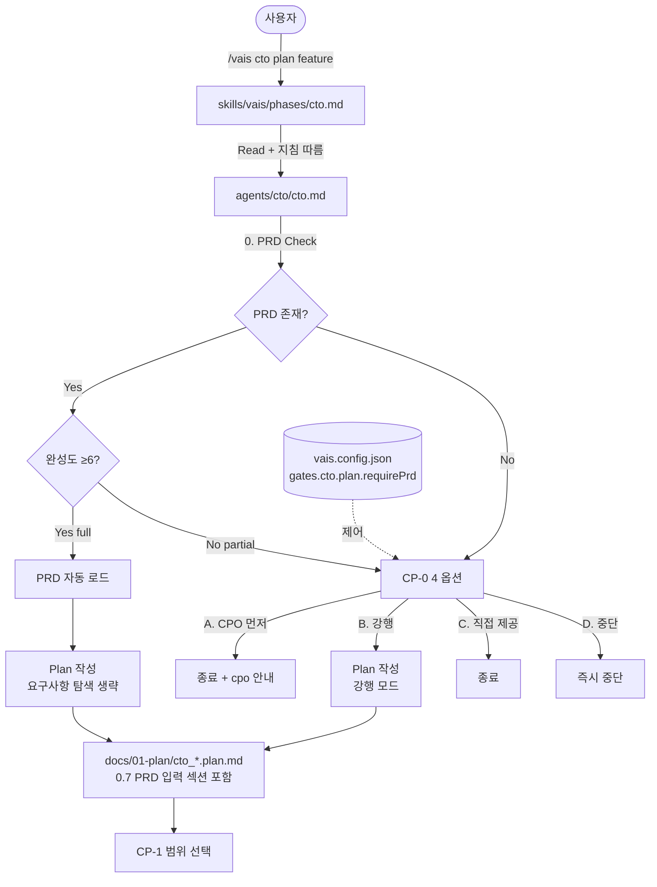

# cto-plan-prd-consumption - 설계

> ⛔ **Design 단계 범위**: 이 문서는 설계 결정만 기록합니다. 프로덕트 파일 생성·수정은 Do 단계에서 수행하세요.
> 참조 문서: `docs/01-plan/cto_cto-plan-prd-consumption.plan.md`
> 범위: **B (표준)** — F1~F6 + F7(Nice)

## Context Anchor

| Key | Value |
|-----|-------|
| **WHY** | plan 중복 + CTO 단독 진입 시 PRD 부재 침묵 무시 |
| **WHO** | CPO→CTO 풀 워크플로우 사용자, CTO 단독 사용자 |
| **RISK** | CP-0 마찰 / 완성도 휴리스틱 false positive / 기존 피처 호환성 |
| **SUCCESS** | CPO 선행 plan 분량 30%↓, PRD 부재 시 CP-0 100% 발동, 기존 피처 영향 0건 |
| **SCOPE** | `cto.md` + `plan.template.md` + `vais.config.json` + `cpo.md`(안내 1줄) |

---

## Architecture Options

### Option A — 인라인 (Minimal Changes)
CTO 에이전트 마크다운에 PRD 검사 로직을 통째로 인라인. 별도 모듈 없음.
- **장점**: 변경 파일 최소(1개), 추적 쉬움
- **단점**: 다른 C-Level이 같은 패턴 필요 시 중복 작성

### Option B — 스킬 추출 (Clean)
PRD 검사를 `skills/vais/utils/prd-check.md` 같은 재사용 스킬로 추출. CTO가 호출.
- **장점**: 향후 다른 C-Level(CSO, COO 등)도 동일 패턴 재사용
- **단점**: 본 피처 범위 초과(스킬 신설), Do 단계 작업량 2배

### Option C — 인라인 + 인터페이스 명시 (Pragmatic)
CTO 마크다운에 인라인하되, **검사 로직을 명확한 단계로 분리**해서 향후 추출 가능한 형태로 작성. config 스키마와 CP-0 텍스트를 별도 섹션으로 분리.
- **장점**: 본 피처 범위 유지 + 향후 추출 비용 낮음
- **단점**: 마크다운 길이 약간 증가

### Comparison

| 기준 | A: Minimal | B: Clean | C: Pragmatic |
|------|:----------:|:--------:|:------------:|
| 복잡도 | 낮음 | 높음 | 중간 |
| 유지보수 | 중간 | 높음 | 중간~높음 |
| 구현 속도 | 빠름 | 느림 | 빠름 |
| 리스크 | 중간 | 낮음 | 낮음 |
| 본 피처 범위 적합 | ⭕ | ❌(스코프 크리프) | ⭕ |
| 재사용성 | ❌ | ⭕ | △(향후 추출 가능) |

### Selected: Option C — Pragmatic

**Rationale**:
- B는 plan 단계에서 채택했던 "F4/F5/F8 V2 미룸" 결정과 일관 (스코프 크리프 방지)
- A는 추후 CSO/COO 등에서 같은 패턴 필요 시 복붙 발생
- C는 인라인이지만 "단계 분리 + 인터페이스 명시"로 추후 추출 비용을 낮춤

---

## 1. 컴포넌트 맵



---

## 2. CTO 에이전트 Plan 진입 로직

### 2.1 단계 정의 (인라인하되 명확히 분리)

```
Phase: cto.plan
─────────────────
Step 0  : PRD Check (NEW)
Step 0a :   - F1. Glob/Read 'docs/03-do/cpo_{feature}.do.md'
Step 0b :   - F2. 완성도 휴리스틱 (8 섹션 헤더 카운트)
Step 0c :   - 결과 분류: full | partial | missing
Step 0d :   - requirePrd 정책 적용
Step 0e :   - full + (requirePrd != strict) → Step 0f
            - partial 또는 missing → CP-0 발동 → 사용자 응답 대기
Step 0f : F3. PRD 자동 로드 (Read 후 컨텍스트 주입)

Step 1  : 요구사항 탐색 (기존)
            - PRD가 있으면: PRD 핵심 결정 추출 + 기술 변환 모드
            - PRD가 없으면(강행): 기존 로직대로 코드베이스 탐색

Step 2  : Plan 문서 작성 (기존, 단 0.7 섹션 추가)

Step 3  : CP-1 (기존)
```

### 2.2 PRD 검사 의사코드

```pseudocode
function checkPRD(feature, requirePrd):
    path = "docs/03-do/cpo_" + feature + ".do.md"
    
    if not Glob(path):
        return { exists: false, quality: "missing", path: path, sectionCount: 0 }
    
    content = Read(path)
    
    # 8개 표준 섹션 헤더 패턴
    standardHeaders = [
        "## 1. 개요" or "## 1.",
        "## 2.",  # 사용자 스토리
        "## 3.",  # 기능 요구사항
        "## 4.",  # 정책
        "## 5.",  # 비기능
        "## 6.",  # Success Criteria
        "## 7.",  # Impact Analysis
        "## 8."   # 기술 스택
    ]
    
    matched = count headers in content matching standardHeaders
    
    if matched >= 6:
        quality = "full"
    elif matched >= 1:
        quality = "partial"
    else:
        quality = "missing"
    
    return { exists: true, quality, path, sectionCount: matched }


function decideAction(check, requirePrd):
    if requirePrd == "skip":
        return "auto-load-or-force"
    
    if check.quality == "full":
        return "auto-load"
    
    if requirePrd == "strict":
        return "block"  # 자동 거부, 사용자에게 CPO 안내만
    
    # default "ask"
    return "cp-0"
```

### 2.3 정책 매트릭스

| `quality` | `requirePrd=ask` | `requirePrd=strict` | `requirePrd=skip` |
|-----------|:----------------:|:-------------------:|:-----------------:|
| `full` | 자동 로드 | 자동 로드 | 자동 로드 |
| `partial` | CP-0 | block (CPO 안내) | 강행 (경고만) |
| `missing` | CP-0 | block (CPO 안내) | 강행 (경고만) |

---

## 3. CP-0 체크포인트 사양

### 3.1 정확한 출력 텍스트

```
────────────────────────────────────────────────────────────────────────────
⚠️ PRD 검사 결과
────────────────────────────────────────────────────────────────────────────
📂 기대 경로: docs/03-do/cpo_{feature}.do.md
📊 상태: {missing | partial(N/8 섹션)}
{partial인 경우} 누락 섹션: {섹션 번호 목록}

💡 CTO plan은 PRD를 입력으로 동작하도록 설계되어 있습니다.
   - PRD가 있으면: 요구사항 탐색을 생략하고 기술 변환에 집중
   - PRD가 없으면: 코드베이스 + 피처명 추론에 의존 (정확도 ↓)
────────────────────────────────────────────────────────────────────────────
```

### 3.2 AskUserQuestion 사양

```yaml
question: "PRD가 {부재|부실}합니다. 어떻게 진행할까요?"
multiSelect: false
options:
  - label: "A. CPO 먼저 실행 (권장)"
    description: "종료 후 /vais cpo {feature} 실행. PRD 생성 비용 발생."
  - label: "B. PRD 없이 강행"
    description: "피처명+코드베이스만으로 plan 작성. 강행 모드로 표시됨."
  - label: "C. 사용자가 직접 PRD 제공"
    description: "docs/03-do/cpo_{feature}.do.md 작성/붙여넣기 후 CTO 재진입."
  - label: "D. 중단"
    description: "지금 종료. 결정 후 재시도."
```

### 3.3 옵션별 분기 동작

| 옵션 | 동작 | 종료 메시지 |
|------|------|------------|
| A | 즉시 종료, plan 문서 생성 안 함 | "다음: `/vais cpo {feature}` → 완료 후 `/vais cto plan {feature}`" |
| B | Step 1로 진행, plan 문서 0.7 섹션에 "강행 모드" 명기 | (CP-1로 자연 진행) |
| C | 즉시 종료, plan 문서 생성 안 함 | "PRD 작성: `docs/03-do/cpo_{feature}.do.md` → 완료 후 `/vais cto plan {feature}`" |
| D | 즉시 종료 | "중단됨." |

### 3.4 권장 옵션 (B 범위, 정적)

본 범위에서는 **항상 A를 권장**합니다(피처명 휴리스틱은 V2). 단, CP-0 텍스트에 "잘 정의된 표준 피처는 B도 합리적" 한 줄 안내 포함.

---

## 4. Plan 템플릿 변경 (`templates/plan.template.md`)

### 4.1 신설 섹션 위치

`## 0.6 경쟁/참고 분석` **다음, `## 1. 개요` 앞**에 삽입.

### 4.2 섹션 본문

```markdown
## 0.7 PRD 입력 (CTO 전용)

> CTO plan은 CPO PRD를 입력으로 동작합니다. CPO 선행이 없는 경우 "강행 모드"로 표시됩니다.

| Key | Value |
|-----|-------|
| PRD 경로 | `docs/03-do/cpo_{feature}.do.md` 또는 "없음 (강행 모드)" |
| 완성도 | full / partial(N/8) / missing |
| 검사 시각 | YYYY-MM-DD |

### PRD 핵심 결정 (PRD가 있는 경우)

| # | 결정 | PRD 출처 섹션 |
|---|------|--------------|
| 1 | (예: 비밀번호 8자 이상) | 5. 정책 |
| 2 | | |
| 3 | | |

### 강행 모드 사유 (PRD가 없는 경우)

- 사용자 선택: CP-0에서 B 선택
- 가정한 요구사항:
  - 1. 
  - 2. 

> ⚠️ 강행 모드 plan은 PRD 부재로 인한 가정이 포함됩니다. design 단계에서 검증 필요.
```

### 4.3 다른 C-Level 영향
이 섹션은 **CTO만 채움**. 다른 C-Level(CPO/CSO/CMO 등)이 plan.template를 사용할 때는 "(N/A — CTO 전용)" 한 줄로 채우거나 섹션 자체 생략. CPO plan 문서는 본 섹션을 만들 일이 없으므로 실제로는 영향 없음.

---

## 5. `vais.config.json` 변경

### 5.1 신설 키 위치

기존 `"orchestration"` 블록(line 274~276) 다음에 새 `"gates"` 블록 추가.

### 5.2 스키마

```json
{
  "orchestration": {
    "gateAction": "confirm"
  },
  "gates": {
    "cto": {
      "plan": {
        "requirePrd": "ask",
        "_requirePrdValues": ["ask", "strict", "skip"],
        "_requirePrdDescription": {
          "ask": "PRD 부재/부실 시 CP-0 체크포인트로 사용자에게 4 옵션 제시 (기본)",
          "strict": "PRD 부재/부실 시 자동 거부, CPO 실행 안내만",
          "skip": "PRD 검사 자체를 생략하고 자동 강행"
        },
        "completenessThreshold": 6,
        "_completenessDescription": "8개 표준 섹션 중 N개 이상 매칭 시 'full'로 분류"
      }
    }
  }
}
```

### 5.3 기본값
- `requirePrd: "ask"` — 신규 사용자 영향 최소화 + 명시적 결정 유도
- `completenessThreshold: 6` — 75% 매칭, 너무 엄격하지도 너무 느슨하지도 않음

### 5.4 마이그레이션
- 기존 `vais.config.json`은 `gates` 키가 없음 → CTO가 키 부재 시 기본값 사용
- 사용자가 명시적으로 변경하려면 `gates.cto.plan.requirePrd` 추가

---

## 6. CTO 에이전트 마크다운 변경 (`agents/cto/cto.md`)

### 6.1 변경 위치 요약

| 섹션 | 라인 (기존) | 변경 유형 | 내용 |
|------|-----------|----------|------|
| Checkpoint 테이블 | 70~76 | 행 추가 | CP-0 행을 CP-1 위에 추가 |
| Checkpoint 섹션 | 179 직전 | 신설 섹션 | "CP-0 — Plan 진입 시 (PRD 검사)" 신설 |
| PDCA 사이클 표 | 96 | 본문 수정 | Plan 행에 "PRD 검사 → 변환 모드 vs 강행 모드" 추가 |
| Context Load | 402~411 | 항목 추가 | "L0: PRD 검사 (`docs/03-do/cpo_{feature}.do.md`)" 추가 |
| ⛔ Plan 단계 범위 제한 | 43~50 | 내용 보강 | "PRD가 있으면 PRD 핵심 결정을 plan 문서 0.7에 인용" 추가 |
| 최우선 규칙 (NEW v1.1) | 20~58 | 내용 보강 | **"AskUserQuestion 도구 호출 필수, 텍스트 출력으로 CP 갈음 금지"** 항목 신설 (F9) |
| CP-1 출력 템플릿 | 187~232 | 구조 수정 | Executive Summary/Context Anchor/기능 요구사항 표를 ``` 펜스 밖으로 이동, 펜스는 CP 안내 문구만 감쌈 (F8) |
| CP-D 출력 템플릿 | 238~263 | 구조 수정 | 비교표를 ``` 밖으로, 펜스는 CP 안내만 (F8) |
| CP-2 출력 템플릿 | 292~326 | 구조 수정 | Decision Record + 에이전트 목록 표를 ``` 밖으로 (F8) |
| CP-Q 출력 템플릿 | 330~363 | 구조 수정 | 일치율/Critical/Success Criteria 표를 ``` 밖으로 (F8) |

### 6.2 신설 "CP-0 — Plan 진입 시 (PRD 검사)" 섹션 본문 (요약)

```markdown
### CP-0 — Plan 진입 시 (PRD 검사) [NEW]

CTO plan 진입 직후 다른 작업 전에 다음 절차를 수행합니다:

1. `vais.config.json > gates.cto.plan.requirePrd` 로드 (기본 "ask")
2. PRD 파일 검사: `docs/03-do/cpo_{feature}.do.md`
   - Glob 미스 → quality = "missing"
   - Read 후 8개 표준 섹션 헤더 카운트
     - ≥ completenessThreshold(6) → "full"
     - ≥ 1 → "partial"
     - 0 → "missing"
3. 정책 매트릭스 적용:
   - full → 자동 로드, CP-0 생략
   - (partial|missing) + ask → CP-0 발동
   - (partial|missing) + strict → 자동 거부 (CPO 안내)
   - (partial|missing) + skip → 강행 (경고 출력만)
4. CP-0 발동 시: "PRD 검사 결과" 블록 출력 + AskUserQuestion 4 옵션
5. 사용자 선택 분기:
   - A → 종료 + cpo 안내
   - B → Step 1 진행, plan 0.7 섹션에 "강행 모드" 표시
   - C → 종료 + 사용자 작성 안내
   - D → 즉시 중단
```

### 6.3 Checkpoint 테이블 추가 행

```
| CP-0 | Plan 진입 시 [NEW] | "PRD가 부재/부실합니다. 어떻게 진행할까요?" | A. CPO먼저 / B. 강행 / C. 직접제공 / D. 중단 |
```

---

## 7. CPO 에이전트 변경 (`agents/cpo/cpo.md`) — Nice

### 7.1 변경 위치
CPO 완료 후 핸드오프 안내 섹션 (기존 "다음 스텝" 출력 부분).

### 7.2 변경 내용
```diff
- 다음: /vais cto {feature}
+ 다음: /vais cto plan {feature}  # CTO가 PRD를 자동으로 입력으로 사용합니다
```

이 변경은 **F7(Nice 우선순위)**이며, 본 피처 MUST 범위는 아님. Do 단계에서 시간이 남으면 함께 처리.

---

## 8. 변경 파일 매트릭스

| 파일 | 변경 유형 | 라인 변경 추정 | 우선순위 |
|------|----------|--------------|---------|
| `agents/cto/cto.md` | modify | +80~110 lines | Must |
| `templates/plan.template.md` | modify | +25 lines | Must |
| `vais.config.json` | modify | +15 lines | Must |
| `agents/cpo/cpo.md` | modify | +1 line | Nice |
| `docs/02-design/cto_cto-plan-prd-consumption.design.md` | create | (이 문서) | Must |

**총 변경**: 1개 생성 + 3~4개 수정. 신규 코드 0줄 (모두 마크다운/JSON).

---

## Session Guide

### Module Map

| Module | Files | Description |
|--------|-------|-------------|
| M1. Config 스키마 | `vais.config.json` | gates.cto.plan 키 추가 |
| M2. CTO 에이전트 로직 | `agents/cto/cto.md` | CP-0 신설 + Checkpoint 테이블 + Context Load |
| M3. Plan 템플릿 | `templates/plan.template.md` | 0.7 섹션 신설 |
| M4. CPO 안내 (Nice) | `agents/cpo/cpo.md` | 다음 스텝 메시지 1줄 |

### Recommended Session Plan

| Session | Modules | 위임 에이전트 | Description |
|---------|---------|-------------|------------|
| Session 1 | M1 | infra-architect | config 스키마 추가 (구조적 변경) |
| Session 2 | M2 + M3 | dev-backend | 에이전트 마크다운 + 템플릿 본문 작성 |
| Session 3 | M4 | dev-backend | (시간 여유 시) CPO 안내 1줄 |
| Session 4 | 회귀 + 신규 시나리오 | qa-validator | 기존 피처 5개 회귀 + SC-01~SC-06 검증 |

> dev-frontend는 호출 안 함 (UI 없음).

---

## Interface Contract

본 피처는 HTTP API가 없으므로 **에이전트 간 인터페이스**를 명세:

### CTO Plan 진입 인터페이스

```yaml
input:
  feature: string (kebab-case)
  config:
    requirePrd: "ask" | "strict" | "skip"
    completenessThreshold: int

internal_state:
  prdCheckResult:
    exists: boolean
    quality: "full" | "partial" | "missing"
    path: string
    sectionCount: int
    matchedSections: int[]  # [1,2,3,4,5,6,7,8] 중 매칭된 번호

output:
  branch: "auto-load" | "cp-0-asked" | "blocked" | "force"
  next_action: "write-plan" | "exit-with-cpo-hint" | "exit-with-user-hint" | "abort"
```

---

## 변경 이력

| version | date | change |
|---------|------|--------|
| v1.0 | 2026-04-07 | 초기 작성 — Option C(Pragmatic) 채택 |
| v1.1 | 2026-04-07 | F8(CP 출력 표 펜스 밖 분리), F9(AskUserQuestion 도구 호출 강제) 추가 — 실행 버그 반영 |
