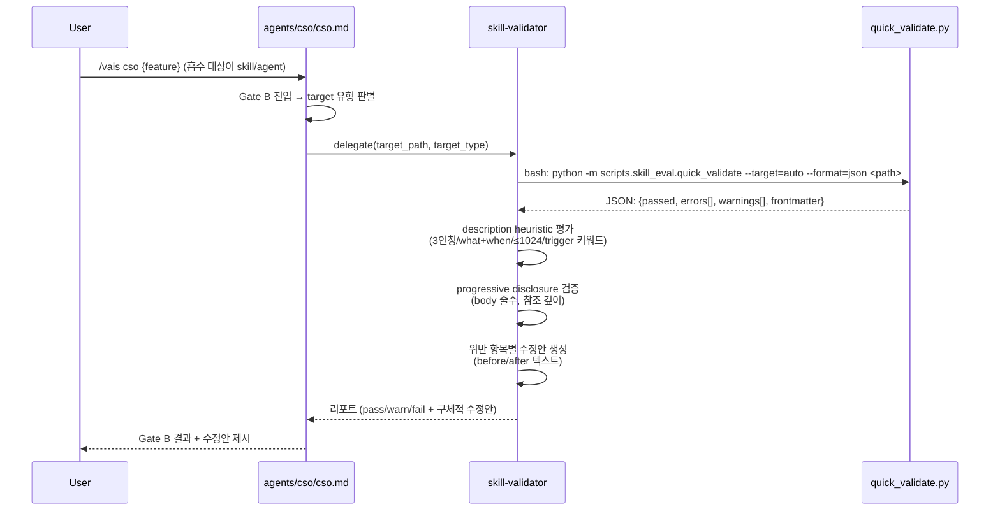

# skill-validator-absorption - 설계

> ⛔ **Design 단계 범위**: 이 문서는 설계 결정만 기록합니다. 프로덕트 파일 생성·수정은 Do 단계에서 수행하세요.
> 참조 문서: `docs/01-plan/ceo_skill-validator-absorption.plan.md` (v1.2)

> ℹ️ **N/A 섹션 안내**: 본 피처는 내부 플러그인 인프라로 **UI/화면/DB가 없습니다**. Plan 템플릿의 Part 1(IA) / Part 2(Wireframe) / Part 3(UI 설계) 섹션은 해당사항 없어 생략하고, Architecture / Module / Data Flow / Interface Contract에 집중합니다.

## Context Anchor

| Key | Value |
|-----|-------|
| **WHY** | absorb 과정에서 skill/agent .md 파일의 trigger 정확도·구조 규격을 수작업으로 점검하던 비효율 제거 |
| **WHO** | CSO(품질 게이트 호출자), 스킬/에이전트 작성자(CTO·CPO), 흡수 결정자(CEO) |
| **RISK** | VAIS는 Node.js 기반이나 흡수 대상 스크립트는 Python — 런타임 이원화 (PyYAML 의존성 추가) |
| **SUCCESS** | `/vais cso`가 스킬/에이전트 흡수·작성 검증 시 skill-validator를 자동 delegation하고, `quick_validate.py`가 skill 디렉토리 + 단일 agent .md 양쪽 모두 판정, **위반 발견 시 구체적 수정안 제시** |
| **SCOPE** | agents/cso/skill-validator.md, scripts/skill_eval/ 2파일(quick_validate, utils), agents/cso/cso.md Gate B 수정, absorption-ledger 기록 |

---

## Architecture Options

### Option A — Minimal Wrapper (최소 변경)

`skill-validator` 에이전트를 얇은 래퍼로 만들어 Bash로 Python 스크립트 직접 실행. 스크립트는 원본 `references/skills/skills/skill-creator/scripts/`에서 **거의 그대로** 이식.

- ✅ 구현 빠름, 원본 호환성 유지 → 향후 업스트림 업데이트 재동기화 쉬움
- ❌ VAIS 경로 규칙(agents/{c-level}/, skills/vais/) 검증 불가 — 원본이 `SKILL.md` 디렉토리만 가정
- ❌ 단일 `.md` agent 파일 검증 불가 (원본은 skill 디렉토리 구조 강제)

### Option B — Full Rewrite (클린)

Python 스크립트를 Node.js로 포팅 + VAIS lib과 통합. frontmatter 파서는 lib/fs-utils 재사용.

- ✅ Node.js 단일 런타임, lib 재사용, agents/ 단일 .md 파일 완벽 지원
- ❌ `improve_description.py`의 `claude -p` 호출 + train/test 분할 로직 재구현 부담 큼
- ❌ 원본 업데이트 재동기화 불가 — 사실상 분기
- ❌ Boil-the-Lake 원칙 위반 (범위 과다)

### Option C — Pragmatic Port (실용적 균형) ✅ 기본 추천

Python 유지하되 **VAIS 맞춤 어댑터 레이어 추가** (범위 축소판):
1. `quick_validate.py`에 `--target` 플래그 추가: `skill` (디렉토리) / `agent` (단일 .md) / `auto` (자동 판별)
2. 단일 agent .md 파일 판정 로직 추가 — SKILL.md 없이 frontmatter만 검증
3. `utils.py`의 `parse_skill_md`를 `parse_md_frontmatter`로 일반화 → skill/agent 양쪽 지원
4. `scripts/skill_eval/__init__.py` 추가로 `python -m scripts.skill_eval.quick_validate` 모듈 실행 지원
5. **description heuristic 평가는 agent 내부에서 처리** (Python 스크립트 없이 skill-validator가 규칙 기반 직접 수행)

- ✅ 원본 로직 보존 + VAIS 필요사항 흡수
- ✅ 런타임 이원화 비용 최소 (Python 3 + PyYAML만 요구, claude CLI 불필요)
- ✅ skill-validator 에이전트는 Python 스크립트 결과 + 자체 heuristic 평가 조합
- ⚠️ Python 3 + PyYAML 의존성 문서화 필요

### Comparison

| 기준 | A: Minimal | B: Clean Rewrite | C: Pragmatic Port |
|------|:----------:|:----------------:|:-----------------:|
| 복잡도 | 낮음 | 높음 | 중간 |
| VAIS 적합성 | 낮음 (agent .md 미지원) | 높음 | 높음 |
| 구현 속도 | 빠름 | 느림 | 중간 |
| 업스트림 재동기화 | 쉬움 | 불가 | 가능 (어댑터만 분리 유지) |
| 리스크 | 중간 | 높음 | 낮음 |

### Selected: **Option C — Pragmatic Port**

**Rationale**:
- VAIS의 이중 검증 대상(skill 디렉토리 + 단일 agent .md)을 Option A는 커버 불가
- Option B는 Plan의 "선별 흡수" 원칙에 역행 (Boil-the-Lake 위반)
- Option C는 원본 Python 로직 보존으로 업스트림 호환 + 어댑터 레이어만 VAIS 전용

---

## Module Map

### M1: scripts/skill_eval/ (Python)

| 파일 | 라인 추정 | 역할 | 원본 대비 변경 |
|------|-----------|------|---------------|
| `__init__.py` | 1 | 빈 파일 (module 인식) | 신규 |
| `utils.py` | ~60 | `parse_md_frontmatter(path)` — skill 디렉토리 + 단일 .md 양쪽 지원 | `parse_skill_md` → 일반화 리팩토링 |
| `quick_validate.py` | ~150 | 구조/frontmatter 검증 엔트리포인트, `--target` 플래그, JSON 출력 | 로직 재사용 + agent 분기 추가 + JSON 포맷터 추가 |

> ⚠️ 폴더명은 파이썬 import 호환을 위해 **`scripts/skill_eval/`** (언더스코어) 사용.
> ❌ `improve_description.py`는 제외됨 — 원본 `run_eval.py` 출력(`eval_results` JSON)을 필수 입력으로 받는 의존성이 있어 단독 실행 불가. 단순 검증 범위 초과로 판단.

### M2: agents/cso/skill-validator.md (신규 agent)

| 섹션 | 내용 |
|------|------|
| frontmatter | name, description (3인칭, when-to-use 포함), model: sonnet, tools: [Read, Glob, Grep, Bash, TodoWrite] |
| 입력 컨텍스트 | `target_path`(file/dir), `target_type`(skill/agent/auto) |
| 워크플로우 4단계 | 1) quick_validate.py 실행 (구조/frontmatter) → 2) description heuristic 평가 (agent 내부 규칙) → 3) progressive disclosure 검증 (500줄, 깊이 2) → 4) 리포트 + 수정안 생성 |
| 규격 체크리스트 | description 3인칭, what+when, ≤1024자, trigger 키워드 / SKILL.md ≤500줄 / frontmatter 필수 필드 |
| 수정안 생성 | 위반 항목마다 **before/after 텍스트**를 agent가 Claude 능력으로 직접 작성하여 리포트에 포함 |
| 리포트 형식 | pass/warn/fail + 근거 + 구체적 수정안 (사용자가 복사-붙여넣기 가능한 형태) |
| validate-plugin과의 구분 | 상단 박스로 명시: "구조/의미 vs 배포 규격" |

### M3: agents/cso/cso.md (수정)

| 변경 위치 | 변경 내용 |
|-----------|-----------|
| Gate B 섹션 | skill-validator delegation 조건 추가: "흡수 대상 또는 신규 작성 대상이 skill/agent .md 파일인 경우" |
| 에이전트 목록 | skill-validator 행 추가 |
| 기존 validate-plugin 설명 | "배포 규격" 스코프 명시 (중복 회피) |

### M4: docs/absorption-ledger.jsonl (기록)

```jsonl
{"timestamp":"2026-04-07","source":"references/skills/skills/skill-creator","decision":"partial-merge","absorbed":["scripts/skill_eval/{quick_validate,utils}.py","agents/cso/skill-validator.md"],"excluded":["agents/{analyzer,comparator,grader}.md","scripts/{improve_description,run_eval,run_loop,aggregate_benchmark,generate_report,package_skill}.py","eval-viewer/","references/schemas.md"],"rationale":"eval loop infra (A/B compare) out of scope — pure structural/heuristic validation only"}
```

---

## Data Flow

### D1: CSO → skill-validator 호출 체인



### D2: quick_validate `--target` 분기 로직

```
입력: path, target (skill|agent|auto)
├─ auto:
│   ├─ path가 디렉토리 AND path/SKILL.md 존재 → skill 모드
│   ├─ path가 파일 AND .md 확장자 → agent 모드
│   └─ 그 외 → 에러
├─ skill 모드: 원본 로직 (SKILL.md frontmatter + 구조)
└─ agent 모드:
    ├─ frontmatter YAML 파싱
    ├─ 필수 필드: name, description (version/model/tools는 권장)
    ├─ description 규격 체크 (3인칭, 1024자)
    └─ body ≤ 500줄 권장 (초과 시 warning)
```

### D3: Progressive Disclosure 검증 규칙

| 항목 | 기준 | 판정 |
|------|------|------|
| SKILL.md / agent body | ≤500 lines | > 500: warn, > 800: fail |
| 참조 파일 깊이 | 1단계 (SKILL.md → references/*.md) | 2단계 이상: warn |
| 번들 리소스 배치 | scripts/, references/, assets/ | 그 외 폴더: warn |

---

## Interface Contract

> 본 피처는 REST API가 아니라 **shell command interface**입니다. Gate 2 Interface Contract를 CLI 계약으로 대체합니다.

### CLI: quick_validate (유일 스크립트)

```
python -m scripts.skill_eval.quick_validate <path> [--target=auto|skill|agent] [--format=text|json]
```

**Exit codes:**
| Code | 의미 |
|------|------|
| 0 | pass |
| 1 | warn (비치명적 문제) |
| 2 | fail (frontmatter/구조 위반) |
| 3 | 입력 경로 오류 또는 PyYAML 미설치 |

**stdout (--format=json):**
```json
{
  "path": "agents/cso/skill-validator.md",
  "target_type": "agent",
  "passed": true,
  "errors": [],
  "warnings": [{"rule": "body_length", "message": "body 612 lines > 500", "severity": "warn"}],
  "frontmatter": {"name": "skill-validator", "description": "...", "model": "sonnet"},
  "body_line_count": 612
}
```

### Agent 호출 계약 (CSO → skill-validator)

```yaml
# CSO가 Agent 도구로 skill-validator 호출 시 전달 파라미터
target_path: <string>       # 절대경로 권장
target_type: skill|agent|auto  # default: auto
ledger_update: boolean      # absorption-ledger 업데이트 여부 (default: false)
```

**반환 형식 (skill-validator → CSO):**

```markdown
## skill-validator 리포트

- **대상**: {path}
- **유형**: {skill|agent}
- **판정**: ✅ pass / ⚠️ warn / ❌ fail

### 구조 검증 (quick_validate 결과)
- frontmatter: ✅/❌
- 필수 필드: {누락 필드 목록 or "완료"}
- body 길이: {n} lines ({pass|warn>500|fail>800})

### description 평가 (heuristic)
| 규칙 | 판정 | 현재 값 |
|------|------|---------|
| 3인칭 서술 | ✅/❌ | "{첫 문장}" |
| what + when 포함 | ✅/❌ | {분석} |
| ≤1024자 | ✅/❌ | {n}자 |
| trigger 키워드 | ✅/❌ | {발견된 키워드 목록} |

### 수정안
**description (before):**
> {현재 description}

**description (after) — 권장:**
> {agent가 생성한 개선 description}

**변경 사유:**
- {구체적 이유 1}
- {구체적 이유 2}

### 기타 권장 조치
- {body 축약 제안 등}
```

---

## 환경 의존성

| 의존성 | 버전 | 설치 방법 | 필수/선택 |
|--------|------|-----------|-----------|
| Python | ≥3.9 | OS 패키지 | 필수 |
| PyYAML | ≥6.0 | `pip install pyyaml` 또는 시스템 패키지 | 필수 (quick_validate) |

**문서화 위치:**
- `agents/cso/skill-validator.md` 상단 "환경 요구사항" 섹션에 직접 서술

**Graceful degrade:**
- PyYAML 미설치 → quick_validate가 exit 3 + 명확한 에러 메시지 ("pip install pyyaml")
- skill-validator agent는 exit 3 수신 시 사용자에게 PyYAML 설치 안내 후 중단

---

## 기존 `cso/validate-plugin`과의 구분 (재확인)

| 항목 | validate-plugin | skill-validator (신규) |
|------|-----------------|------------------------|
| 대상 | 플러그인 전체 (package.json, plugin.json, 모든 skill/agent 목록) | 개별 skill 디렉토리 또는 개별 agent .md |
| 관점 | 배포 readiness (marketplace publishing gate) | 작성/흡수 품질 (authoring/absorption gate) |
| 실행 시점 | release 준비 단계 | 신규 작성 직후 또는 외부 흡수 시점 |
| CSO Gate | Gate B (배포) | Gate B (품질) — 동일 Gate지만 서브 액션 분리 |
| 핵심 스크립트 | `scripts/vais-validate-plugin.js` (Node) | `scripts/skill_eval/quick_validate.py` (Python) |

CSO는 Gate B 안에서 "이번 호출이 배포 검증인가 / 품질 검증인가"를 판단하여 delegation을 분기합니다. Do 단계에서 cso.md에 분기 로직을 추가합니다.

---

## Session Guide

### Module Map 요약

| Module | Files | Description |
|--------|-------|-------------|
| M1 | `scripts/skill_eval/{__init__,utils,quick_validate}.py` | Python 검증 스크립트 (3파일) |
| M2 | `agents/cso/skill-validator.md` | CSO sub-agent (신규) |
| M3 | `agents/cso/cso.md` | Gate B delegation 분기 추가 |
| M4 | `docs/absorption-ledger.jsonl` | 흡수 이벤트 기록 |

### Recommended Session Plan

| Session | Modules | Description |
|---------|---------|-------------|
| Session 1 | M1 | Python 스크립트 이식 + `--target=auto` 분기 + JSON 출력 — 단독 테스트 |
| Session 2 | M2 + M3 + M4 | Agent md 작성 (heuristic 규칙 + 수정안 생성 로직) + cso.md 분기 + ledger 기록 |

**병렬화 가능성:** M2(agent .md 작성)와 M3(cso.md 수정)는 Session 2 내에서 병렬 가능. 단, M3가 M2의 agent name/description을 참조하므로 M2 먼저.

---

## 리스크 재평가 (Plan → Design)

| 리스크 (Plan v1.2) | Design 반영 |
|---------------------|-------------|
| `improve_description.py` 단독 실행 불가 | **흡수 제외**. description 평가는 agent 내부 heuristic으로 대체 |
| Python 런타임 이원화 | PyYAML + Python ≥3.9 명시. quick_validate는 graceful degrade로 에러 메시지 제공 |
| agent .md 단일 파일 미지원 | `--target=auto` 분기로 해결 |
| 모듈 import 경로 | `scripts/skill_eval/` (언더스코어) 폴더 + `__init__.py`로 `python -m` 호환 |
| Heuristic 평가 정확도 한계 | 규격 위반(3인칭/길이/what+when)만 정확히 잡으면 충분. trigger accuracy 정밀 측정은 SCOPE 밖 |

---

## CP-D 체크포인트 — 아키텍처 선택

**선택된 Option**: **C — Pragmatic Port**

사용자가 다른 옵션을 원하면 이 섹션에서 중단하고 재결정합니다.

- [x] A (Minimal Wrapper) — agent .md 미지원으로 배제
- [ ] B (Full Rewrite) — Boil-the-Lake 위반으로 배제
- [x] **C (Pragmatic Port)** — 원본 보존 + VAIS 어댑터 추가

---

## 변경 이력

| version | date | change |
|---------|------|--------|
| v1.0 | 2026-04-07 | 초기 작성 — Option C 선택, Python 어댑터 설계, CLI 계약, Data Flow, 모듈 맵. Plan v1.1의 API 키 리스크를 `claude -p` 사용으로 정정 |
| v1.1 | 2026-04-07 | 범위 축소 — `improve_description.py` / A/B polishing 비교 / claude CLI 의존성 모두 제외. skill-validator는 구조 검증 + heuristic description 평가 + 수정안 제안만 수행. Session 3→2로 축소, 스크립트 4→3 파일 |
