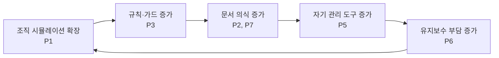

# 02. 문제 진단

> 각 문제는 **증거 → 원인 → 원래 목적과의 충돌** 순으로 기술.

## P1. 조직 시뮬레이션이 수단에서 목적으로 전도됨 (구조적 근본 문제)

- **증거**: C-Suite 6명 + sub-agent 47 + CEO 7차원 알고리즘(`lib/ceo-algorithm.js` 11.5KB) + 라우팅 시나리오 10+1 + Agent Teams 대화-합성 모델 + Lazy Consensus 5-state FSM. 반면 실사용 흐름은 사실상 `/vais cto plan → design → do → qa` 하나.
- **원인**: "가상 조직"이라는 컨셉 자체가 재미있어서, 조직을 정교하게 만드는 것이 곧 개발이 됨. dogfood 이력(docs/)을 보면 최근 피처 대부분이 **플러그인이 플러그인 자신을 개선하는 작업** (positioning-rethink, agent-teams, workflow-contract-alignment...).
- **충돌**: 원래 목적은 "이력 + 일관성 + 완성도"였고, C-Suite는 그것을 재미있게 포장하는 수단이었다. 지금은 CEO 라우팅 승인, C-Level 선택 AskUserQuestion, 아웃트로 의식이 실개발 turn 사이사이에 끼어들어 **흐름을 끊는 비용**이 됨.

## P2. 문서 의식(儀式)이 문서 가치를 초과

- **증거**: 피처 1개 = 17파일/1,701줄. main.md "인덱스"가 89줄. 모든 문서에 frontmatter + 변경 이력 표 + Decision Record append + Owner 컬럼. 가드 문서 8개가 이 의식을 지키는 방법만 설명 (28KB).
- **원인**: "정보 손실 0"을 목표로 삼음 (subdoc-guard v2.0의 명시 목표). 그러나 이력의 가치는 **완전성이 아니라 검색 가능한 결정 요지**에 있다. 30행짜리 Decision Record는 다시 읽히지 않는다 — 다시 읽히지 않는 이력은 이력이 아니라 로그다.
- **충돌**: "쓸데없는 문서를 많이 만들었다"는 사용자 자각과 정확히 일치. 특히 SubagentStop `exit(1)` 차단은 **"문서가 없으면 작업이 안 끝난 것"**이라는 규칙을 물리력으로 강제 — 30분짜리 수정에도 문서 세트를 요구.

## P3. 컨텍스트 로드 체인이 다단계 간접 참조

- **증거**: SKILL.md → phases/cto.md → agents/cto/cto.md → _shared 3종 + config + 템플릿 + knowledge. phase 1회에 ~15-20k 토큰. **같은 규칙이 3~4곳에 중복 기술**됨 (아웃트로 규칙: SKILL.md + phases/cto.md + output-style + outro-format.md 4곳; AskUserQuestion 강제: 3곳).
- **원인**: 규칙이 안 지켜질 때마다 "더 많은 곳에, 더 강한 어조로" 반복 기술하는 방식으로 대응해 옴 (⛔/🚨/필수/절대 금지의 밀도가 그 흔적). 이는 하네스 엔지니어링의 안티패턴 — **지시가 안 먹히면 지시를 늘리는 게 아니라 구조를 바꿔야** 한다 (예: 아웃트로 포맷은 지시 대신 hook이 생성).
- **충돌**: "md 읽는 데 토큰을 많이 소요한다"는 사용자 자각과 일치.

## P4. 에이전트 등록 오염 (즉시 수정 가능한 버그)

- **증거**: `package.json > claude-plugin.agents: ["agents/"]` — 디렉토리 전체 등록으로 `_shared/*.md` 가드 8개와 `knowledge/*.md` 19개가 **호출 가능한 에이전트로 노출**됨. 에이전트 목록에 "Agent from vais-code plugin"이라는 무의미 설명 27개가 뜨고, 매 세션 시스템 프롬프트 ~2.5k 토큰을 점유.
- **원인**: 에이전트/가드/지식을 같은 트리에 두고 glob 등록.
- **충돌**: vais를 쓰지 않는 세션에서도 세금 부과. 또한 모델이 `vais-code:cbo:knowledge:gtm-funnel` 같은 "에이전트"를 실제로 호출해버릴 위험.

## P5. 자기 관리 코드의 비대화 (validator가 validator를 검증)

- **증거**: scripts 37개 중 프로덕트 기능은 소수. `vais-validate-plugin.js`(38KB), `doc-validator`, `template-validator`, `sub-agent-audit`, `auto-judge`, `gate-check`, `patch-clevel-guard`, `patch-subdoc-block`, `patch-advisor-frontmatter`... 가드 문서를 에이전트 파일에 주입하는 patcher, 그 주입을 검증하는 validator, 그 validator를 테스트하는 test.
- **원인**: 규칙(P2·P3)이 많아질수록 규칙 준수를 자동 검증할 도구가 필요해지는 자기 증식 루프.
- **충돌**: 규칙을 줄이면 이 계층 대부분이 필요 없어진다. **원인(규칙 과다)이 아니라 증상(규칙 위반)에 투자**해 온 구조.

## P6. 미사용/실험 자산의 프로덕션 잔류

- **증거**:
  - CBO sub-agent 10종 + knowledge 3종 — 사용 이력 없음 (docs/ 스캔 기준)
  - COO 8종 — scope-gate 로 대부분 비활성 (local plugin 프로젝트에서 CI/CD·Docker·runbook 발동 조건 미충족)
  - CEO 전략 4종 (vision/strategy-kernel/okr/pr-faq-author) — 자기 자신 리포지셔닝에 1회성 사용
  - Agent Teams v2 (conversation-orchestrator.js 13KB + worktree-manager + lock) — opt-in 실험인데 `agentTeams.enabled` 프로젝트 default true 로 켜짐
  - `lib/mcp-validator.js` — 주석에 이미 deprecated
  - `lib/project-profile.js` 21.7KB, `lib/status.js` 29.5KB — status가 brand/lock/ideation helpers 까지 흡수하며 God-module화
- **원인**: 학습 실험(목적 3)의 산출물을 제거하지 않고 계속 GA에 포함.
- **충돌**: 학습은 이미 완료된 가치. 잔류물은 유지보수 비용과 인지 부하만 남김.

## P7. 매-응답 출력 의식

- **증거**: output-style이 매 응답에 (1) 단계 아이콘 헤더, (2) 아웃트로 2블록 + `---` 규칙, (3) 박스 하단 리포트(66자 구분선 × 2 + 6필드), (4) 4-토큰 명령 포맷 검증을 요구. session-start가 output-style **전문을 additionalContext로 중복 주입** (output-styles 등록과 별개로).
- **원인**: 일관된 UX를 출력 포맷 강제로 달성하려 함.
- **충돌**: turn당 ~100-150 출력 토큰 + 모델 주의력 분산. 진행 상태는 hook/status.json이 이미 알고 있으므로 **모델이 그리는 게 아니라 하네스가 그려야** 할 정보.

## 종합: 악순환 구조

이 루프를 끊는 지점은 **A (시뮬레이션 레이어 축소)** 하나다. B~E는 A의 파생물이므로 A를 줄이면 연쇄적으로 소멸한다.
