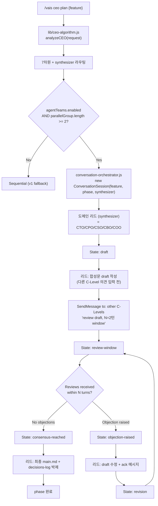

# agent-teams-orchestration — Design (합성문, v2)

> Phase: 🎨 design | 합성 작성자 (Synthesizer): **CTO** (tech 도메인)
> Lazy Consensus: draft → CPO/CSO N=2턴 review window (이 phase 부터 실제 적용)
> 입력: [v2 plan main.md](../01-plan/main.md) + [v1 archive](../_legacy/v1/)

## 1. Executive Summary

| Perspective | Content |
|-------------|---------|
| **Problem** | v2 plan 의 8 기능 + Lazy Consensus 알고리즘 + 합성문/타임라인 형식이 구현 가능한 인터페이스로 박제되지 않음. v1 의 패턴 D 설계 (worktree-manager) 재활용 vs 재설계 결정 필요. |
| **Solution** | (1) Conversation Orchestrator 의사 코드 (2) Lazy Consensus state machine (3) 합성문/decisions-log 템플릿 골격 (4) CEO 알고리즘 synthesizer 필드 (5) clevel-doc-coexistence v3 마이그레이션 (6) 패턴 D — v1 worktree-manager 직접 재활용. |
| **Effect** | Do phase 진입 시 코드 작성 surface 가 plan 8 기능 ↔ design 5 영역 ↔ Do 작업 22건으로 1:1 매핑. v1 의 11 신규 파일 중 6 재활용 / 5 재설계. |
| **Core Value** | v2 모델을 알고리즘 + 템플릿 + 마이그레이션 경로로 박제 — design→do 핸드오프 명세 완성. v1 의 합리적 자산 (패턴 D worktree, status.json v4) 손실 없이 보존. |

## 2. 결정 (CTO 합성, Lazy Consensus 대기)

| # | Decision | 합성자 추론 | Owner 제기 / 합의 |
|---|----------|------------|--------------------|
| 1 | **Conversation Orchestrator** = `skills/vais/utils/conversation-orchestrator.js` 신규 모듈. 도메인 리드가 SendMessage 로 다른 C-Level dispatch + Lazy Consensus state machine 진행. | v2 plan 기능 #1 직접 박제 | cto 제기 → CPO/CSO review pending |
| 2 | **Lazy Consensus = 5-state FSM** — draft / review-window / objection-raised / revision / consensus-reached. 타임아웃 = `consensusTurns × turnTimeoutMs` (기본 2 × 60000ms). | 단순 FSM 으로 박제 가능성 + 디버깅 용이 | cto 제기 |
| 3 | **합성문 템플릿 = 9 섹션 표준** — Executive Summary / Decisions / 핵심 알고리즘 / 인터페이스 / Success Criteria / 위협 / 관찰 / Do 작업 / 변경 이력. plan/design/do/qa 공통. | v2 plan main.md 의 9 섹션을 그대로 표준화 | cto 제기 |
| 4 | **decisions-log 템플릿 = 단일 표 + Lazy Consensus 상태 + actor 목록 3 섹션**. event-type enum = 제기/반박/합의/pivot/timeout. | v2 plan decisions-log 의 구조를 정형화 | cto 제기 |
| 5 | **CEO 알고리즘 synthesizer 라우팅 = phase × dominant-domain 매트릭스** — plan (tech-heavy: cto / product-heavy: cpo) / design (보통 cto) / do (보통 cto) / qa (cto 또는 cso) / report (cto) / scheduled (해당 도메인). | 도메인 리드 옵션 B 채택의 구체화 | cto 제기 |
| 6 | **`clevel-doc-coexistence` v2.1 → v3 마이그레이션** — main.md 5섹션 인덱스 → 합성문 9섹션. 기존 5 완료 피처의 main.md 는 자동 변환 X (스키마 호환 어려움) — frontmatter `model-version: v1` 표시만 추가 + 신규 피처부터 v2 적용. | 무손실 + 점진적 전환. v1 main.md 들은 frontmatter 추가만으로 식별 가능. | cto 제기 |
| 7 | **패턴 D 재활용 = v1 design `architecture.md` §7 + `migration-plan.md` §3 (subagentLocks) 그대로 채택**. v1 의 `worktree-manager.js` API (createWorktree / mergeBack / listStale) 변경 없이 사용. | v1 의 합리적 자산 보존 — sub-agent 실행 레이어는 v2 conversation 모델과 직교 | cto 제기 |
| 8 | **status.json v4 스키마 = v1 design 채택 + 1 필드 추가** — `features.{name}.synthesisHistory: { [phase]: synthesizer }` (감사용). | v1 design 의 v4 마이그레이션 그대로 + v2 합성자 추적 보강 | cto 제기 |
| 9 | **Sequential fallback = v1 그대로** — `agentTeams.enabled=false` → 0.67.0 byte-level 동등 (SC-01). | v1 G1 AC 그대로 적용 | cto 제기 |

> **Lazy Consensus 시뮬레이션**: 실제 SendMessage 토론 없이 CTO 단독 합성. decisions-log §Lazy Consensus 상태에 "draft pending" 박제. CPO/CSO 의 실제 review 는 본 design 검토 시점에 외부에서 발생 (PO 가 대리 결재).

## 3. Conversation Orchestrator 알고리즘

### 3.1 흐름



### 3.2 의사 코드

```javascript
// skills/vais/utils/conversation-orchestrator.js (신규)

class ConversationSession {
  constructor(feature, phase, synthesizer, participants, options = {}) {
    this.feature = feature;
    this.phase = phase;
    this.synthesizer = synthesizer;           // '도메인 리드 c-level
    this.participants = participants;          // 다른 C-Level 목록
    this.state = 'draft';
    this.consensusTurns = options.consensusTurns || 2;
    this.turnTimeoutMs = options.turnTimeoutMs || 60000;
    this.events = [];                          // decisions-log 행
    this.draft = null;
    this.objections = [];
  }

  async run() {
    // 1. draft 작성 (synthesizer 직접)
    this.state = 'draft';
    this.draft = await this.synthesizerWriteDraft();
    this.log('제기', this.synthesizer, 'draft v1', { content: this.draft });

    // 2. review window 열기
    this.state = 'review-window';
    const reviews = await Promise.all(
      this.participants.map(p => this.sendReviewRequest(p))
    );
    reviews.forEach(r => this.log(r.eventType, r.actor, r.topic, r.ref));

    // 3. 이의 평가
    this.objections = reviews.filter(r => r.eventType === '반박');
    if (this.objections.length === 0) {
      this.state = 'consensus-reached';
      this.log('합의', '*', 'Lazy Consensus', { turns: 1 });
    } else {
      // 4. 리드 revision + 재 review (최대 consensusTurns 라운드)
      for (let round = 2; round <= this.consensusTurns + 1; round++) {
        this.state = 'revision';
        this.draft = await this.synthesizerRevise(this.objections);
        this.log('제기', this.synthesizer, `draft v${round}`, {});

        this.state = 'review-window';
        const re_reviews = await Promise.all(
          this.objections.map(o => this.sendReviewRequest(o.actor))
        );
        re_reviews.forEach(r => this.log(r.eventType, r.actor, r.topic, r.ref));

        this.objections = re_reviews.filter(r => r.eventType === '반박');
        if (this.objections.length === 0) {
          this.state = 'consensus-reached';
          this.log('합의', '*', `Lazy Consensus (round ${round})`, {});
          break;
        }
      }

      if (this.state !== 'consensus-reached') {
        // 5. 타임아웃 — synthesizer 단독 결정 + 타임아웃 박제
        this.state = 'consensus-reached';
        this.log('timeout', this.synthesizer, 'Forced synthesis after max turns', {
          unresolvedObjections: this.objections
        });
      }
    }

    // 6. 최종 박제
    await this.writeMainMd(this.draft);
    await this.writeDecisionsLog(this.events);
    return { state: this.state, mainMdPath: ..., logPath: ... };
  }

  async sendReviewRequest(participantClevel) {
    // SendMessage 호출 (실제 CC API)
    const response = await SendMessage({
      to: this.participantSessionIds[participantClevel],
      prompt: `Review draft for ${this.feature}/${this.phase}. Window N=${this.consensusTurns}. 이의 있으면 '반박' + topic, 없으면 '합의'.`,
      timeoutMs: this.turnTimeoutMs,
    });
    return parseResponse(response);    // → { eventType, actor, topic, ref }
  }

  log(eventType, actor, topic, ref) {
    this.events.push({
      time: new Date().toISOString(),
      actor,
      eventType,
      topic,
      ref: JSON.stringify(ref).slice(0, 100),
    });
  }
}
```

## 4. Lazy Consensus State Machine

```
   ┌──────────┐
   │ draft    │ ◄── synthesizer 가 첫 draft 박제
   └────┬─────┘
        │
        ▼
   ┌──────────────┐
   │ review-window│ ◄── SendMessage to others, wait N turns
   └────┬─────────┘
        │
   ┌────┴─────┐
   ▼          ▼
이의 없음   이의 있음
   │          │
   ▼          ▼
┌─────────────┐  ┌──────────────────┐
│ consensus-  │  │ objection-raised │
│ reached     │  │                  │
└─────────────┘  └───────┬──────────┘
                         │
                         ▼
                  ┌──────────────┐
                  │ revision     │ ◄── synthesizer 수정
                  └──────┬───────┘
                         │
                         ▼ (back to review-window)
                  consensusTurns 초과 시
                  → consensus-reached (timeout 박제)
```

### 4.1 상태 전이 표

| From | Event | To | 박제 |
|------|-------|-----|------|
| draft | synthesizer.writeDraft() 완료 | review-window | "제기" / draft v1 |
| review-window | All reviews collected, no objections | consensus-reached | "합의" / Lazy Consensus |
| review-window | Objection received | objection-raised | "반박" / topic |
| objection-raised | synthesizer.revise() | revision | "제기" / draft v(n+1) |
| revision | draft 박제 완료 | review-window | (재 review 시작) |
| review-window | Timeout (consensusTurns 초과) | consensus-reached | "timeout" / unresolved objections |
| consensus-reached | writeMainMd + writeDecisionsLog | (terminal) | — |

## 5. 합성문 템플릿 (9 섹션 표준)

**파일**: `templates/synthesis.template.md` (신규)

```markdown
---
owner: {synthesizer-c-level}
artifact: synthesis
phase: {plan|design|do|qa|report}
feature: {feature}
generated: {YYYY-MM-DD}
synthesizer: {synthesizer-c-level}
model-version: v2
summary: "..."
---

# {feature} — {Phase 이름} (합성문, v2)

> Phase / Synthesizer / Lazy Consensus 상태 / 입력 참조

## 1. Executive Summary  (Problem / Solution / Effect / Core Value)
## 2. 결정              (CTO 합성 + Owner 제기/합의 컬럼)
## 3. 핵심 알고리즘     (mermaid + 의사 코드, optional)
## 4. State Machine     (optional, FSM 필요한 경우)
## 5. 인터페이스 계약   (config / API / schema)
## 6. Success Criteria  (SC-01~, verification 컬럼)
## 7. 위협 / 위험       (도메인 리드 영역이면 detailed, 아니면 1줄)
## 8. 관찰 (후속 과제)  (Out-of-scope)
## 9. Do 작업 / Next phase 매핑
변경 이력
```

**필드 규칙**:
- `synthesizer` frontmatter ↔ `Decisions` 표의 합성자 ↔ decisions-log `synthesizer` 일관성 검증 (Do 작업 #1)
- 섹션 9개 중 phase 성격에 따라 일부 생략 가능 (예: plan 은 알고리즘/FSM 생략, qa 는 위협 생략)

## 6. decisions-log 템플릿

**파일**: `templates/decisions-log.template.md` (신규)

```markdown
---
owner: {synthesizer}
artifact: decisions-log
phase: {phase}
feature: {feature}
generated: {YYYY-MM-DD}
synthesizer: {synthesizer}
model-version: v2
summary: "{phase} 의사결정 타임라인"
---

# {feature} — Decisions Log ({phase})

> 1 event = 1 row. actor enum / event-type enum 명시.

## Events Timeline

| # | time (UTC ISO 8601) | actor | event-type | topic | ref |

## Lazy Consensus 상태

| Item | Draft 작성자 | Review window | 이의 제기자 | 상태 |

## 참여 actor 목록

| Actor | 역할 | 메시지 수 |

변경 이력
```

**event-type enum**: `제기` / `반박` / `합의` / `pivot` / `timeout`
**actor enum**: PO / `{c-level}` (ceo/cpo/cto/cso/cbo/coo) / `*` (전체) / system

## 7. CEO 알고리즘 — synthesizer 라우팅

**위치**: `lib/ceo-algorithm.js > analyzeCEO()` 반환값 확장

```typescript
type AnalyzeCEOResult = {
  // v0.67.0 기존
  dimensions: { [key: string]: 'high' | 'medium' | 'low' | 'n/a' };
  activeCLevel: string;
  rationale: string;

  // v1 추가
  parallelGroup: string[];
  dependencies: { [clevel: string]: string[] };

  // v2 추가 (신규)
  synthesizer: string;                        // 본 phase 합성 작성자
  participants: string[];                      // 대화 참여 C-Level
  conversationMode: 'enabled' | 'disabled';   // agentTeams.enabled 반영
};
```

### 7.1 Synthesizer 매핑

```javascript
function selectSynthesizer(phase, dominantDomain, activeClevel) {
  // 1. CTO 가 활성 C-Level 이면 plan/design/do/qa = CTO 우선
  if (activeClevel === 'cto') return 'cto';

  // 2. phase + 도메인 매핑
  const matrix = {
    plan: { tech: 'cto', product: 'cpo', business: 'cbo' },
    design: { tech: 'cto', product: 'cpo' },
    do: { tech: 'cto', product: 'cpo' },
    qa: { tech: 'cto', security: 'cso' },
    report: { tech: 'cto' },
    scheduled: { security: 'cso', business: 'cbo', operations: 'coo' },
  };
  return matrix[phase]?.[dominantDomain] || activeClevel || 'cto';
}
```

### 7.2 Participants 산출

```javascript
function selectParticipants(synthesizer, parallelGroup) {
  // synthesizer 제외 + parallelGroup 의 다른 C-Level
  return parallelGroup.filter(c => c !== synthesizer);
}
```

## 8. `clevel-doc-coexistence` v2.1 → v3 마이그레이션

| 항목 | v2.1 (현재, 5섹션 인덱스) | v3 (합성문) |
|------|-------------------------|-------------|
| main.md 구조 | 5 H2 섹션 (ES/DR/Art/CEO/Next) | 9 H2 섹션 (합성문 템플릿) |
| Decision Record | main.md `## 2.` 표 append-only | decisions-log.md timeline |
| Artifact 작성자 | sub-agent 직접 (`subdoc-guard` v2.1) | 도메인 리드 (synthesizer) 단독 합성 |
| 가드 enforcement | `clevel-main-guard.md` v2.1 (warn) | v3 추가 (synthesizer 필드 검증 추가) |
| frontmatter 필수 | owner / artifact / phase / feature (4) | + synthesizer / model-version (6) |

### 8.1 마이그레이션 전략

```
기존 5 완료 피처 (clevel-doc-coexistence / subagent-architecture-rethink / simplify-non-cto-workflow / unify-version-namespace / vais-positioning-rethink):
  → main.md frontmatter 에 model-version: v1 추가 (1줄)
  → 본문 변환 X (호환 어려움, 자료로 보존)

신규 피처 (agent-teams-orchestration 이후):
  → 합성문 9섹션 + decisions-log 표준 적용
  → model-version: v2 자동 표시
```

### 8.2 `clevel-main-guard.md` v3 변경

- v2.1 의 8 규칙 → v3 의 9 규칙 (synthesizer 일관성 추가)
- enforcement 는 warn 유지 (refuse 아님)
- `agents/_shared/clevel-main-guard.full.md` v3 도 동시 업데이트

## 9. Sub-agent worktree 레이어 (패턴 D, v1 재활용)

> 본 § 은 v1 design 의 `architecture.md` §7 을 그대로 채택. 변경 없음.

| 항목 | 출처 | 변경 |
|------|------|------|
| 흐름 다이어그램 | v1 `architecture.md` §7.1 | 동일 |
| `lib/worktree-manager.js` API | v1 `architecture.md` §7.2 | 동일 (createWorktree/mergeBack/listStale) |
| `subagentLocks` 스키마 | v1 `migration-plan.md` §3 + `interface-contract.md` §3 | 동일 + status.json v4 의 `synthesisHistory` 추가 |
| SendMessage 정책 | **v2 변경** — v1 의 "C-Level↔C-Level 금지" 폐기, sub-agent↔sub-agent 만 금지 | 패턴 D 의 sub-agent 영역만 v1 정책 유지 |
| 패턴 분기 | v1 `architecture.md` §7.5 그대로 | 동일 |

## 10. 인터페이스 계약

### 10.1 `vais.config.json > orchestration.agentTeams`

```json
{
  "orchestration": {
    "agentTeams": {
      "enabled": false,
      "subagentSessions": false,
      "consensusTurns": 2,
      "turnTimeoutMs": 60000,
      "maxConcurrentSessions": 4,
      "maxConcurrentSubagents": 3,
      "fallbackMode": "sequential",
      "lockStaleMinutes": 30,
      "worktreeRoot": ".claude/worktrees",
      "worktreeAutoCleanup": false,
      "schedule": {
        "csoAuditCron": "0 3 * * 1",
        "cboFinopsCron": "0 4 1 * *"
      }
    }
  }
}
```

**v1 대비 추가**: `consensusTurns`, `turnTimeoutMs` (Lazy Consensus 조정용).

### 10.2 SendMessage 사용 정책 (v2 — v1 폐기)

| From | To | 허용 | 정책 |
|------|-----|:---:|------|
| C-Level | C-Level (대화 모드) | ✅ | v2 핵심 — Conversation Orchestrator 가 관리 |
| C-Level | sub-agent | ✅ | 위임 |
| sub-agent | sub-agent | ❌ | T8 (v1) — 금지 유지 |
| sub-agent | C-Level | ⚠️ | 응답만 허용 |

### 10.3 합성문 + decisions-log 일관성 계약

| Contract | 검증 |
|----------|------|
| C1. main.md frontmatter `synthesizer` = 본문 §2 Decisions 의 합성자 | 단위 테스트 |
| C2. decisions-log frontmatter `synthesizer` = 같은 phase main.md 의 synthesizer | 단위 테스트 |
| C3. decisions-log event-type 는 enum (`제기`/`반박`/`합의`/`pivot`/`timeout`) | schema 검증 |
| C4. Lazy Consensus 상태 = `consensus-reached` 가 아니면 main.md 박제 거부 | hook 검증 |
| C5. `agentTeams.enabled=false` → 합성문 모드 미진입, v1 식 5섹션 인덱스 유지 | SC-01 |
| C6~C9 | v1 interface-contract 그대로 (lock / SendMessage / worktree) | 동일 |

## 11. Success Criteria (재확인)

> v2 plan main.md §5 의 SC-01~08 그대로 + design 추가 SC-09

| ID | Criterion | Verification |
|----|-----------|--------------|
| SC-01~08 | v2 plan 참조 | (재) |
| SC-09 | Lazy Consensus 5-state FSM 모든 상태 전이 unit test 통과 | `tests/lazy-consensus-fsm.test.js` |

## 12. 위협 (CSO 영역 — 본 design 은 CTO 합성이라 위협은 §2 결정 위주, 보안 상세는 별도 phase)

| ID | 위협 | Mitigation |
|----|------|-----------|
| Td1 | Lazy Consensus 타임아웃 강행 — synthesizer 가 미해결 이의를 무시하고 박제 | decisions-log 에 `timeout` event-type 명시 박제 + unresolvedObjections 필드 보존 |
| Td2 | synthesizer 가 다른 C-Level 의견 왜곡 인용 | (v2 plan T1) decisions-log 의 원본 actor + topic 보존으로 추적 가능 |
| Td3 | conversationMode 가 켜져있는데 1개 C-Level 만 참여 → 의사 결정 단독 | participants.length === 0 시 conversation-orchestrator 가 fallback to sequential |

## 13. 관찰 (Out-of-scope 후속)

- **합성 품질 LLM-as-judge** — synthesizer 가 다른 C-Level 의견을 적절히 반영했는지 측정. v2.1.
- **SendMessage 원본 hash 박제** — Td2 mitigation 강화. v2.1.
- **Multi-synthesizer (공동 작성)** — phase 가 멀티도메인 시 2명 공동. v2.2.
- **재진입 대화 이어가기 (3B)** — 현재 새 세션 (3A) 채택, CC 세션 영속성 강화 시 재고.

## 14. Do 작업 (22 + 4 보안 = 26)

| # | 작업 | 신규/수정 | 파일 | Owner sub-agent |
|---|------|----------|------|-----------------|
| 1 | `skills/vais/utils/conversation-orchestrator.js` 신규 — 클래스 + FSM | create | skills/vais/utils/ | backend-engineer |
| 2 | `templates/synthesis.template.md` 신규 — 9 섹션 표준 | create | templates/ | backend-engineer |
| 3 | `templates/decisions-log.template.md` 신규 | create | templates/ | backend-engineer |
| 4 | `lib/ceo-algorithm.js` 수정 — synthesizer + participants 필드 + selectSynthesizer 함수 | modify | lib/ | backend-engineer |
| 5 | `vais.config.json` 수정 — agentTeams 섹션 추가 (consensusTurns/turnTimeoutMs 포함) | modify | (config) | (CTO 직접) |
| 6 | `agents/_shared/clevel-main-guard.md` v3 — synthesizer 필드 검증 + 합성문 9섹션 룰 | modify | agents/_shared/ | (CTO 직접) |
| 7 | `agents/_shared/clevel-main-guard.full.md` v3 — 동기화 | modify | agents/_shared/ | (CTO 직접) |
| 8 | `agents/_shared/work-rules.md` 수정 — Lazy Consensus 정책 + SendMessage v2 정책 (C↔C 허용) | modify | agents/_shared/ | (CTO 직접) |
| 9 | `agents/ceo/ceo.md` 수정 — synthesizer 라우팅 출력 | modify | agents/ceo/ | (CTO 직접) |
| 10 | `lib/status.js` 수정 — multi-feature lock + subagentLocks (v1) + synthesisHistory (v2 신규) | modify | lib/ | backend-engineer |
| 11 | `scripts/migrate-status-v3-to-v4.js` 신규 — v1 design 의 마이그레이션 + synthesisHistory 빈 객체 default | create | scripts/ | backend-engineer |
| 12 | `lib/cc-version-detect.js` 신규 — v1 design 그대로 | create | lib/ | backend-engineer |
| 13 | `lib/worktree-manager.js` 신규 — v1 design 그대로 (createWorktree/mergeBack/listStale) | create | lib/ | backend-engineer |
| 14 | `skills/vais/utils/subagent-dispatcher.js` 신규 — v1 design 그대로 (패턴 D) | create | skills/vais/utils/ | backend-engineer |
| 15 | `skills/vais/utils/teams-status.md` 신규 — `/vais teams status` 액션 (synthesizer 표시 추가) | create | skills/vais/utils/ | backend-engineer |
| 16 | `skills/vais/utils/teams-cleanup.md` 신규 — stale worktree cleanup 사용자 명시 호출 | create | skills/vais/utils/ | backend-engineer |
| 17 | `skills/vais/utils/schedule-cso.md` 신규 — 주기 보안 감사 (v1) | create | skills/vais/utils/ | backend-engineer |
| 18 | `skills/vais/utils/schedule-cbo.md` 신규 — 주기 finops (v1) | create | skills/vais/utils/ | backend-engineer |
| 19 | `hooks/session-start.js` 수정 — activeFeatures[] 다중 표시 (v1) | modify | hooks/ | backend-engineer |
| 20 | `scripts/vais-validate-plugin.js` 수정 — v4 허용 + agentTeams=true warning + synthesizer 일관성 검증 | modify | scripts/ | backend-engineer |
| 21 | `agents/cto/cto.md` 수정 — Do phase subagentSessions 토글 분기 (v1) | modify | agents/cto/ | (CTO 직접) |
| 22 | `CLAUDE.md` 수정 — Mandatory Rule #18 (agentTeams opt-in) + #19 (sub-agent worktree) + #20 (v2 합성문 모델) | modify | (root) | (CTO 직접) |
| **보안 4건** | | | | |
| 23 | `tests/lazy-consensus-fsm.test.js` 신규 — 5-state FSM 모든 전이 검증 (SC-09) | create | tests/ | test-engineer |
| 24 | `tests/subagent-worktree-merge.test.js` 신규 — 패턴 D 무손실 (v1, SC-07) | create | tests/ | test-engineer |
| 25 | `tests/worktree-merge-safety.test.js` 신규 — lint/test 실패 → merge 차단 (T6) | create | tests/ | test-engineer |
| 26 | `tests/synthesis-consistency.test.js` 신규 — C1~C4 계약 검증 | create | tests/ | test-engineer |

## 15. v1 design → v2 design 매핑

| v1 design artifact | v2 design 대응 | 처리 |
|--------------------|---------------|------|
| `architecture.md` §1~6 (B C-Level 병렬) | v2 §3 Conversation Orchestrator | 흡수 (DAG 알고리즘 + dispatch 부분 재활용, mermaid 변경) |
| `architecture.md` §7 (패턴 D sub-agent worktree) | v2 §9 | **그대로 재활용** |
| `migration-plan.md` (status.json v3→v4) | v2 §8 + Do 작업 #10/11 | 흡수 (`synthesisHistory` 1 필드 추가) |
| `interface-contract.md` (config / lock / SendMessage / C1~C9) | v2 §10 | 흡수 (`consensusTurns/turnTimeoutMs` 추가, SendMessage 정책 v2 로 갱신) |

## 16. Next Phase

→ **do** (CTO 합성 — backend-engineer + test-engineer 위임 26 작업)

> Do phase 진입 시 본 design 의 §14 표를 그대로 작업 시퀀스로 사용. backend-engineer 가 #1~5,10~20 / test-engineer 가 #23~26 / CTO 직접 #6~9,21,22.

---

## 변경 이력

| version | date | change |
|---------|------|--------|
| v1.0 | 2026-05-16 | 초기 작성 — v2 design 합성문. 9 결정 / Conversation Orchestrator 의사 코드 + Lazy Consensus FSM / 합성문·timeline 템플릿 / CEO synthesizer 라우팅 / coexistence v3 마이그레이션 / 패턴 D v1 재활용 / 26 Do 작업 |

<!-- model-version: v2, template: synthesis -->
