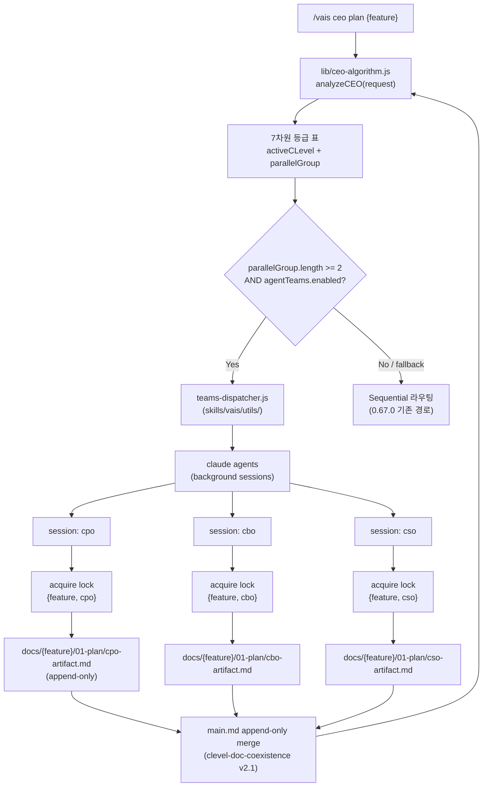
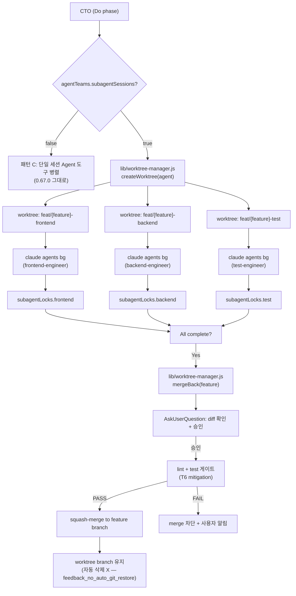

# agent-teams-orchestration — Architecture (CTO)

> Design phase | Owner: CTO | Date: 2026-05-16
> 참조: [tech-plan.md](../01-plan/tech-plan.md) §4 기능 요구사항 / [ac-verification.md](../01-plan/ac-verification.md) G1-G3

## 1. 전체 흐름



## 2. 의존성 DAG 분석 (parallelGroup 산출 알고리즘)

**입력**: `vais.config.json > cSuite.launchPipeline.dependencies` (기존 — 신규 추가 없음)
**출력**: `parallelGroup: string[]` — 동시 dispatch 가능한 C-Level 배열

```javascript
function computeParallelGroup(activeFeature, completedClevels, dependencies) {
  // 1. 미완료 C-Level 목록
  const pending = ['ceo', 'cpo', 'cto', 'cso', 'cbo', 'coo']
    .filter(c => !completedClevels.includes(c));

  // 2. 의존성 충족된 C-Level 만 필터
  const ready = pending.filter(c => {
    const deps = dependencies[c] || [];
    return deps.every(d => completedClevels.includes(d));
  });

  // 3. 그래프 간선 없는 (서로 의존성 없는) 노드들 묶음
  const group = [];
  for (const c of ready) {
    const conflictsWithGroup = group.some(g =>
      (dependencies[g] || []).includes(c) ||
      (dependencies[c] || []).includes(g)
    );
    if (!conflictsWithGroup) group.push(c);
  }

  // 4. 한도 적용 (정책 #1: max 4)
  return group.slice(0, 4);
}
```

**예시** (의존성: cto→cpo, cso→cto, coo→cto, cbo→{}):
- completedClevels=[] → ready=[ceo, cpo, cbo] → group=[ceo, cpo, cbo] (3-way 병렬)
- completedClevels=[ceo, cpo, cto] → ready=[cso, cbo, coo] → group=[cso, cbo, coo] (3-way 병렬)

## 3. Background Session Dispatch (teams-dispatcher)

**위치**: `skills/vais/utils/teams-dispatcher.js` (신규)
**책임**: `parallelGroup` 을 받아 `claude agents` background session 으로 dispatch + lock 획득

```javascript
async function dispatchTeams(feature, parallelGroup, phase) {
  const sessions = [];
  for (const clevel of parallelGroup) {
    // 1. lock 획득 (advisory)
    const lock = await acquireLock(feature, clevel);
    if (!lock.acquired) {
      console.warn(`⚠️ ${clevel} skipped — lock held by ${lock.holder}`);
      continue;
    }

    // 2. background session dispatch
    const session = await exec('claude', [
      '--bg',
      '--cwd', process.cwd(),
      `--prompt`, `Continue VAIS workflow: /vais ${clevel} ${phase} ${feature}`,
    ]);
    sessions.push({ clevel, sessionId: session.id, lock });
  }

  // 3. status.json 업데이트
  await updateStatusJson(feature, sessions);
  return sessions;
}
```

**Fallback**: `agentTeams.enabled=false` 또는 CC 2.0.x → `dispatchTeams` 가 sequential mode 로 첫 C-Level 만 반환, 나머지는 후속 호출에 대기.

## 4. SendMessage 적용 범위 (Decision #3 재확인)

| 채널 | 사용 | 이유 |
|------|------|------|
| C-Level → sub-agent | ✅ SendMessage 사용 | sub-agent ephemeral 작업 위임 — 메시지 단발성 |
| C-Level ↔ C-Level | ❌ SendMessage 금지 — 파일 기반 | grep/감사 가능성. append-only Decision Record 정합 |
| Sub-agent ↔ Sub-agent | ❌ 직접 통신 금지 | C-Level 통해 조정 |

**구현**: `agents/_shared/work-rules.md` 에 SendMessage 사용 규칙 박제. CTO 가 sub-agent 호출 후 추가 지시 필요 시 SendMessage(to: 'agent-id', prompt: '...').

## 5. Lock 라이프사이클

```
1. acquire   → status.json features.{feature}.lock = {clevel, sessionId, acquiredAt: now}
2. heartbeat → session 이 1분 주기로 lock.heartbeatAt = now (TODO: v2)
3. release   → session 정상 종료 시 lock = null
4. stale     → acquiredAt + 30min < now AND no heartbeat → 경고 표시, cleanup 가이드
```

**Stale 처리**: 자동 cleanup 안 함 (사용자 의사 확인 우선 — memory `feedback_no_auto_git_restore` 정신과 정합).

## 6. CC 2.0.x Fallback 경로

| 조건 | 동작 |
|------|------|
| `which claude` 가 2.0.x 출력 | `agentTeams.enabled` 강제 false 처리 + 1회 알림 |
| `claude agents --help` 실패 (명령어 없음) | 동일 fallback |
| `claude --version` 파싱 실패 | sequential 안전 모드 (경고만) |

검출 로직: `lib/cc-version-detect.js` (신규, 작은 wrapper).

## 7. Sub-agent Worktree 레이어 (패턴 D)

> 2026-05-16 추가 — Plan tech-plan §In-scope 의 패턴 D 정식 박제.

### 7.1 흐름



### 7.2 Worktree 생성/머지 API

**위치**: `lib/worktree-manager.js` (신규)

```javascript
async function createWorktree(feature, agent) {
  const branch = `feat/${feature}-${agent}`;
  const path = `.claude/worktrees/${feature}-${agent}`;
  await exec('git', ['worktree', 'add', path, '-b', branch]);
  return { path, branch };
}

async function mergeBack(feature, agents) {
  // 1. AskUserQuestion: diff 확인
  for (const agent of agents) {
    const diff = await exec('git', ['diff', `feat/${feature}-${agent}`]);
    // 사용자에게 표시 + 승인 요청
  }

  // 2. lint + test 게이트 (T6 mitigation)
  for (const agent of agents) {
    const r1 = await exec('npm', ['run', 'lint', '--', `worktrees/${feature}-${agent}`]);
    const r2 = await exec('npm', ['run', 'test', '--', `worktrees/${feature}-${agent}`]);
    if (r1.code !== 0 || r2.code !== 0) {
      throw new Error(`merge 차단: ${agent} lint/test 실패`);
    }
  }

  // 3. squash-merge
  for (const agent of agents) {
    await exec('git', ['merge', '--squash', `feat/${feature}-${agent}`]);
    await exec('git', ['commit', '-m', `feat(${feature}): merge ${agent} (squash)`]);
  }
}

async function listStale(staleMinutes = 30) {
  // worktree list + acquiredAt 비교
  // 자동 cleanup X — 식별만
}
```

### 7.3 Sub-agent Lock 구조 (status.json v4 확장)

`features.{name}.subagentLocks` 필드 추가:

```json
{
  "subagentLocks": {
    "frontend-engineer": {
      "sessionId": "abc123",
      "worktreeBranch": "feat/agent-teams-orchestration-frontend",
      "acquiredAt": "2026-05-16T10:00:00Z"
    },
    "backend-engineer": { ... }
  }
}
```

> **migration-plan.md 참조**: v4 스키마에 `subagentLocks: {}` (default 빈 객체) 추가 필요. 본 design 의 §7 확장으로 migration-plan §1 스키마 v4 부분 reread 요망.

### 7.4 SendMessage 정책 (확장)

| From | To | 허용 |
|------|-----|:----:|
| C-Level | sub-agent | ✅ |
| C-Level | C-Level | ❌ (파일 기반) |
| sub-agent | sub-agent (같은 C-Level 하위) | ❌ (T8 — 신규 금지) |
| sub-agent | sub-agent (다른 C-Level 하위) | ❌ (T8 — 신규 금지) |
| sub-agent | C-Level | ⚠️ 응답만 허용 (request 금지) |

### 7.5 패턴 C vs 패턴 D 분기

| 조건 | 사용 패턴 |
|------|----------|
| `agentTeams.enabled=false` | 패턴 A (sequential) |
| `agentTeams.enabled=true && subagentSessions=false` | 패턴 B (C-Level 만 병렬) + 패턴 C (sub-agent Agent 도구 병렬, 그대로) |
| `agentTeams.enabled=true && subagentSessions=true` | 패턴 B + 패턴 D (sub-agent worktree 병렬) |
| CC 2.0.x 감지 | 패턴 A (모든 토글 무시, sequential fallback) |

## 8. 관찰 (Out-of-scope 후속)

- heartbeat 메커니즘 (정책 §5 step 2) — 본 design 에서는 acquiredAt only. heartbeat 는 v2.
- session-to-session 결과 streaming — 현재는 각 session 완료 후 main.md merge 만. 실시간 progress 는 v2.
- worktree 자동 cleanup — Claude Code 가 자동 처리하지만, 우리 측 hook 으로 stale worktree 식별 가능 (v2).

---

## 변경 이력

| version | date | change |
|---------|------|--------|
| v1.0 | 2026-05-16 | 초기 작성 — DAG 알고리즘 + dispatch 흐름 + SendMessage 범위 + fallback + lock 라이프사이클 |
| v1.1 | 2026-05-16 | §7 Sub-agent Worktree 레이어 (패턴 D) 추가 — 흐름 다이어그램 / worktree-manager API / subagentLocks 구조 / SendMessage 정책 확장 / 패턴 A~D 분기 표 |
