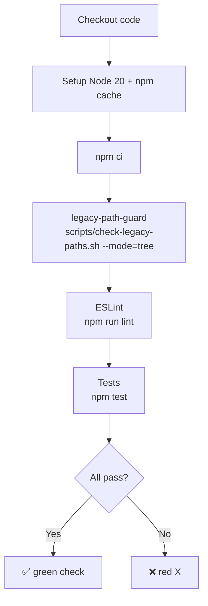

# ci-bootstrap - 설계

> ⛔ **Design 단계 범위**: 이 문서는 설계 결정만 기록합니다. `.github/workflows/ci.yml` 등 실제 파일 생성은 Do 단계에서 수행.
> 참조 문서: `docs/ci-bootstrap/01-plan/main.md`
> 담당 C-Level: **COO** (release-engineer 주 위임)

---

## Context Anchor

| Key | Value |
|-----|-------|
| **WHY** | Layer 2(pre-commit) 단독으론 hook 미설치자 우회 가능. 저장소 public화로 외부 PR 리스크 존재 |
| **WHO** | 모든 PR 제출자(외부 포함), 유지보수자(merge 권한), 미래 Claude Code agent |
| **RISK** | GitHub Actions workflow 무한 loop, branch protection 권한 필요(owner), lockfile 정합성 |
| **SUCCESS** | `.github/workflows/ci.yml` 1개가 PR/push 시 3종 검사(legacy-path + ESLint + test) 자동 실행 |
| **SCOPE** | **워크플로우 1개 + 3종 검사**. 배포 자동화·성능 regression·시크릿 스캔은 범위 밖 |

---

## Architecture Options

| Option | 설명 | 복잡도 | 유지보수 | 구현 속도 | 리스크 | 선택 |
|--------|------|:------:|:--------:|:---------:|:------:|:----:|
| A. Minimal | 단일 YAML 내 모든 검사 인라인 (`git grep` 포함) | 낮음 | 낮음 | 빠름 | 중 | |
| B. Clean | 공용 스크립트 추출 + workflow 3개 분리(test/lint/guard) | 높음 | 높음 | 느림 | 낮음 | |
| C. Pragmatic | 단일 workflow + 단일 job + 공용 스크립트 1개 (hook 재사용) | 중 | 중 | 중 | 낮음 | ✓ |

**Rationale**: C를 채택. hook과 CI가 같은 검사 로직을 공유해 drift 방지. YAML은 단순하게 유지하되, 재사용 가능한 shell 스크립트 1개만 추가.

---

## 1. 결정 사항 요약

| # | 결정 항목 | 선택 | 근거 |
|---|----------|------|------|
| D1 | legacy-path-guard 로직 공유 방식 (plan §F6) | **옵션 (a) — 공용 스크립트 추출** | hook/CI drift 방지. 예외 리스트 단일 소스 관리 |
| D2 | `package-lock.json` 생성 (plan §F10) | **생성 + 커밋** | `npm ci` 사용. 재현 가능한 빌드. eslint devDep 추가 |
| D3 | Workflow 개수 | **단일 (`ci.yml`)** | MVP 범위. 분리는 후속 피처 |
| D4 | Job 구성 | **단일 job, 순차 step** | 3종 검사 빠름(<3분). 병렬 필요 없음 |
| D5 | Node 버전 | **Node 20 (LTS)** | package.json engines `>=18.0.0` 호환, LTS 안정 |
| D6 | Trigger 정책 | `pull_request` + `push: [main]` + `workflow_dispatch` | PR 검증 + main 직접 푸시 백업 + 수동 디버그 |
| D7 | 캐시 | `actions/setup-node@v4`의 `cache: 'npm'` | 내장 기능. 별도 액션 불필요 |
| D8 | Permissions | `contents: read` | 최소 권한. 쓰기 권한 없음 |
| D9 | Branch protection | **문서화만** (GitHub UI 수동 설정) | owner 권한 + UI 설정, 자동화는 범위 밖 |
| D10 | ESLint 설치 | **devDependency로 명시** | 현재 `npx` 온-디맨드 → lockfile 기반 고정 |

---

## 2. Workflow 구조 설계

### 2.1 파일 경로
`.github/workflows/ci.yml` (신규)

### 2.2 Trigger

| Event | Branch/Ref | 실행 |
|-------|-----------|------|
| `pull_request` | 모든 대상 브랜치 | ✅ (types: [opened, synchronize, reopened]) |
| `push` | `main` 만 | ✅ |
| `workflow_dispatch` | 수동 | ✅ (디버그용) |

### 2.3 Job 구성



### 2.4 Step 상세

| # | Step name | 명령 | 실패 시 |
|---|-----------|------|--------|
| 1 | Checkout | `actions/checkout@v4` (fetch-depth: 0 for git grep) | 즉시 실패 |
| 2 | Setup Node | `actions/setup-node@v4` with `node-version: 20`, `cache: 'npm'` | 즉시 실패 |
| 3 | Install | `npm ci` | 즉시 실패 (lockfile 없으면 fallback `npm install` — 단 경고) |
| 4 | Legacy path guard | `bash scripts/check-legacy-paths.sh --mode=tree` | 즉시 실패 |
| 5 | Lint | `npm run lint` | 즉시 실패 |
| 6 | Tests | `npm test` | 즉시 실패 |

> **Step 순서 근거**: 가장 빠른 검사를 먼저(legacy-path는 초 단위). lint는 테스트 전(코드 스타일 차단). 테스트 마지막(가장 무거움).

### 2.5 실행 시간 예상

| Step | 예상 시간 |
|------|---------|
| Checkout | 3~5s |
| Setup Node + cache hit | 5~10s / miss: 20~40s |
| npm ci | cache hit: 5s / miss: 30~60s |
| legacy-path-guard | <2s |
| ESLint | 3~5s |
| Tests (`node --test tests/*.test.js`, 16 파일) | 5~15s |
| **합계** | cache hit: **~30s** / miss: **~2분** |

비기능 요구사항 (plan §6, 3분 이내) 충족.

---

## 3. 공용 스크립트 설계 — `scripts/check-legacy-paths.sh`

### 3.1 목적
`.hooks/pre-commit`의 legacy-path 검사 로직을 추출하여 hook + CI 양쪽이 재사용.

### 3.2 인터페이스

```bash
# 사용법
bash scripts/check-legacy-paths.sh --mode={staged|tree}

# --mode=staged: git diff --cached 기반 (hook용)
# --mode=tree  : 리포지토리 전체 tracked 파일 기반 (CI용)

# 종료 코드
# 0: 위반 없음
# 1: 위반 발견 (stderr에 상세)
```

### 3.3 예외 리스트 (단일 소스)

현재 `.hooks/pre-commit` case 문에 하드코딩된 예외를 스크립트 내 변수로 이관:

```bash
EXCEPTIONS="docs/_legacy/* CHANGELOG.md tests/paths.test.js README.md CLAUDE.md \
            docs/legacy-path-guard/* docs/docs-structure-redesign/* \
            docs/ci-bootstrap/* .hooks/pre-commit scripts/check-legacy-paths.sh"
```

> **`docs/ci-bootstrap/*` 예외 추가 근거**: 본 design/plan 문서가 plan §F6 참조 중 레거시 패턴 문자열(`docs/[0-9][0-9]-`)을 인용하므로 자가 차단 방지.

### 3.4 mode별 동작

| mode | 대상 파일 선택 | 검사 방법 |
|------|--------------|---------|
| `staged` | `git diff --cached --name-only --diff-filter=ACM` | 각 파일의 staged content를 `git show :$file`로 읽어 grep |
| `tree` | `git ls-files` (전체 tracked) | 각 파일을 직접 읽어 grep |

### 3.5 `.hooks/pre-commit` 리팩토링 범위

- 기존 inline legacy-path 블록(L8~L36) 제거
- `bash scripts/check-legacy-paths.sh --mode=staged` 호출로 치환
- ESLint/test 블록은 변경 없음
- **호환성**: hook의 동작/예외 리스트/출력 메시지 동일하게 유지

---

## 4. `package-lock.json` 생성 전략

### 4.1 현재 상태
- `package.json`에 `dependencies`/`devDependencies` 미선언
- `npx eslint`로 eslint 온-디맨드 설치 (느림, 비결정적)
- `package-lock.json` 없음

### 4.2 변경 계획 (Do 단계)

1. `package.json`에 devDependency 추가:
   ```json
   "devDependencies": {
     "eslint": "^9.0.0"
   }
   ```
   (현재 `eslint.config.js` flat config 사용 → eslint 9.x 호환 확인 필요)
2. `npm install` 1회 실행 → `package-lock.json` 생성
3. `.gitignore` 확인 (`node_modules/` 무시, `package-lock.json`은 커밋)
4. 기존 `.hooks/pre-commit`의 `npx eslint` → `npm run lint` 또는 로컬 설치 바이너리 경로 사용
5. 스크립트 `scripts/lint` 통일

### 4.3 CI에서의 효과

- `npm ci`: lockfile 기반 deterministic install
- cache hit 시 5초 내 완료
- ESLint 버전 고정으로 "로컬 OK, CI 실패" 현상 제거

---

## 5. Branch Protection 가이드 (문서화 대상)

Do 단계에서 `README.md` 또는 `docs/ci-bootstrap/03-do/main.md`에 추가할 가이드:

```markdown
## CI Status Check 강제 (owner 수동 설정)

1. GitHub 저장소 → Settings → Branches
2. Branch protection rules → Add rule
3. Branch name pattern: `main`
4. ✅ Require status checks to pass before merging
5. Status checks 선택: `CI / build-and-test` (workflow의 job name)
6. ✅ Require branches to be up to date before merging
7. (선택) ✅ Require pull request reviews before merging
```

> **자동화 범위 밖**: GitHub REST API로 설정 가능하나 owner PAT 필요 + 재현성 낮음. 수동 설정 유지.

---

## 6. Permissions & Security

| 항목 | 값 | 근거 |
|------|-----|------|
| `permissions` | `contents: read` | 기본(`write-all`)에서 최소화. supply-chain 공격 표면 축소 |
| Secret 사용 | 없음 | public repo + read-only job |
| Third-party action pin | 모든 action을 **major version** 참조 (`@v4`) | 보안 알림 + 호환성 균형. commit SHA pinning은 후속 |
| Fork PR 동작 | 기본 (read-only, secret 미주입) | 안전. 외부 기여자 악성 코드로 secret 유출 불가 |

---

## 7. Rollback / 실패 대응

| 시나리오 | 대응 |
|---------|------|
| Workflow 무한 loop | `push: [main]` 외 브랜치 trigger 금지로 방지. 발견 시 즉시 `workflow_dispatch`로 수동 중단 + 파일 revert |
| ESLint 규칙 오탐 | `eslint.config.js`의 rules 수정 PR. CI 실패 시 `--no-verify` 대신 규칙 수정이 원칙 |
| legacy-path 예외 추가 | `scripts/check-legacy-paths.sh`의 `EXCEPTIONS` 변수 수정 PR. 승인 후 merge |
| CI 자체 장애 (GitHub 다운) | `workflow_dispatch` 재실행. 복구 불가 시 수동 리뷰로 일시 전환 |

---

## 8. Verification (Plan SC-01~08 매핑)

| SC ID | 검증 방법 | Do 이후 수행 |
|-------|----------|------------|
| SC-01 | workflow YAML 구문 검증 (GitHub Actions UI 또는 `actionlint`) | ✅ |
| SC-02 | 테스트 PR 열어 트리거 확인 | ✅ |
| SC-03 | 일부러 실패하는 테스트 추가 후 PR → status "failure" 확인 후 revert | ✅ |
| SC-04 | lint 위반 라인 의도적 추가 → 실패 확인 후 revert | ✅ |
| SC-05 | `docs/01-plan/test.md` 같은 레거시 패턴 파일을 PR에 포함 → 실패 확인 | ✅ |
| SC-06 | main merge 후 CI 재실행 확인 | ✅ |
| SC-07 | README 뱃지 마크다운 렌더 확인 | ✅ |
| SC-08 | 본 §5 존재 + README에서 링크 | ✅ |

---

## 9. 모듈 맵 (Do 단계 참조)

| Module | Files | 변경 유형 |
|--------|-------|:--------:|
| ci-workflow | `.github/workflows/ci.yml` | create |
| shared-guard-script | `scripts/check-legacy-paths.sh` | create |
| hook-refactor | `.hooks/pre-commit` | modify |
| lockfile | `package.json`, `package-lock.json` | modify/create |
| docs-ops | `docs/ci-bootstrap/03-do/main.md`, `docs/ci-bootstrap/04-qa/main.md` | create |
| readme | `README.md` (CI 뱃지 + branch protection 가이드 링크) | modify |

### Recommended Session Plan

| Session | Modules | Description |
|---------|---------|-------------|
| Session 1 | shared-guard-script + hook-refactor | 공용 스크립트 생성 + hook 회귀 검증 (기존 동작 유지) |
| Session 2 | lockfile | devDep 추가 + `npm install` + lockfile 커밋 |
| Session 3 | ci-workflow | YAML 작성 + PR 테스트 (SC-01~06) |
| Session 4 | readme + docs-ops | 뱃지 + branch protection 가이드 + ops 문서 |

---

## Part 2/3: UI / 와이어프레임

**N/A — CI/CD 인프라 피처 (사용자 인터페이스 없음)**

상호작용 표면:
- GitHub PR 페이지의 status check 뱃지 (GitHub 제공 기본 UI)
- README의 workflow status badge (shields.io 또는 GitHub 기본)

---

## Part 4/5: Tech Stack Lock / Implementation Contract

**N/A — CTO 전용 섹션** (COO 설계 문서이며, 구현 계약은 단일 YAML + shell 스크립트로 단순하여 별도 API/Layer 계약 불필요)

기술 구성 요약:
| 영역 | 기술 | 버전 |
|------|------|------|
| CI 플랫폼 | GitHub Actions | n/a |
| Runner | `ubuntu-latest` | 24.04 (현재) |
| Node | Node 20 | LTS |
| Action `setup-node` | `actions/setup-node` | `@v4` |
| Action `checkout` | `actions/checkout` | `@v4` |
| Shell | `bash` | GNU bash 5.x |
| Linter | ESLint (devDep로 추가) | `^9.0.0` |

---

## 다음 단계 진입 조건 (Do 준비 체크)

- [x] D1~D10 결정 완료
- [x] 공용 스크립트 인터페이스 확정
- [x] Workflow step 순서 확정
- [x] 예외 리스트 단일 소스 정책 확정
- [ ] CP-2 사용자 승인 (Do 실행 전)

---

## 변경 이력

| version | date | change |
|---------|------|--------|
| v1.0 | 2026-04-17 | 초기 작성 — F6 옵션(a) 공용 스크립트 채택, F10 lockfile 생성 결정, 단일 workflow + 단일 job 구조, Node 20, 4개 세션 분할 |

<!-- template version: v0.18.0 (ops variant — UI Parts N/A) -->
