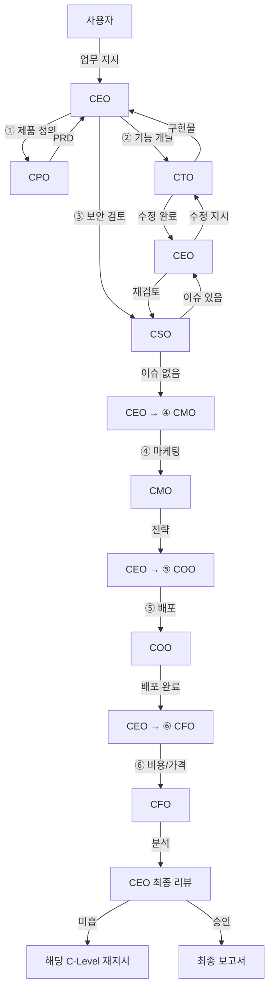

# VAIS Code — 서비스 런칭 프로세스

> CEO가 Product Owner로서 C-Level 팀을 고용·지휘하여 서비스를 런칭하는 전체 프로세스.

---

## 개요

사용자가 CEO에게 업무를 지시하면, CEO는 필요한 C-Level을 판단하여 순서대로 업무를 위임한다.
각 C-Level은 자신의 도메인에서 독립적으로 PDCA 사이클을 수행하고, 결과를 CEO에게 보고한다.
CEO는 모든 결과를 종합 검토하여 미흡한 부분을 재지시한다.

---

## 진입점 (B안: 이중 진입)

| 진입점 | 커맨드 | 용도 |
|--------|--------|------|
| **CEO** | `/vais ceo {feature}` | 서비스 런칭, 비즈니스 전략, 복합 요청 |
| **CTO** | `/vais cto {feature}` | 기술 구현만 (기획/PRD가 이미 있는 경우) |
| **개별 C-Level** | `/vais {cpo\|cso\|cmo\|cfo\|coo} {feature}` | 특정 도메인만 직접 호출 |

사용자가 직접 CTO나 CSO를 호출하는 것도 가능하다. CEO를 통하지 않아도 된다.
단, **새 서비스 런칭**처럼 전체 C-Level 협업이 필요한 경우 CEO 진입을 권장한다.

---

## 서비스 런칭 파이프라인



---

## 각 C-Level의 역할

### ① CPO — 제품 정의

**"무엇을 만들 것인가"를 정의한다.**

| 단계 | 내용 |
|------|------|
| pm-discovery | 기회 발견 (Teresa Torres OST) |
| pm-strategy + pm-research | 전략 수립 + 시장 조사 (병렬) |
| pm-prd | PRD 합성 (8개 섹션) |

산출물: `docs/03-do/cpo_{feature}.do.md` (PRD)

### ② CTO — 기능 개발

**"어떻게 만들 것인가"를 실행한다.**

| 단계 | 실행자 |
|------|--------|
| Plan | CTO 직접 |
| Design | design + architect (병렬) |
| Do | frontend + backend (병렬) |
| QA | qa 에이전트 |

산출물: 구현 코드 + `docs/03-do/cto_{feature}.do.md` + `docs/04-qa/cto_{feature}.qa.md`

### ③ CSO — 보안 검토

**CTO의 구현물을 보안 관점에서 검증한다.**

- Gate A: OWASP Top 10 기반 보안 스캔
- Critical 발견 시 → CEO에게 보고 → CEO가 CTO에게 수정 지시 → 재검토 (최대 3회)

산출물: `docs/04-qa/cso_{feature}.qa.md` (보안 판정)

### ④ CMO — 마케팅 전략

**서비스의 시장 진입 전략을 수립한다.**

- 마케팅 전략 수립
- SEO 감사 (seo 서브에이전트 위임)

산출물: `docs/03-do/cmo_{feature}.do.md`

### ⑤ COO — 배포

**서비스를 운영 환경에 배포한다.**

- CI/CD 파이프라인 설계
- 배포 전략 (Blue/Green, Canary 등)
- 모니터링 설정

산출물: `docs/03-do/coo_{feature}.do.md`

### ⑥ CFO — 비용/가격 분석

**서비스에 사용된 재원을 파악하고 기능별 적정 가격을 수립한다.**

- 기능별 개발/운영 비용 산출
- ROI 분석
- 가격 전략 (기능별 적정 가격)
- 수익 전망

산출물: `docs/03-do/cfo_{feature}.do.md`

---

## CEO 최종 리뷰

모든 C-Level 완료 후, CEO가 전체 결과를 종합 검토한다.

### 검증 매트릭스

| C-Level | 통과 기준 | 미달 시 |
|---------|----------|---------|
| CPO | PRD 8개 섹션 완성 | CPO 재실행 |
| CTO | 요구사항 100% 구현 + 빌드 성공 | CTO 재실행 |
| CSO | Critical 0건 | CSO→CTO 루프 |
| CMO | SEO ≥ 80 | CMO 재실행 |
| COO | CI/CD 전 단계 정의 | COO 재실행 |
| CFO | 비용/수익/ROI 수치 완성 | CFO 재실행 |

- 미달 C-Level에 최대 2회 재지시
- 2회 후에도 미달 → 사용자에게 에스컬레이션

---

## 범위 선택 (MVP/표준/확장)

| 범위 | 실행 C-Level | 용도 |
|------|-------------|------|
| MVP | CPO → CTO → CSO | 빠른 검증이 필요할 때 |
| 표준 | CPO → CTO → CSO → CMO → COO → CFO | 일반적인 서비스 런칭 |
| 확장 | 표준 + CEO 2차 리뷰 + 추가 반복 | 대규모 서비스 |

---

## 산출물 경로 체계

```
docs/
  ├── 01-plan/
  │   ├── ceo_{feature}.plan.md    ← CEO 전략 분석 (런칭 계획)
  │   ├── cpo_{feature}.plan.md    ← CPO 제품 범위
  │   ├── cto_{feature}.plan.md    ← CTO 기술 기획
  │   └── cso_{feature}.plan.md    ← CSO 위협 범위
  ├── 03-do/
  │   ├── cpo_{feature}.do.md      ← PRD
  │   ├── cto_{feature}.do.md      ← 구현 로그
  │   ├── cso_{feature}.do.md      ← 보안 검토 결과
  │   ├── cmo_{feature}.do.md      ← 마케팅 전략
  │   ├── coo_{feature}.do.md      ← 배포 계획
  │   └── cfo_{feature}.do.md      ← 비용/가격 분석
  ├── 04-qa/
  │   ├── cto_{feature}.qa.md      ← QA 분석
  │   └── cso_{feature}.qa.md      ← 보안 판정
  └── 05-report/
      └── ceo_{feature}.report.md  ← CEO 최종 보고서
```

---

## 변경 이력

| version | date | change |
|---------|------|--------|
| v1.0 | 2026-04-03 | 초기 작성 — CEO 중심 서비스 런칭 프로세스 정의 |
