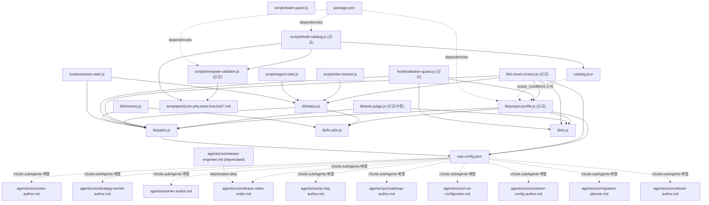

> Author: infra-architect
> Phase: 02-design
> Refs: docs/subagent-architecture-rethink/03-do/main.md, docs/subagent-architecture-rethink/03-do/solution-features.md, docs/subagent-architecture-rethink/01-plan/tech-implementation-plan.md, docs/subagent-architecture-rethink/01-plan/nfr-and-data-model.md, docs/subagent-architecture-rethink/01-plan/cto-impact-schedule.md
> Summary: F1~F8 기술 아키텍처 설계 — lib/project-profile.js 모듈 + hooks/ideation-guard.js 수정 플로우 + scripts 2개 CLI + auto-judge alignment α + 신규 sub-agent 10개 frontmatter + template 3개 샘플 + 모듈 의존성 다이어그램 + release-engineer deprecate 정책

---

## Context

PRD 8섹션 (03-do/main.md v1.1) + CTO Plan (tech-implementation-plan.md v1.0) + NFR (nfr-and-data-model.md v1.0) + Impact Schedule (cto-impact-schedule.md v1.0) 기반.

설계 범위:
- Sprint 1~3 critical 파일 4개 (F1, F2 기초)
- Sprint 7~10 신규 sub-agent 10개 frontmatter
- Sprint 4~6 template (c) 3개 샘플
- 전체 모듈 의존성 다이어그램

기술 제약 (D-T5 + 기존 패턴):
- CJS only (Node.js, no ESM, no TypeScript)
- 신규 의존성: js-yaml + gray-matter 2개만
- 보안: path traversal 차단 (lib/paths.js safePath 패턴 재사용)
- CEL 파서 불필요 — 단순 dict 비교 (YAGNI)

---

## Body

### 1. lib/project-profile.js 모듈 설계

#### 1.1 전체 인터페이스 + JSDoc

```js
'use strict';
/**
 * VAIS Code — Project Profile (F1)
 * ideation 종료 시 합의된 12변수 Profile을 로드/검증/평가.
 * 모든 C-Level 진입 시 Context Load에 자동 주입.
 *
 * @module lib/project-profile
 * @requires js-yaml   (YAML 파싱)
 * @requires lib/paths (safePath, PROJECT_DIR)
 * @requires lib/fs-utils (fileExists, atomicWriteSync)
 * @see https://github.com/nodeca/js-yaml#api
 */

// ── Schema 상수 ──────────────────────────────────────────────

const PROFILE_SCHEMA_VERSION = '1.0';

/**
 * Project Profile의 12 변수 허용 값 집합.
 * undefined 값은 "선택적 / 아직 미결정"을 의미.
 *
 * @see docs/subagent-architecture-rethink/03-do/solution-features.md#F1
 */
const ALLOWED_VALUES = {
  type: ['b2b-saas', 'b2c-app', 'marketplace', 'oss', 'internal-tool', 'api-only', 'plugin'],
  stage: ['idea', 'mvp', 'pmf', 'scale', 'mature'],
  'users.target_scale': ['proto', 'pilot', 'sub-1k', '1k-100k', '100k+'],
  'users.geography': ['domestic', 'global', 'regulated-region'],
  'business.revenue_model': ['subscription', 'transaction', 'ads', 'freemium', 'enterprise', 'none'],
  'deployment.target': ['cloud', 'on-prem', 'hybrid', 'edge', 'local-only'],
};

const BOOLEAN_FIELDS = [
  'business.monetization_active',
  'data.handles_pii',
  'data.handles_payments',
  'data.handles_health',
  'data.cross_border_transfer',
  'deployment.sla_required',
  'brand.seo_dependent',
  'brand.public_marketing',
];

// ── 경로 해석 ────────────────────────────────────────────────

/**
 * feature 의 ideation profile.yaml 경로를 반환.
 * 형식: docs/{feature}/00-ideation/project-profile.yaml
 *
 * @param {string} feature  - 피처명 (kebab-case 영문)
 * @returns {string}        - 절대 경로 (PROJECT_DIR 기준)
 * @throws {Error}          - path traversal 시도 시
 */
function profilePath(feature) { /* ... */ }

// ── 로드 ─────────────────────────────────────────────────────

/**
 * project-profile.yaml 파일을 읽어 파싱된 ProfileObject 반환.
 * 파일이 없으면 null 반환 (에러 throw 안 함).
 *
 * 보안:
 * - feature 값은 paths.safePath로 traversal 방지
 * - YAML 파싱은 js-yaml FAILSAFE_SCHEMA로 코드실행 방지
 *
 * @param {string} feature  - 피처명
 * @returns {ProjectProfile|null}
 *
 * @typedef {Object} ProjectProfile
 * @property {string}  _schema_version
 * @property {string}  _feature
 * @property {string}  type
 * @property {string}  stage
 * @property {Object}  users       - { target_scale, geography }
 * @property {Object}  business    - { revenue_model, monetization_active }
 * @property {Object}  data        - { handles_pii, handles_payments, handles_health, cross_border_transfer }
 * @property {Object}  deployment  - { target, sla_required }
 * @property {Object}  brand       - { seo_dependent, public_marketing }
 */
function loadProfile(feature) { /* ... */ }

// ── 검증 ─────────────────────────────────────────────────────

/**
 * ProfileObject의 유효성을 검사.
 * ALLOWED_VALUES 열거 검사 + BOOLEAN_FIELDS 타입 검사 + secret 패턴 차단 (G-1 NFR).
 *
 * @param {object} profile  - loadProfile() 반환 객체
 * @returns {{ valid: boolean, errors: string[] }}
 *
 * secret 패턴 (G-1):
 *   - API key / token / password 값에 엔트로피 > 3.5 문자열 포함 시 차단
 *   - 정규식: /(?:api[_-]?key|token|secret|password)\s*[:=]\s*\S{8,}/i
 */
function validateProfile(profile) { /* ... */ }

// ── Scope Conditions 평가 ────────────────────────────────────

/**
 * template frontmatter 의 scope_conditions 배열을 평가하여
 * 현재 Profile에서 해당 산출물 생성 여부를 결정.
 *
 * 문법 (CEL-like dict 비교, YAGNI 단순 구현):
 *   condition := field op value
 *   field   := "type" | "stage" | "users.target_scale" | "deployment.target" | ...
 *   op      := "=" | "!=" | "IN" | "NOT_IN" | ">=" (target_scale 순서 비교)
 *   value   := string | [string...]  (IN/NOT_IN 시 배열)
 *
 * 배열 조건은 AND 로 결합 (모든 조건이 true여야 pass).
 *
 * 예시:
 *   conditions = ["deployment.target IN [cloud,hybrid]", "business.monetization_active = true"]
 *   → cloud 또는 hybrid 배포 + 수익화 활성화 시만 true
 *
 * @param {string[]} conditions  - CEL-like 조건 문자열 배열
 * @param {ProjectProfile} profile
 * @returns {boolean}            - true = 산출물 생성, false = skip
 *
 * @see docs/subagent-architecture-rethink/03-do/solution-features.md#F1
 */
function evaluateScopeConditions(conditions, profile) { /* ... */ }

// ── Context Load 주입 ────────────────────────────────────────

/**
 * 현재 feature의 Profile을 읽어 C-Level Context Load용 문자열을 반환.
 * ideation 미완료(파일 없음) 시 경고 문자열 반환 (에러 아님).
 *
 * 반환 예:
 * ```
 * ## [VAIS] Project Profile (subagent-architecture-rethink)
 * - type: plugin | stage: mvp
 * - deployment.target: local-only | sla_required: false
 * - data.handles_pii: false | data.handles_payments: false
 * - brand.seo_dependent: false
 * ```
 *
 * @param {string} feature  - 피처명
 * @returns {string}        - Context Load 삽입용 마크다운 블록
 */
function buildContextBlock(feature) { /* ... */ }

// ── 저장 ─────────────────────────────────────────────────────

/**
 * Profile 객체를 YAML로 직렬화하여 ideation 폴더에 원자적 저장.
 * 저장 전 validateProfile() 호출 — 검증 실패 시 throw.
 *
 * @param {string}         feature
 * @param {ProjectProfile} profile
 * @returns {string}       저장된 파일의 절대 경로
 * @throws {Error}         검증 실패 또는 path traversal
 */
function saveProfile(feature, profile) { /* ... */ }

// ── feature flag ─────────────────────────────────────────────

/**
 * vais.config.json > orchestration.profileGateEnabled 읽어 반환.
 * 필드 없으면 true (기본 활성화 — Sprint 1 이후).
 *
 * @returns {boolean}
 */
function isProfileGateEnabled() { /* ... */ }

// ── exports ──────────────────────────────────────────────────

module.exports = {
  profilePath,
  loadProfile,
  validateProfile,
  evaluateScopeConditions,
  buildContextBlock,
  saveProfile,
  isProfileGateEnabled,
  PROFILE_SCHEMA_VERSION,
  ALLOWED_VALUES,
  BOOLEAN_FIELDS,
};
```

#### 1.2 핵심 구현 상세 — evaluateScopeConditions

target_scale 순서 비교를 위한 rank 맵:

```js
const TARGET_SCALE_RANK = {
  proto: 0,
  pilot: 1,
  'sub-1k': 2,
  '1k-100k': 3,
  '100k+': 4,
};

// condition 파서 (정규식 기반, CEL 파서 불필요)
// 형식: "field OP value" 또는 "field IN [v1,v2]"
const COND_PATTERN = /^(\S+)\s+(=|!=|IN|NOT_IN|>=)\s+(.+)$/;

function parseCondition(condStr) {
  const m = condStr.trim().match(COND_PATTERN);
  if (!m) return null;
  const [, field, op, rawVal] = m;
  // IN/NOT_IN: "[v1,v2,v3]" → ['v1','v2','v3']
  if (op === 'IN' || op === 'NOT_IN') {
    const vals = rawVal.replace(/^\[|\]$/g, '').split(',').map(v => v.trim());
    return { field, op, values: vals };
  }
  return { field, op, value: rawVal.trim() };
}

function getNestedValue(profile, dotPath) {
  return dotPath.split('.').reduce((obj, key) => obj?.[key], profile);
}
```

boolean 처리: `"true"` / `"false"` 문자열 및 실제 boolean 양방향 허용.

#### 1.3 테스트 케이스 5개

| # | 입력 | 기대 결과 | 검증 항목 |
|---|------|-----------|-----------|
| T-01 | conditions=[], profile=any | true | 빈 조건 = always pass |
| T-02 | `["deployment.target IN [cloud,hybrid]"]`, profile.deployment.target="cloud" | true | IN 연산자 |
| T-03 | `["deployment.target IN [cloud,hybrid]"]`, profile.deployment.target="local-only" | false | IN 연산자 (미포함) |
| T-04 | `["users.target_scale >= 1k-100k"]`, profile.users.target_scale="pilot" | false | >= 순서 비교 (rank 1 < rank 3) |
| T-05 | `["data.handles_pii = true", "users.geography = regulated-region"]`, profile.data.handles_pii=true + profile.users.geography="regulated-region" | true | 복수 AND 조건 모두 true |

추가 (보안):
- T-06: validateProfile — 값에 `secret: ghp_xxxxx` 포함 → valid=false, errors 배열 1건
- T-07: loadProfile — feature="../../../etc" → throw Error (path traversal)

---

### 2. hooks/ideation-guard.js 수정 설계

#### 2.1 기존 구조 분석

파일 경로: `hooks/ideation-guard.js` (현재 미존재 — 신규 생성이나 CTO Plan에서 "수정"으로 분류된 것은 향후 ideation hook 통합을 전제).

hooks/hooks.json 분석:
- PreToolUse Bash 훅 (bash-guard.js)
- PostToolUse Write|Edit 훅 (doc-tracker.js)
- SessionStart 훅 (session-start.js)
- ideation-guard는 현재 agents/_shared에 포함된 guard 개념 (includes 패턴)

실제 구현 전략:
1. `hooks/ideation-guard.js` 를 **신규 PostToolUse** 훅 스크립트로 작성
2. matcher: ideation 단계 완료 이벤트 감지 (00-ideation/main.md Write 이벤트)
3. Profile 합의 prompt → `AskUserQuestion` 상당 로직 (훅에서는 stdout additionalContext 활용)

#### 2.2 수정 위치 — Flow Chart

```
[ideation phase Write 이벤트]
         │
         ▼
hooks/ideation-guard.js (PostToolUse, matcher: "Write")
         │
         ├── 파일 경로 확인: docs/{feature}/00-ideation/main.md 아닌 경우
         │       └──> outputEmpty() [패스스루]
         │
         ├── 파일 경로 = docs/{feature}/00-ideation/main.md
         │       │
         │       ▼
         │   project-profile.yaml 이미 존재?
         │       ├── YES → outputAllow(buildContextBlock(feature)) [이미 합의됨]
         │       └── NO
         │               │
         │               ▼
         │           Profile 초안 추출 (main.md 파싱 — regex 기반)
         │               │
         │               ▼
         │           additionalContext에 Profile 합의 안내 삽입:
         │           "ideation 완료 — Project Profile 12변수를 확인하고 승인하거나 수정하세요."
         │           + YAML 초안 블록
         │               │
         │               ▼
         │           outputAllow(contextStr)
         │           [Claude가 다음 응답에서 AskUserQuestion으로 Profile 확정 요청]
         │               │
         │               ▼
         │           사용자 확정 응답 → saveProfile(feature, profile) 호출
         │           → docs/{feature}/00-ideation/project-profile.yaml 저장
         │
         └── lib/io.js outputAllow / outputEmpty 사용 (기존 패턴 준수)
```

#### 2.3 Profile 초안 추출 로직

ideation main.md에서 project_profile 관련 키워드를 regex로 스캔:
- "saas", "b2b", "mvp", "배포", "pii" 등 키워드 → 해당 필드 초안 설정
- 매핑 불가 필드 → `null` (사용자가 직접 입력)

```js
// ideation main.md 내용 → 초안 profile 추출
function extractProfileDraft(content, feature) {
  const draft = {
    _schema_version: PROFILE_SCHEMA_VERSION,
    _feature: feature,
    type: null,
    stage: 'idea',  // 기본값
    users: { target_scale: 'proto', geography: 'domestic' },
    business: { revenue_model: 'none', monetization_active: false },
    data: { handles_pii: false, handles_payments: false, handles_health: false, cross_border_transfer: false },
    deployment: { target: 'local-only', sla_required: false },
    brand: { seo_dependent: false, public_marketing: false },
  };
  // 키워드 스캔으로 초안 보정
  if (/\bsaas\b/i.test(content)) draft.type = 'b2b-saas';
  if (/\bplugin\b/i.test(content)) draft.type = 'plugin';
  if (/\bpii\b|개인정보/i.test(content)) draft.data.handles_pii = true;
  if (/\bpayment|결제/i.test(content)) draft.data.handles_payments = true;
  if (/\bcloud|클라우드/i.test(content)) draft.deployment.target = 'cloud';
  // ... 추가 패턴
  return draft;
}
```

---

### 3. scripts/template-validator.js + scripts/build-catalog.js 설계

#### 3.1 template-validator.js

**CLI 인터페이스**:

```
node scripts/template-validator.js [options] [paths...]

Options:
  --dir <dir>      templates/ 하위 디렉토리 (기본: 모든 subdirectory)
  --fix            수정 가능한 오류 자동 수정 (미래 기능, 현재는 dry-run)
  --json           결과를 JSON으로 출력 (CI 파이프라인용)
  --quiet          실패만 출력
  --depth-check    (c) 깊이 검증 활성화 (3섹션 존재 확인)

Exit codes:
  0  모든 template 통과
  1  1개 이상 schema 오류
  2  (c) 깊이 오류 (--depth-check 시만)
```

**frontmatter schema 검증 로직**:

```js
// @see https://github.com/jonschlinkert/gray-matter#readme

const matter = require('gray-matter');

const REQUIRED_FIELDS = ['artifact', 'owner_agent', 'phase', 'canon_source', 'execution'];
const EXECUTION_REQUIRED = ['policy'];
const VALID_POLICIES = ['always', 'scope', 'user-select', 'triggered'];
const VALID_PHASES = ['core', 'why', 'what', 'how', 'biz', 'alignment'];
const VALID_TEMPLATE_DEPTHS = ['stub', 'outline', 'filled-sample', 'filled-sample-with-checklist'];

/**
 * 단일 template 파일 검증.
 *
 * @param {string} filePath  - 절대 경로
 * @returns {{
 *   file: string,
 *   valid: boolean,
 *   errors: string[],
 *   warnings: string[],
 *   depthCheck: { sample: boolean, checklist: boolean, antipattern: boolean } | null
 * }}
 */
function validateTemplateFile(filePath) { /* ... */ }
```

**(c) 깊이 검증 로직 — 3섹션 존재 확인**:

```js
/**
 * template_depth 가 "filled-sample-with-checklist" 인 경우
 * 마크다운 본문에 3섹션이 모두 있는지 확인:
 *   1. "## (작성된 sample)" — 실제 filled sample 블록
 *   2. "## 작성 체크리스트" — 5+ 항목 (- [ ] 패턴)
 *   3. "## ⚠ Anti-pattern" 또는 "## Anti-pattern" — 3+ 항목
 *
 * @param {string} content  - 마크다운 본문 (frontmatter 제외)
 * @returns {{ sample: boolean, checklist: boolean, antipattern: boolean,
 *             checklistCount: number, antipatternCount: number }}
 */
function checkDepthC(content) {
  const sampleRe = /^##\s+\(작성된 sample\)/m;
  const checklistRe = /^##\s+작성 체크리스트/m;
  const antiRe = /^##\s+(?:⚠\s+)?Anti-pattern/m;

  const sample = sampleRe.test(content);
  const checklist = checklistRe.test(content);
  const antipattern = antiRe.test(content);

  // 항목 수 카운트
  const checklistItems = (content.match(/^- \[[ x]\]/gm) || []).length;
  const afterAnti = antipattern ? content.slice(content.search(antiRe)) : '';
  const antiItems = (afterAnti.match(/^[-*]\s+/gm) || []).length;

  return {
    sample,
    checklist,
    antipattern,
    checklistCount: checklistItems,
    antipatternCount: antiItems,
  };
}
```

#### 3.2 build-catalog.js

**CLI 인터페이스**:

```
node scripts/build-catalog.js [options]

Options:
  --templates-dir <dir>   templates/ 루트 (기본: 프로젝트 루트/templates)
  --output <file>         catalog.json 출력 경로 (기본: catalog.json)
  --validate              빌드 전 template-validator 실행 (오류 있으면 중단)
  --pretty                JSON 들여쓰기 2칸 (기본: 2칸)

Exit codes:
  0  성공
  1  template 파싱 오류 1건 이상
  2  --validate 옵션 + 검증 실패
```

**동작 흐름**:

```js
// @see https://github.com/jonschlinkert/gray-matter#readme

/**
 * templates/{section}/*.md 스캔 → catalog.json 인덱스 빌드.
 *
 * 정렬 순서: phase → policy 우선순위(always→scope→user-select→triggered) → artifact id 알파벳
 *
 * @param {object} options
 * @param {string} options.templatesDir  - templates/ 루트 절대 경로
 * @param {string} options.outputPath    - catalog.json 출력 절대 경로
 * @param {boolean} [options.validate]   - 빌드 전 schema 검증 여부
 * @returns {{ total: number, byPhase: object, errors: string[] }}
 */
function buildCatalog(options) { /* ... */ }

/**
 * 단일 template 파일을 catalog artifact 엔트리로 변환.
 *
 * @param {string} filePath   - template 파일 절대 경로
 * @param {string} sectDir    - 섹션 디렉토리명 (core/why/what/how/biz)
 * @returns {object|null}     - catalog artifact 객체 또는 null (파싱 실패)
 */
function templateToArtifact(filePath, sectDir) {
  const { data: fm, content } = matter.read(filePath);
  if (!fm.artifact) return null;
  return {
    id: fm.artifact,
    phase: fm.phase || sectDir,
    owner_agent: fm.owner_agent || null,
    canon_source: fm.canon_source || null,
    execution: fm.execution || { policy: 'user-select' },
    template_depth: fm.template_depth || 'stub',
    template_path: path.relative(process.cwd(), filePath),
    project_context_reason: fm.project_context_reason || null,
    review_recommended: fm.review_recommended ?? false,
  };
}
```

**catalog.json schema** (nfr-and-data-model.md 2.2 기준 준수):

```json
{
  "version": "1.0",
  "generated_at": "ISO-8601",
  "total_artifacts": 25,
  "policy_distribution": {
    "always": 17, "scope": 14, "user-select": 17, "triggered": 2
  },
  "artifacts": [ /* templateToArtifact 결과 배열 */ ],
  "by_phase": {
    "core": ["vision-statement", "strategy-kernel", "okr", "pr-faq", "3-horizon"],
    "why":  ["pest", "five-forces", "swot", "jtbd", "persona"],
    "what": ["value-proposition-canvas", "lean-canvas", "bmc", "nsm", "roadmap"],
    "how":  ["adr", "c4", "stride", "test-plan", "runbook"],
    "biz":  ["3-statement", "cohort", "cloud-cost", "funnel", "seo-audit"]
  },
  "by_policy": {
    "always": ["vision-statement", "..."],
    "scope":  ["c4", "stride", "..."],
    "user-select": ["pest", "pr-faq", "..."],
    "triggered": ["postmortem", "migration-plan"]
  },
  "by_intent": {
    "business-model-design": ["lean-canvas", "bmc", "vpc"],
    "market-analysis": ["pest", "five-forces", "swot"]
  }
}
```

---

### 4. lib/auto-judge.js alignment α 메트릭 추가

#### 4.1 기존 designCompleteness와 통합 인터페이스

현재 `lib/auto-judge.js` 미존재 → CTO Plan에서 "수정" 대상으로 명시 (Sprint 11~14).
설계는 신규 모듈로 작성하되, 향후 기존 designCompleteness 로직과 동일 파일에 합산.

```js
'use strict';
/**
 * VAIS Code — Auto Judge (designCompleteness + alignment α)
 *
 * designCompleteness: PRD 8섹션 존재 여부 점수 (기존 로직 자리)
 * alignment α:       단계 간 핵심 엔티티/키워드 일치율 측정
 *
 * @module lib/auto-judge
 */

// ── alignment α ──────────────────────────────────────────────

/**
 * alignment α — 두 단계 산출물 간 핵심 키워드 일치율 측정.
 * 감지율 목표 70%+ (EXP-4).
 *
 * 알고리즘:
 *   1. fromText와 toText에서 핵심 명사/복합어 추출 (stopword 제거)
 *   2. fromText 키워드 집합 K_from, toText 키워드 집합 K_to
 *   3. alignment_score = |K_from ∩ K_to| / |K_from|  (recall 기준)
 *   4. 70% 미만 시 misaligned 판정 + 누락 키워드 목록 반환
 *
 * 한계 (명시):
 *   - 동의어 처리 없음 (예: "vision" vs "목표" 미연결)
 *   - 영어 + 한국어 혼용 시 언어별 별도 처리
 *   - 70% threshold는 EXP-4 검증 후 조정 예정
 *
 * @param {AlignmentInput} input
 * @returns {AlignmentResult}
 *
 * @typedef {Object} AlignmentInput
 * @property {string} fromText      - 이전 단계 산출물 원문 (markdown)
 * @property {string} toText        - 현재 단계 산출물 원문 (markdown)
 * @property {string} fromPhase     - 'core' | 'why' | 'what' | 'how'
 * @property {string} toPhase       - 'why' | 'what' | 'how' | 'biz'
 * @property {number} [threshold]   - 일치율 임계값 (기본 0.70)
 *
 * @typedef {Object} AlignmentResult
 * @property {number}   score           - 0.0 ~ 1.0 일치율
 * @property {boolean}  aligned         - score >= threshold
 * @property {string[]} matchedKeywords - 양쪽 공통 키워드
 * @property {string[]} missingKeywords - fromText에 있으나 toText 없는 키워드
 * @property {string}   fromPhase
 * @property {string}   toPhase
 * @property {string}   summary         - 한 줄 판정 메시지
 */
function measureAlignmentAlpha(input) { /* ... */ }

// ── 키워드 추출 헬퍼 ─────────────────────────────────────────

/**
 * 마크다운 텍스트에서 핵심 명사 키워드를 추출.
 * 전처리: 코드블록 제거 → frontmatter 제거 → 한국어/영어 단어 추출.
 *
 * @param {string} text
 * @returns {Set<string>}   소문자 정규화된 키워드 집합
 */
function extractKeywords(text) { /* ... */ }

/**
 * 영어 stopword 집합 (빈도 높은 100개).
 * @type {Set<string>}
 */
const EN_STOPWORDS = new Set([
  'the', 'a', 'an', 'is', 'are', 'was', 'be', 'been', 'to', 'of', 'in',
  'for', 'on', 'with', 'at', 'by', 'from', 'and', 'or', 'but', 'not',
  'this', 'that', 'will', 'can', 'may', 'should', 'must', 'have', 'has',
  'it', 'its', 'we', 'our', 'you', 'your', 'they', 'their', 'all', 'each',
  // ... (100개)
]);

/**
 * 한국어 조사/어미 제거 기본 처리 (완전한 형태소 분석 없이 suffix 제거).
 * @param {string} word
 * @returns {string}
 */
function stripKoreanParticles(word) { /* ... */ }

// ── designCompleteness (기존 로직 자리) ──────────────────────

/**
 * PRD 8섹션 존재 여부로 completeness 점수 계산 (기존 코드 예정).
 *
 * @param {string} prdText
 * @returns {{ score: number, presentSections: string[], missingSections: string[] }}
 */
function measureDesignCompleteness(prdText) { /* ... */ }

// ── 통합 judge ───────────────────────────────────────────────

/**
 * 전체 판정 — designCompleteness + alignment α 통합 결과.
 *
 * @param {object} opts
 * @param {string}  opts.feature
 * @param {string}  opts.phase
 * @param {string}  opts.prdText        - PRD 산출물 원문
 * @param {object}  [opts.alignmentPair] - { fromText, toText, fromPhase, toPhase }
 * @returns {{
 *   completeness: object,  // measureDesignCompleteness 결과
 *   alignment: object|null // measureAlignmentAlpha 결과 또는 null
 * }}
 */
function judge(opts) { /* ... */ }

module.exports = {
  measureAlignmentAlpha,
  measureDesignCompleteness,
  extractKeywords,
  judge,
};
```

#### 4.2 70% 감지율 알고리즘 설계

**단계 쌍별 가중 키워드** (도메인 특화):

| 단계 쌍 | 고가중 키워드 예 |
|---------|----------------|
| core→why | "problem", "market", "persona", "segment", "pain", "문제", "시장" |
| why→what | "solution", "value", "proposition", "feature", "roadmap", "기능" |
| what→how | "architecture", "api", "deploy", "infra", "spec", "구현" |

가중치 적용: 고가중 키워드 매칭 시 score += 1.5 (일반 키워드 += 1.0) → 정규화.

임계 70%는 EXP-4에서 검증. 초기 구현은 단순 recall(unweighted)로 시작, 가중치는 v2에서 추가.

---

### 5. 신규 sub-agent 10개 frontmatter 초안

#### 5.1 CEO 4개

**vision-author**:

```yaml
---
name: vision-author
version: 0.59.0
description: |
  Crafts Vision Statement and BHAG (Big Hairy Audacious Goal) grounded in Collins
  'Built to Last' framework. Produces a 1-sentence inspiring vision + 10-30 year BHAG.
  Use when: delegated by CEO at Core phase start or when vision is missing/outdated.
  Policy: Always (A) — every product needs a north-star vision before strategy.
model: sonnet
layer: strategy
agent-type: subagent
parent: ceo
tools: [Read, Write, Edit, Glob, Grep, TodoWrite]
memory: project
artifacts:
  - vision-statement
  - bhag
execution:
  policy: always
  intent: vision-definition
  prereq: []
  required_after: []
  review_recommended: false
canon_source: "Collins & Porras 'Built to Last' (1994)"
advisor:
  enabled: true
  model: claude-opus-4-6
  max_uses: 3
  caching: { type: ephemeral, ttl: 5m }
includes:
  - _shared/advisor-guard.md
---
```

**Role**: Vision Statement + BHAG 초안 작성 전문가. Collins의 "Core Ideology + Envisioned Future" 구조를 정확히 구현.

**Execution Flow** (5단계):
1. 기존 ideation main.md + Project Profile 읽기 (존재 시)
2. Core Ideology 분석 — Core Values (5개 이하) + Core Purpose 추출
3. Envisioned Future 설계 — BHAG 후보 2~3개 + Vivid Description 초안
4. Vision Statement 1문장 정제 (영문 + 한국어 번역)
5. `templates/core/vision-statement.md` 형식으로 산출물 저장 → scratchpad Write

---

**strategy-kernel-author**:

```yaml
---
name: strategy-kernel-author
version: 0.59.0
description: |
  Writes Strategy Kernel (Diagnosis, Guiding Policy, Coherent Actions) using Rumelt's
  'Good Strategy / Bad Strategy' framework. Also produces 3-Horizon roadmap skeleton.
  Use when: delegated by CEO after vision is defined, before What/roadmap phase.
  Policy: Always (A) — strategy without kernel is wish-list.
model: sonnet
layer: strategy
agent-type: subagent
parent: ceo
tools: [Read, Write, Edit, Glob, Grep, TodoWrite]
memory: project
artifacts:
  - strategy-kernel
  - 3-horizon-strategy
execution:
  policy: always
  intent: strategy-definition
  prereq: [vision-statement]
  required_after: []
  review_recommended: true
canon_source: "Rumelt 'Good Strategy / Bad Strategy' (2011)"
advisor:
  enabled: true
  model: claude-opus-4-6
  max_uses: 3
  caching: { type: ephemeral, ttl: 5m }
includes:
  - _shared/advisor-guard.md
---
```

**Role**: Rumelt Kernel 3단계 (진단-정책-행동) 구조 + McKinsey 3-Horizon 스켈레톤 작성.

**Execution Flow** (6단계):
1. Vision Statement + Project Profile + ideation main.md 읽기
2. Diagnosis 작성 — 핵심 장애물/기회 식별 (Rumelt: "simplification of reality")
3. Guiding Policy 정의 — 전략적 접근 방향 1~2문장
4. Coherent Actions 목록 — 정책을 강화하는 구체적 행동 3~7개
5. 3-Horizon 스켈레톤 — H1(Now)/H2(Next)/H3(Future) 범위 초안
6. 산출물 저장 + review_recommended: true 경고 주석

---

**okr-author**:

```yaml
---
name: okr-author
version: 0.59.0
description: |
  Defines OKRs (Objective + 3-5 Key Results) following Grove / Doerr methodology.
  Produces quarterly OKR set with leading/lagging KR distinction.
  Use when: delegated by CEO/CPO after strategy kernel is defined.
  Policy: Always (A) — OKR is the execution contract between strategy and team.
model: sonnet
layer: strategy
agent-type: subagent
parent: ceo
tools: [Read, Write, Edit, Glob, Grep, TodoWrite]
memory: project
artifacts:
  - okr
execution:
  policy: always
  intent: goal-setting
  prereq: [strategy-kernel]
  required_after: []
  review_recommended: false
canon_source: "Grove 'High Output Management' (1983) + Doerr 'Measure What Matters' (2018)"
advisor:
  enabled: true
  model: claude-opus-4-6
  max_uses: 3
  caching: { type: ephemeral, ttl: 5m }
includes:
  - _shared/advisor-guard.md
---
```

**Role**: OKR 전문 작성가. Doerr의 "Objective는 영감, KR은 측정 가능 + 시간 한정" 원칙 엄수.

**Execution Flow** (5단계):
1. Strategy Kernel + Project Profile 읽기
2. Objective 초안 — 질적, 영감적, 분기 단위 목표 1개
3. Key Results 3~5개 — leading/lagging 구분 + 기준치/목표치 명시
4. Scoring 가이드 추가 (0.0~1.0, Doerr stretch: 0.7이 성공)
5. 산출물 저장

---

**pr-faq-author**:

```yaml
---
name: pr-faq-author
version: 0.59.0
description: |
  Writes Amazon-style Working Backwards PR/FAQ document. Produces a 1-page press release
  (future date) + 5-section FAQ (external 3 + internal 2).
  Use when: delegated by CEO at Core phase to pressure-test product idea from customer POV.
  Policy: User-select (C) — valuable but not always necessary.
model: sonnet
layer: strategy
agent-type: subagent
parent: ceo
tools: [Read, Write, Edit, Glob, Grep, TodoWrite]
memory: project
artifacts:
  - pr-faq
execution:
  policy: user-select
  intent: customer-validation
  prereq: [vision-statement]
  required_after: []
  review_recommended: false
  alternates: [lean-canvas, jtbd]
canon_source: "Amazon 'Working Backwards' (Bryar & Carr, 2021)"
advisor:
  enabled: true
  model: claude-opus-4-6
  max_uses: 3
  caching: { type: ephemeral, ttl: 5m }
includes:
  - _shared/advisor-guard.md
---
```

**Role**: Amazon Working Backwards 방식 PR/FAQ 전문 작성가.

**Execution Flow** (6단계):
1. Vision + Strategy Kernel + Project Profile 읽기
2. 미래 날짜 Press Release 1페이지 초안 (헤드라인 + 부제 + 3문단 본문 + CTA)
3. External FAQ 3개 — 고객 관점 가장 날카로운 질문 + 정직한 답변
4. Internal FAQ 2개 — 실행 가능성/리스크 관점
5. "Clarity Test" — PR이 1분 내 이해 가능한지 자가 평가
6. 산출물 저장

---

#### 5.2 CPO 1개

**roadmap-author**:

```yaml
---
name: roadmap-author
version: 0.59.0
description: |
  Produces Now-Next-Later Roadmap grounded in ProductPlan's framework.
  Translates OKR and strategy into outcome-based roadmap (not feature list).
  Use when: delegated by CPO at What phase after OKR is defined.
  Policy: Always (A) — roadmap is the bridge from strategy to backlog.
model: sonnet
layer: product
agent-type: subagent
parent: cpo
tools: [Read, Write, Edit, Glob, Grep, TodoWrite]
memory: project
artifacts:
  - roadmap
execution:
  policy: always
  intent: roadmap-planning
  prereq: [okr, strategy-kernel]
  required_after: [prd]
  review_recommended: false
canon_source: "ProductPlan 'Now-Next-Later Roadmap' (2019)"
advisor:
  enabled: true
  model: claude-opus-4-6
  max_uses: 3
  caching: { type: ephemeral, ttl: 5m }
includes:
  - _shared/advisor-guard.md
---
```

**Role**: Now-Next-Later Roadmap 전문 작성가. "기능 목록이 아닌 결과 중심(outcome-based)" 원칙 엄수.

**Execution Flow** (5단계):
1. OKR + Strategy Kernel + Project Profile 읽기
2. 결과(Outcome) 정의 — Now/Next/Later 각 기간의 목표 상태
3. 이니셔티브 매핑 — 각 결과를 달성할 이니셔티브 묶음
4. 의존성 + 리스크 표시 (붉은 플래그)
5. 산출물 저장 + backlog-manager에게 핸드오프 안내

---

#### 5.3 COO 5개 (release-engineer 5분해)

**release-notes-writer**:

```yaml
---
name: release-notes-writer
version: 0.59.0
description: |
  Writes structured Release Notes and maintains CHANGELOG.md following Keep a Changelog
  convention. Produces per-release notes with Added/Changed/Fixed/Security sections.
  Use when: delegated by COO at every deployment. No scope conditions — always required.
  Policy: Always (A).
model: sonnet
layer: operations
agent-type: subagent
parent: coo
tools: [Read, Write, Edit, Glob, Grep, TodoWrite]
memory: none
artifacts:
  - release-notes
  - changelog-entry
execution:
  policy: always
  intent: release-documentation
  prereq: []
  required_after: []
  review_recommended: false
canon_source: "Keep a Changelog (keepachangelog.com, Lacan 2023)"
advisor:
  enabled: true
  model: claude-opus-4-6
  max_uses: 2
  caching: { type: ephemeral, ttl: 5m }
includes:
  - _shared/advisor-guard.md
---
```

**Role**: Release Notes + CHANGELOG 전문 작성가.

**Execution Flow** (5단계):
1. 변경 커밋 로그 / PR 제목 읽기 (Git log 또는 COO 전달)
2. Semantic Versioning 결정 (Major/Minor/Patch)
3. Added/Changed/Deprecated/Removed/Fixed/Security 섹션 분류
4. CHANGELOG.md 업데이트 (원자적 쓰기)
5. 배포 채널별 단문 요약 (Slack/Email 형식) 선택 제공

---

**ci-cd-configurator**:

```yaml
---
name: ci-cd-configurator
version: 0.59.0
description: |
  Configures CI/CD pipelines (GitHub Actions / GitLab CI / CircleCI) for cloud/hybrid
  deployments. Scope-gated: only runs when deployment.target IN [cloud, hybrid] AND
  users.target_scale >= pilot.
  Use when: delegated by COO for pipeline setup or modification.
  Policy: Scope (B).
model: sonnet
layer: operations
agent-type: subagent
parent: coo
tools: [Read, Write, Edit, Glob, Grep, Bash, TodoWrite]
memory: none
artifacts:
  - ci-cd-pipeline
  - github-actions-workflow
execution:
  policy: scope
  scope_conditions:
    - "deployment.target IN [cloud,hybrid]"
    - "users.target_scale >= pilot"
  intent: ci-cd-automation
  prereq: []
  required_after: []
  review_recommended: false
canon_source: "GitHub Actions Documentation (docs.github.com/actions)"
disallowedTools:
  - "Bash(rm -rf*)"
  - "Bash(git push --force*)"
advisor:
  enabled: true
  model: claude-opus-4-6
  max_uses: 3
  caching: { type: ephemeral, ttl: 5m }
includes:
  - _shared/advisor-guard.md
---
```

**Role**: CI/CD 파이프라인 전문 구성가. 기존 release-engineer의 CI/CD 기능만 담당.

**Execution Flow** (6단계):
1. Project Profile 로드 → scope_conditions 평가 (미충족 시 skip + 이유 반환)
2. 기존 CI 설정 파일 탐색 (.github/workflows, .gitlab-ci.yml 등)
3. 파이프라인 단계 설계 (lint → test → build → deploy)
4. 환경별 설정 분리 (dev/staging/prod secrets)
5. 파이프라인 파일 생성/수정
6. 롤백 트리거 조건 정의

---

**container-config-author**:

```yaml
---
name: container-config-author
version: 0.59.0
description: |
  Creates Dockerfile and docker-compose.yml for containerized deployments.
  Scope-gated: only runs when deployment.containerized is true.
  Use when: delegated by COO for container setup.
  Policy: Scope (B).
model: sonnet
layer: operations
agent-type: subagent
parent: coo
tools: [Read, Write, Edit, Glob, Grep, TodoWrite]
memory: none
artifacts:
  - dockerfile
  - docker-compose
execution:
  policy: scope
  scope_conditions:
    - "deployment.target IN [cloud,hybrid,on-prem]"
  intent: containerization
  prereq: []
  required_after: []
  review_recommended: false
canon_source: "Docker Documentation (docs.docker.com)"
advisor:
  enabled: true
  model: claude-opus-4-6
  max_uses: 2
  caching: { type: ephemeral, ttl: 5m }
includes:
  - _shared/advisor-guard.md
---
```

**Role**: Docker 설정 전문 작성가. multi-stage build + 보안 베스트 프랙티스 적용.

**Execution Flow** (5단계):
1. Project Profile 로드 → scope_conditions 평가
2. 기존 패키지 매니페스트 탐색 (package.json / pyproject.toml 등)
3. multi-stage Dockerfile 작성 (builder → runtime 분리)
4. docker-compose.yml 작성 (서비스 + 볼륨 + 환경변수)
5. .dockerignore 생성

---

**migration-planner**:

```yaml
---
name: migration-planner
version: 0.59.0
description: |
  Creates schema migration plan when DB schema changes are detected. Triggered policy:
  only activates on explicit DB schema change events, not on every deployment.
  Use when: delegated by COO or CTO when DB schema modification is needed.
  Policy: Triggered (D).
model: sonnet
layer: operations
agent-type: subagent
parent: coo
tools: [Read, Write, Edit, Glob, Grep, TodoWrite]
memory: none
artifacts:
  - migration-plan
  - rollback-script
execution:
  policy: triggered
  trigger_events: ["db-schema-change", "migration-requested"]
  intent: schema-migration
  prereq: []
  required_after: []
  review_recommended: true
canon_source: "Flyway / Liquibase migration best practices"
advisor:
  enabled: true
  model: claude-opus-4-6
  max_uses: 3
  caching: { type: ephemeral, ttl: 5m }
includes:
  - _shared/advisor-guard.md
---
```

**Role**: DB 마이그레이션 계획 전문가. 롤백 시나리오 필수 포함.

**Execution Flow** (6단계):
1. 기존 schema 파일 탐색 (migrations/, prisma/, drizzle/ 등)
2. 변경 내용 분류 (ADD COLUMN / DROP COLUMN / CREATE TABLE / ALTER)
3. 순방향 마이그레이션 SQL/ORM 스크립트 작성
4. 역방향 롤백 스크립트 작성
5. 데이터 손실 위험 평가 (review_recommended: true 근거)
6. 마이그레이션 실행 체크리스트 작성

---

**runbook-author**:

```yaml
---
name: runbook-author
version: 0.59.0
description: |
  Writes operational Runbook (deployment procedures, incident playbook) following
  Google SRE book conventions. Scope-gated: only when sla_required=true or scale >= 1k-100k.
  Use when: delegated by COO for operational documentation.
  Policy: Scope (B).
model: sonnet
layer: operations
agent-type: subagent
parent: coo
tools: [Read, Write, Edit, Glob, Grep, TodoWrite]
memory: none
artifacts:
  - runbook
  - incident-playbook
execution:
  policy: scope
  scope_conditions:
    - "deployment.sla_required = true"
  intent: operational-documentation
  prereq: []
  required_after: []
  review_recommended: false
canon_source: "Beyer et al. 'Site Reliability Engineering' (Google, 2016)"
advisor:
  enabled: true
  model: claude-opus-4-6
  max_uses: 2
  caching: { type: ephemeral, ttl: 5m }
includes:
  - _shared/advisor-guard.md
---
```

**Role**: 운영 Runbook + 인시던트 Playbook 전문 작성가.

**Execution Flow** (5단계):
1. Project Profile 로드 → scope_conditions 평가
2. 배포 절차 단계 정의 (pre-deploy checklist → deploy → smoke test → rollback)
3. 인시던트 분류 트리 작성 (Severity 1~4 + 대응 SLA)
4. On-call 핸드오프 체크리스트
5. 런북 저장 + SRE-engineer와의 연계 포인트 명시

---

### 6. 신규 template 3개 샘플

#### 6.1 templates/core/vision-statement.md

```markdown
---
artifact: vision-statement
owner_agent: vision-author
phase: core
canon_source: "Collins & Porras 'Built to Last' (1994)"
execution:
  policy: always
  intent: vision-definition
  prereq: []
  required_after: [strategy-kernel, okr]
  review_recommended: false
  trigger_events: []
  scope_conditions: []
template_depth: filled-sample-with-checklist
project_context_reason: "Core 단계 첫 번째 산출물 — 모든 전략과 결정의 북극성"
review_recommended: false
---

# Vision Statement + BHAG

> **canon**: Collins & Porras "Built to Last" — Core Ideology + Envisioned Future 구조
>
> **정의**: Vision = Core Ideology (불변) + Envisioned Future (달성 목표). BHAG는 10~30년 단위의
> 크고 어렵고 대담한 목표 (Big Hairy Audacious Goal).

---

## 구조

### Core Ideology

| 항목 | 내용 |
|------|------|
| **Core Values** | (무엇을 믿는가? — 5개 이하, 외부 보상 무관하게 지킬 것) |
| **Core Purpose** | (왜 존재하는가? — "돈을 벌기 위해"가 아닌 더 깊은 이유) |

### Envisioned Future

| 항목 | 내용 |
|------|------|
| **BHAG** | (10~30년, 측정 가능, 달성 확률 50~70%의 목표) |
| **Vivid Description** | (BHAG 달성 시 세상이 어떤 모습인지 생생하게 묘사 — 현재 시제) |

---

## (작성된 sample)

**제품**: VAIS Code (AI C-Suite 플러그인)

### Core Ideology

| 항목 | 내용 |
|------|------|
| **Core Values** | 1) 결정의 근거는 항상 정전(Canon)에 있어야 한다 2) 사용자의 지식 격차를 채우되 주권은 돌려준다 3) 쓸데없이 만드는 것은 낭비다 |
| **Core Purpose** | 혼자 일하는 빌더도 팀이 있는 것처럼 만든다 |

### Envisioned Future

| 항목 | 내용 |
|------|------|
| **BHAG** | 2035년까지, 전 세계 10만 명의 솔로 빌더가 VAIS를 통해 팀 없이도 Fortune 500 수준의 제품 프로세스를 실행한다 |
| **Vivid Description** | 한 명의 개발자가 오전 커피 한 잔을 마시는 동안 VAIS CEO에게 "신규 피처 X 시작해"라고 말하면, 오후에 완성된 PRD, 아키텍처, 보안 감사, GTM 초안이 나온다. 그 결과물에는 어느 컨설팅 펌이 만든 것보다 명확한 정전 출처가 붙어 있다. |

---

## 작성 체크리스트

- [ ] Core Values는 5개 이하이며, 돈/성장이 아닌 진정한 신념인가?
- [ ] Core Purpose는 "왜 존재하는가?"에 답하고 있는가? ("돈 벌기 위해" 제외)
- [ ] BHAG는 10년 이상 장기이며 측정 가능한 지표를 포함하는가?
- [ ] BHAG 달성 확률이 50~70% 수준인가? (100% = 도전 아님, 5% = 환상)
- [ ] Vivid Description이 현재 시제로 구체적인 장면을 묘사하는가?
- [ ] Vision 전체가 내부 팀이 암기할 수 있을 만큼 간결한가?

---

## ⚠ Anti-pattern

- **Financial BHAG**: "2030년 매출 1조 원" — 숫자 목표는 BHAG가 아니라 재무 목표임. Collins는 명시적으로 경고.
- **현재 상태 기술**: Vision이 "우리는 X를 한다"처럼 현재 상태를 기술하면 방향이 없음. Envisioned Future는 아직 없는 미래여야 함.
- **너무 짧은 BHAG 기간**: "3년 안에 1위" — BHAG는 10~30년. 3년 목표는 OKR에 적합.
```

---

#### 6.2 templates/core/strategy-kernel.md

```markdown
---
artifact: strategy-kernel
owner_agent: strategy-kernel-author
phase: core
canon_source: "Rumelt 'Good Strategy / Bad Strategy' (2011)"
execution:
  policy: always
  intent: strategy-definition
  prereq: [vision-statement]
  required_after: [okr, roadmap]
  review_recommended: true
  trigger_events: []
  scope_conditions: []
template_depth: filled-sample-with-checklist
project_context_reason: "Core 단계 두 번째 산출물 — Vision을 실행 가능한 전략으로 변환. review_recommended=true: 자기기만적 진단 위험."
review_recommended: true
---

# Strategy Kernel

> **canon**: Rumelt "Good Strategy / Bad Strategy" — 좋은 전략의 핵심 구조
>
> **경고**: Rumelt는 대부분의 "전략"을 나쁜 전략(목표 나열 + 구호)으로 진단함.
> Kernel은 진단 → 정책 → 행동의 3단계 논리 사슬이어야 함.

---

## 구조

### 1. Diagnosis (진단)

> 핵심 문제/기회를 단순화하여 정의. "현실의 단순화" — Rumelt.
> **가장 어려운 부분**: 무엇이 진짜 문제인가?

[여기에 진단 작성 — 3~5문장. 시장/내부/경쟁/기술 중 가장 결정적 장애물 1~2개]

### 2. Guiding Policy (정책)

> 진단에 대응하는 전략적 접근. 무엇을 할지 + **무엇을 하지 않을지** 포함.

[여기에 정책 작성 — 1~2문장. 방향성이지 구체적 행동이 아님]

### 3. Coherent Actions (행동)

> 정책을 강화하는 행동 목록. **서로 연관되어 정책을 상호 강화해야 함.**

| # | 행동 | 정책과의 연결 |
|---|------|--------------|
| 1 | ... | ... |
| 2 | ... | ... |
| 3 | ... | ... |

---

## (작성된 sample)

**제품**: VAIS Code

### 1. Diagnosis

VAIS의 44개 sub-agent는 호출되면 무조건 산출물을 생성하는 "default-execute" 패턴을 가지고 있다. 사용자의 프로젝트 맥락(B2B SaaS vs 개인 플러그인, MVP vs Scale 등)을 고려하지 않아 "쓸데없이 CI/CD를 만드는" 마찰이 발생한다. 근본 문제는 맥락 없는 실행이다.

### 2. Guiding Policy

VAIS의 모든 sub-agent는 Project Profile(12변수) + 실행 정책(A/B/C/D) 조합으로 동작해야 한다. 범용 AI처럼 모든 것을 만드는 방향이 아닌, 이 프로젝트에 필요한 것만 만드는 방향으로.

### 3. Coherent Actions

| # | 행동 | 정책과의 연결 |
|---|------|--------------|
| 1 | ideation 종료 시 Project Profile 12변수 합의 → yaml 저장 | 맥락 포착의 유일한 진입점 |
| 2 | 모든 template frontmatter에 scope_conditions 정의 | 정책이 코드로 실행됨 |
| 3 | release-engineer 5분해 — scope별 분리 | 가장 큰 마찰 직접 해소 |
| 4 | 50+ 산출물 카탈로그 (c) 깊이 — 정전 출처 명시 | 맥락-산출물 계약을 신뢰 가능하게 |

---

## 작성 체크리스트

- [ ] Diagnosis가 "현실을 단순화"하고 있는가? (목표 나열이 아님)
- [ ] 진단이 증거 또는 데이터(정성/정량)에 기반하는가?
- [ ] Guiding Policy가 Trade-off를 명시하는가? (무엇을 안 하는가?)
- [ ] Coherent Actions들이 서로 독립적이지 않고 상호 강화하는가?
- [ ] 전략이 "경쟁자가 쉽게 복제할 수 없는" 방향인가?
- [ ] review_recommended=true 이유를 문서 내 명시했는가?

---

## ⚠ Anti-pattern

- **Fluff + Wish**: "우리는 최고가 될 것이다" — 진단 없는 선언은 나쁜 전략의 전형. Rumelt 2장 참조.
- **행동 목록 = 전략**: 할 일 목록(Todo)을 나열하는 것은 전략이 아님. 행동들이 Guiding Policy를 공통으로 강화해야 함.
- **모든 것 우선**: "모든 기능이 중요하다"는 우선순위 결여. 전략은 선택과 집중.
```

---

#### 6.3 templates/core/okr.md

```markdown
---
artifact: okr
owner_agent: okr-author
phase: core
canon_source: "Grove 'High Output Management' (1983) + Doerr 'Measure What Matters' (2018)"
execution:
  policy: always
  intent: goal-setting
  prereq: [strategy-kernel]
  required_after: [roadmap]
  review_recommended: false
  trigger_events: []
  scope_conditions: []
template_depth: filled-sample-with-checklist
project_context_reason: "Core 단계 세 번째 산출물 — 전략을 분기 단위 측정 가능한 목표로 변환. Strategy Kernel 없이는 작성 불가."
review_recommended: false
---

# OKR (Objective + Key Results)

> **canon**: Grove "High Output Management" + Doerr "Measure What Matters"
>
> **원칙**: Objective = 질적, 영감적, 시간 한정. Key Result = 측정 가능, 이진(binary) 또는 수치.
> Doerr: "KR이 달성되면 반드시 O가 달성된 것이어야 한다."

---

## OKR 세트 (분기: YYYY-QN)

**기간**: ______

### Objective

> [영감적이고 질적인 목표 — 1문장. 분기 내 팀이 집중할 방향]

### Key Results

| # | Key Result | 기준치 | 목표치 | 타입 | 담당 |
|---|------------|--------|--------|------|------|
| KR1 | ... | ... | ... | 수치/이진 | ... |
| KR2 | ... | ... | ... | 수치/이진 | ... |
| KR3 | ... | ... | ... | 수치/이진 | ... |

> **scoring 가이드** (Doerr):
> - 1.0 = 목표 초과 달성 (예상치 못한 결과)
> - 0.7 = stretch 목표 달성 (적절한 성공)
> - 0.5 = 기대 이하 (반성 필요)
> - 0.3 이하 = 실패 (목표 재검토)
>
> **warning**: OKR이 매번 1.0이면 목표가 너무 낮은 것.

---

## (작성된 sample)

**제품**: VAIS Code | **기간**: 2026-Q2

### Objective

VAIS sub-agent의 "default-execute" 패턴을 해소하여 사용자가 "쓸데없이 만들어진" 산출물 없이 신뢰할 수 있는 AI C-Suite를 경험한다.

### Key Results

| # | Key Result | 기준치 | 목표치 | 타입 | 담당 |
|---|------------|--------|--------|------|------|
| KR1 | Project Profile 게이트 B 정책 skip 적중률 | 0% | ≥ 95% | 수치 | CTO |
| KR2 | 우선 25개 template (c) 깊이 완성 | 0개 | 25개 | 수치 | CTO/CPO |
| KR3 | 44 sub-agent Q-A/B/C/D 4기준 점검 완료 | 0개 | 44개 | 이진 | QA |
| KR4 | alignment α 70%+ 감지율 검증 (EXP-4) | 미측정 | 70%+ | 수치 | CTO |

---

## 작성 체크리스트

- [ ] Objective가 영감적이고 질적인가? (수치 포함 금지)
- [ ] KR이 모두 측정 가능한 수치 또는 이진(binary) 결과인가?
- [ ] "KR 전부 달성 = O 자동 달성" 인지 논리 확인했는가?
- [ ] KR 수가 3~5개 범위인가? (2개 이하 = 너무 단순, 6개 이상 = 집중 희석)
- [ ] leading KR(선행지표)과 lagging KR(결과지표)이 혼합되어 있는가?
- [ ] Scoring 가이드 (0.7 = 성공 기준)를 팀이 알고 있는가?

---

## ⚠ Anti-pattern

- **Activity KR**: "회의 10회 진행" — 활동이 아닌 결과(outcome)여야 함. "→ 의사결정 10건 완료"로 변환.
- **부드러운 KR**: "고객 만족도 향상" — 측정 불가. "NPS 점수 30 → 50으로 향상"으로 구체화.
- **O가 KR인 OKR**: "매출 1억 달성" — 이것은 KR이지 O가 아님. O는 "팀이 자랑스러워할 시장 위치 확보" 같은 질적 목표.
```

---

### 7. 모듈 의존성 다이어그램



**의존성 원칙 (D-DP)**:
- `lib/project-profile.js`는 `lib/paths.js` + `lib/fs-utils.js` + `lib/io.js` 3개만 의존 (최소화)
- `lib/auto-judge.js`는 `lib/paths.js` + `lib/io.js` 2개만 의존 (외부 NLP 라이브러리 금지 — YAGNI)
- `scripts/build-catalog.js`는 `scripts/template-validator.js`를 선택적으로 호출 (--validate 플래그 시만)
- `hooks/ideation-guard.js`는 `lib/io.js` + `lib/project-profile.js` 2개만 의존 (훅은 경량 유지)
- 순환 의존 금지 — `lib/status.js → lib/paths.js` 단방향 유지

---

### 8. release-engineer deprecate 정책 구체화

#### 8.1 Deprecate Notice Template

`agents/coo/release-engineer.md` frontmatter에 추가될 섹션:

```yaml
---
name: release-engineer
version: 0.59.0
deprecated: true
deprecation_notice: |
  v0.59에서 5개 전문 sub-agent로 분해됨.
  - 릴리즈 노트/CHANGELOG → release-notes-writer
  - CI/CD 파이프라인 → ci-cd-configurator
  - Docker/컨테이너 → container-config-author
  - DB 마이그레이션 → migration-planner
  - 운영 런북 → runbook-author
  현재 호출은 release-notes-writer로 redirect됩니다.
  v0.60에서 완전 제거 예정.
removal_target: "v0.60"
redirect_to: release-notes-writer
# ... 기존 필드 유지 (backward compat)
---
```

#### 8.2 Alias Redirect 메커니즘

**구현 위치**: `scripts/agent-start.js` (기존 PostToolUse 훅 스크립트)

```js
// @see hooks/hooks.json SubagentStart 이벤트
const DEPRECATED_AGENT_REDIRECTS = {
  'release-engineer': 'release-notes-writer',
};

function handleDeprecatedAgentRedirect(agentName) {
  const redirect = DEPRECATED_AGENT_REDIRECTS[agentName];
  if (!redirect) return null;
  return {
    redirectTo: redirect,
    notice: `[VAIS] ⚠️  ${agentName} 는 v0.59에서 deprecated 됨. ${redirect}로 redirect합니다. v0.60에서 완전 제거.`,
  };
}
```

**additionalContext 주입**: SubagentStart 훅에서 deprecation 경고를 Claude 컨텍스트에 삽입.

#### 8.3 제거 타임라인

| 마일스톤 | 시점 | 조치 |
|---------|------|------|
| v0.59 (Sprint 7~10) | 현재 피처 Do 단계 | deprecate 마킹 + redirect + 경고 주입 |
| v0.60 (Sprint 11~14) | 1 phase 후 | `agents/coo/release-engineer.md` 파일 삭제 + `vais.config.json cSuite.coo.subAgents` 배열에서 제거 + `package.json claude-plugin.agents`에서 제거 |
| v0.60 CHANGELOG.md | v0.60 릴리즈 | `BREAKING CHANGE: release-engineer removed. Use release-notes-writer / ci-cd-configurator / container-config-author / migration-planner / runbook-author.` |

**CHANGELOG 항목 예시** (Keep a Changelog 형식):

```markdown
## [0.60.0] - 2026-TBD

### Removed
- `agents/coo/release-engineer` — v0.59에서 deprecated된 통합 COO sub-agent 완전 제거.
  마이그레이션: 목적에 따라 5개 전문 sub-agent 중 선택.

### BREAKING CHANGE
- release-engineer 호출이 더 이상 작동하지 않음. COO에게 위임 시 목적을 명시하면 COO가 적절한 sub-agent를 선택함.
```

---

## Decisions

| ID | 결정 | 근거 |
|----|------|------|
| D-IA-01 | `evaluateScopeConditions` — CEL 파서 대신 정규식 기반 단순 파서 구현 | D-T5 (YAGNI): 단순 dict 비교로 SC-01/SC-03 충분. 확장 시 파서 교체 가능하도록 모듈 경계 유지 |
| D-IA-02 | YAML 파싱에 js-yaml FAILSAFE_SCHEMA 사용 | G-1 NFR 보안: YAML arbitrary code execution 방지 (js-yaml DEFAULT_SCHEMA는 !!js/function 허용) |
| D-IA-03 | `ideation-guard.js` 를 PostToolUse 훅으로 구현 (별도 훅 이벤트 없음) | hooks.json 기존 패턴 준수. PreToolUse/PostToolUse만 지원됨. Write 이벤트 필터링으로 ideation main.md 완료 감지 |
| D-IA-04 | `build-catalog.js` — `template-validator.js` 는 선택적 의존 (--validate 플래그) | 빌드 속도 최적화: 기본 빌드는 schema 검증 없이 진행. CI에서는 --validate 필수 |
| D-IA-05 | `auto-judge.js` alignment α — 단순 keyword recall 기반 (가중치 없음 v1) | 70% 감지율 목표는 EXP-4에서 검증 후 가중치 v2 추가. 초기 단순 구현으로 베이스라인 측정 |
| D-IA-06 | 신규 sub-agent frontmatter `artifacts:` 필드 추가 | 메타-원칙 "산출물이 sub-agent 정의" 코드 수준 적용. 기존 agent md와 backward compat (선택 필드) |
| D-IA-07 | `container-config-author` scope_condition을 `deployment.target IN [cloud,hybrid,on-prem]`으로 설정 (containerized 불리언 대신) | Project Profile 12변수에 `deployment.containerized` 필드 미포함. deployment.target으로 proxy 판단 가능. Profile schema 확장 최소화. |
| D-IA-08 | release-engineer redirect target을 `release-notes-writer`로 설정 | release-notes-writer가 Always 정책 — redirect 시 가장 안전한 기본 sub-agent. COO가 실제 목적에 맞는 sub-agent를 재선택하도록 안내 |

---

## Artifacts

| 파일 | 타입 | 설명 |
|------|------|------|
| `lib/project-profile.js` | 신규 코드 | F1 Profile 로드/검증/평가/저장 |
| `hooks/ideation-guard.js` | 신규 코드 | ideation 종료 시 Profile 합의 흐름 |
| `scripts/template-validator.js` | 신규 코드 | F2 template schema + (c) 깊이 검증 |
| `scripts/build-catalog.js` | 신규 코드 | G-2 catalog.json 인덱스 빌더 |
| `lib/auto-judge.js` | 수정 코드 | F7 alignment α 메트릭 추가 |
| `agents/coo/release-engineer.md` | 수정 | deprecate notice + redirect |
| `agents/ceo/vision-author.md` | 신규 agent | CEO Core 1/4 |
| `agents/ceo/strategy-kernel-author.md` | 신규 agent | CEO Core 2/4 |
| `agents/ceo/okr-author.md` | 신규 agent | CEO Core 3/4 |
| `agents/ceo/pr-faq-author.md` | 신규 agent | CEO Core 4/4 |
| `agents/cpo/roadmap-author.md` | 신규 agent | CPO What 1/1 |
| `agents/coo/release-notes-writer.md` | 신규 agent | COO 분해 1/5 |
| `agents/coo/ci-cd-configurator.md` | 신규 agent | COO 분해 2/5 |
| `agents/coo/container-config-author.md` | 신규 agent | COO 분해 3/5 |
| `agents/coo/migration-planner.md` | 신규 agent | COO 분해 4/5 |
| `agents/coo/runbook-author.md` | 신규 agent | COO 분해 5/5 |
| `templates/core/vision-statement.md` | 신규 template | (c) 깊이 샘플 1/3 |
| `templates/core/strategy-kernel.md` | 신규 template | (c) 깊이 샘플 2/3 |
| `templates/core/okr.md` | 신규 template | (c) 깊이 샘플 3/3 |

---

## Handoff

```json
{
  "scratchpadPath": "docs/subagent-architecture-rethink/02-design/_tmp/infra-architect.md",
  "summary": "F1~F8 기술 아키텍처 설계 — lib/project-profile.js (8함수 + 보안 G-1) + ideation-guard.js 흐름 + template-validator/build-catalog CLI 설계 + alignment α 알고리즘 + 신규 sub-agent 10개 frontmatter + template 3개 (c) 깊이 샘플 + 모듈 의존성 다이어그램 + release-engineer deprecate 정책 완성",
  "artifacts": [
    "docs/subagent-architecture-rethink/02-design/_tmp/infra-architect.md"
  ]
}
```

---

## 변경 이력

| version | date | change |
|---------|------|--------|
| v1.0 | 2026-04-25 | 초기 작성 — 8개 설계 항목 전체 (lib/project-profile.js, ideation-guard, scripts 2개, auto-judge α, sub-agent 10개, template 3개, 의존성 다이어그램, release-engineer deprecate 정책) |
