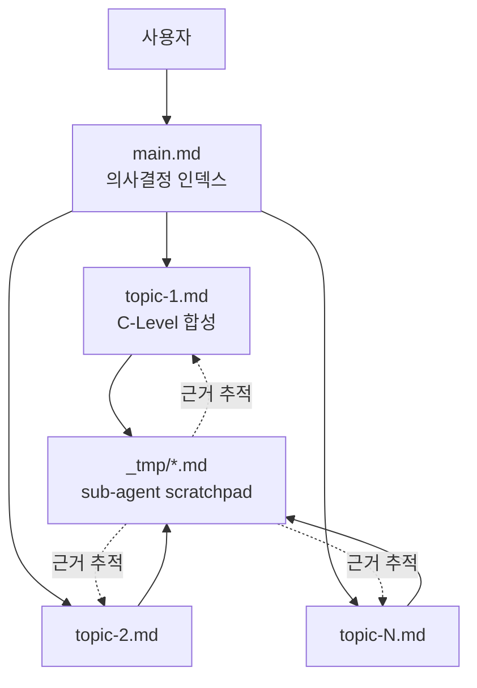

# v057-subdoc-preservation - 설계

> ⛔ **Design 단계 범위**: 이 문서는 설계 결정만 기록합니다. 프로덕트 파일 생성·수정은 Do 단계에서 수행하세요.
> 참조 문서: `docs/v057-subdoc-preservation/01-plan/main.md`
> Gate 2 합성물: `docs/v057-subdoc-preservation/02-design/interface-contract.md`

## Context Anchor

| Key | Value |
|-----|-------|
| **WHY** | 결정 근거 유실 + 병렬 쓰기 경합 해소 |
| **WHO** | VAIS 사용자/유지보수자 |
| **RISK** | include 런타임 미동작 / 35 파일 diff / 리포 크기↑ |
| **SUCCESS** | 169 pass + Rule #14 + v0.57.0 + 샘플 피처 시연 |
| **SCOPE** | 플러그인 내부 convention/templates/validator/agent 레이어 |

---

## Architecture Options

| Option | 설명 | 복잡도 | 유지보수 | 구현 속도 | 리스크 | 선택 |
|--------|------|:------:|:--------:|:---------:|:------:|:----:|
| A. Minimal | 35 sub-agent markdown 에 블록 직접 복붙 (include 없이) | 낮음 | **낮음** (중복) | 중 | include 오작동 우려 제거 | |
| B. Clean | `_shared/subdoc-guard.md` + includes + 전용 lib + 세밀한 이벤트 | 높음 | 높음 | 느림 | 과도 설계 | |
| C. Pragmatic | `_shared/subdoc-guard.md` include (advisor-guard 선례 활용) + 기존 status.js/doc-validator 확장 + warn only | **중** | **중** | **중** | **낮음** (선례 존재) | ✓ |

**Rationale**: `advisor-guard.md` include 가 v0.56 에서 이미 정상 동작 중. 동일 패턴을 `subdoc-guard.md` 로 확장하면 35 파일 DRY + 유지보수성 확보. warn-only 정책으로 기존 피처 역호환 파괴 없음.

**결정: Option C. Pragmatic**

---

## Part 1: Document Architecture (IA 대체)

> 메타 피처라 UI IA 가 없음. 대신 "문서 레이어 IA" 를 정의.

### 1.1 문서 레이어 구조



### 1.2 디렉토리 구조 (최종 타깃)

```
docs/{feature}/{NN-phase}/
├── main.md                          # Layer 1: C-Level 의사결정 인덱스 (필수)
├── {topic-A}.md                     # Layer 2: C-Level 큐레이션 topic 문서 (선택, phase별 프리셋)
├── {topic-B}.md
├── {topic-C}.md
├── interface-contract.md            # 시스템 산출물 (02-design 에만, Gate 2)
└── _tmp/                            # Layer 3: sub-agent scratchpad (영구 보존, git 커밋)
    ├── {agent-slug-1}.md
    ├── {agent-slug-1}.{qualifier}.md
    └── {agent-slug-2}.md
```

### 1.3 쓰기 권한 매트릭스

| 주체 | `_tmp/{slug}.md` | `{topic}.md` | `main.md` | `interface-contract.md` |
|------|:----------------:|:------------:|:---------:|:-----------------------:|
| sub-agent (자기) | ✅ Write | ❌ | ❌ | ❌ |
| sub-agent (타) | ❌ | ❌ | ❌ | ❌ |
| C-Level | Read | ✅ Write | ✅ Write | ✅ Write (CTO Gate 2) |
| 사용자 | ✅ | ✅ | ✅ | ✅ |

### 1.4 Phase 별 Topic 프리셋

| Phase | Topic 프리셋 (vais.config.json > workflow.topicPresets) |
|-------|--------------------------------------------------------|
| 00-ideation | `problem` / `hypotheses` / `exit-criteria` |
| 01-plan | `requirements` / `impact-analysis` / `policy` |
| 02-design | `architecture` / `data-model` / `api-contract` / `ui-flow` / `security` |
| 03-do | `implementation` / `changes` / `tests` |
| 04-qa | `findings` / `metrics` / `issues` |
| 05-report | (none — main.md 단독) |

> C-Level 은 프리셋 외 추가 topic 생성 가능 (자유 확장). doc-validator 는 topic 이름에 대한 강제 없음.

---

## Part 2: 컴포넌트 설계 (Wireframe 대체)

> 본 섹션은 **각 변경 대상의 상세 설계**.

### 2.1 `agents/_shared/subdoc-guard.md` 설계

**목적**: 35 sub-agent 에 include 되어 scratchpad 작성 규칙을 공유.

**블록 내용 스펙** (Do 단계에서 실제 작성):

```markdown
<!-- 이 파일은 agents/_shared/subdoc-guard.md 입니다.
     각 sub-agent markdown frontmatter 에 `includes: [_shared/subdoc-guard.md]` 로 참조됩니다. -->

## 산출물 (Sub-doc / Scratchpad)

**저장 경로**: `docs/{feature}/{NN-phase}/_tmp/{agent-slug}.md`

**Phase 폴더 매핑**: ideation→`00-ideation`, plan→`01-plan`, design→`02-design`, do→`03-do`, qa→`04-qa`, report→`05-report`

### 작성 규칙

1. 호출 완료 시 반드시 위 경로에 자기 분석/설계/구현 결과를 **축약 없이** Write
2. 파일 상단에 메타 헤더 3줄 고정:
   > Author: {agent-slug}
   > Phase: {NN-phase}
   > Refs: {참조한 상위 문서 경로, 쉼표 구분}
3. 복수 산출물일 때 qualifier 사용 (예: `ui-designer.review.md`). qualifier 는 kebab-case 1~2 단어
4. 최소 크기 500B (빈 템플릿 스캐폴드 금지)
5. C-Level 에게 한 줄 요약(scratchpad 첫 단락)을 반환

### 금지

- ❌ C-Level main.md / topic 문서 직접 Write/Edit (race 방지)
- ❌ 다른 sub-agent 의 scratchpad 수정
- ❌ 빈 파일 또는 템플릿 그대로 저장

### 권장 qualifier

| qualifier | 용도 | 예시 |
|-----------|------|------|
| `.review` | 리뷰/크리틱 | `ui-designer.review.md` |
| `.audit` | 심화 감사 | `security-auditor.audit.md` |
| `.bench` | 성능 벤치 | `performance-engineer.bench.md` |
| `.draft` | WIP 저장 | `prd-writer.draft.md` |
| `.v2`, `.v3` | 재실행 이력 | `backend-engineer.v2.md` |

### 공통 템플릿

`templates/subdoc.template.md` 참조.
```

**Include 메커니즘 검증 (R1 완화)**: Do phase 첫 작업에서 `agents/cto/backend-engineer.md` frontmatter 의 `includes: - _shared/advisor-guard.md` 런타임 해석 여부를 smoke test 1건으로 확인. 실패 시 fallback = 35 sub-agent 에 블록 직접 삽입.

### 2.2 "큐레이션 기록" 섹션 스펙

**위치**: 각 topic 문서 (`docs/{feature}/{phase}/{topic}.md`) 내부 하단 직전

**포맷**:

```markdown
## 큐레이션 기록

> 이 topic 문서는 아래 scratchpad 를 읽고 C-Level 이 편집한 결과입니다.

| Source (`_tmp/...`) | 채택 | 거절 | 병합 | 추가 | 이유 |
|---------------------|:----:|:----:|:----:|:----:|------|
| `_tmp/infra-architect.md` | §2.1 | §3.4 | §2.2↔`_tmp/db-architect.md`§1 |  | DB 층 중복 병합, 스케일링 섹션은 out-of-scope |
| `_tmp/db-architect.md` | §1~§4 |  |  | §5 (백업 전략) | scratchpad 에 없던 운영 관점 추가 |

**C-Level 판단 요약**:
- 필요성: ✅ 인증 섹션 3건 전부 필수
- 누락: ⚠️ 백업 전략 — `_tmp` 에 없어 C-Level 이 직접 추가
- 충돌: ❌ JWT vs Session → JWT 선택 (근거: scratchpad `_tmp/backend-engineer.md` §Auth)
```

**검증** (doc-validator):
- `## 큐레이션 기록` 헤딩 존재 → warn 아님
- 부재 → `warn: {topic}.md 큐레이션 기록 누락`
- enforcement=warn only (v0.57)

### 2.3 C-Level main.md 인덱스 포맷 (6 C-Level 공통)

```markdown
# {feature} — {phase} ({C-Level})

> Author: {c-level}
> Phase: {NN-phase}
> Scratchpads: {N} (_tmp/)
> Topic Docs: {M} ({topic-list})

## Executive Summary
| Perspective | Content |
| Problem / Solution / Effect / Core Value |

## Context Anchor
| WHY / WHO / RISK / SUCCESS / SCOPE |

## Decision Record

| # | 결정 | 대안 | 선택 이유 | 근거 scratchpad / topic |
|---|------|------|-----------|-------------------------|
| 1 | JWT 인증 | Session 기반 | 수평 확장 | [_tmp/backend-engineer.md#auth](_tmp/backend-engineer.md#auth) |

## Topic Documents (인덱스)

| Topic | 파일 | 한 줄 요약 | 참조 scratchpad |
|-------|------|-----------|----------------|
| architecture | `architecture.md` | 3-tier + JWT + Redis | infra-architect, backend-engineer |
| data-model | `data-model.md` | 3 테이블 ER | db-architect, infra-architect |
| security | `security.md` | OWASP 체크리스트 | security-auditor (예정) |

## Scratchpads (추적용)

| Agent | 경로 | 크기 | 갱신 |
|-------|------|:----:|-----|
| infra-architect | `_tmp/infra-architect.md` | 4.2KB | 2026-04-19 |
| backend-engineer | `_tmp/backend-engineer.md` | 6.8KB | 2026-04-19 |

## Gate Metrics (해당 phase 만)
- matchRate: 93%
- criticalIssueCount: 0

## Next
- 다음 phase: `/vais {c-level} {next-phase} {feature}`
```

### 2.4 공통 템플릿 `templates/subdoc.template.md`

```markdown
# {feature} — {phase} — {agent-slug}

> Author: {agent-slug}
> Phase: {NN-phase}
> Refs: {쉼표 구분 상위 문서 경로}

## 1. Context
- 작업 요청 (C-Level 위임):
- 선행 의사결정 (참조 main.md 경로 + 섹션):
- 스코프:

## 2. Body
### 2.1 ~ 2.N
(전문 영역 축약 금지. 측정치·대안·근거 포함.)

## 3. Decisions
| # | Decision | Options | Chosen | Rationale |

## 4. Artifacts
| Path | Type | Change |

## 5. Handoff
- 다음 에이전트에게:
- 열린 질문:
- 기술 부채:

## 6. 변경 이력
| version | date | change |
| v1.0 | | 초기 작성 |

<!-- subdoc-template version: v0.57.0 -->
```

---

## Part 3: 데이터/스키마 설계

### 3.1 `vais.config.json` 스키마 확장 (Interface Contract)

```jsonc
{
  "workflow": {
    "docPaths": {
      "main":                 "docs/{feature}/{phase}/main.md",
      "topic":                "docs/{feature}/{phase}/{topic}.md",          // 신규
      "scratchpad":           "docs/{feature}/{phase}/_tmp/{slug}.md",      // 신규
      "scratchpadQualified":  "docs/{feature}/{phase}/_tmp/{slug}.{qualifier}.md",  // 신규
      "systemArtifacts": [                                                    // 신규
        "docs/{feature}/02-design/interface-contract.md"
      ]
    },
    "phaseFolders": { /* 기존 유지 */ },
    "topicPresets": {                                                         // 신규
      "00-ideation": ["problem", "hypotheses", "exit-criteria"],
      "01-plan":     ["requirements", "impact-analysis", "policy"],
      "02-design":   ["architecture", "data-model", "api-contract", "ui-flow", "security"],
      "03-do":       ["implementation", "changes", "tests"],
      "04-qa":       ["findings", "metrics", "issues"],
      "05-report":   []
    },
    "subDocPolicy": {                                                         // 신규
      "enforcement":          "warn",              // warn | retry | fail (v0.57 = warn)
      "scratchpadPreserve":   true,                // git 커밋 대상
      "scratchpadMinBytes":   500,                 // 빈 스캐폴드 방지
      "requireCurationRecord": true,               // topic 문서 "## 큐레이션 기록" 필수
      "reportPhase":          "single"             // 05-report 는 main.md 단독
    }
  }
}
```

**Schema JSON**: `scripts/check-version-sync.js` 와 기존 validator 가 파싱 가능한 범위. 신규 키는 optional 로 표기.

### 3.2 `.vais/status.json` subDocs[] 스키마

```jsonc
{
  "features": {
    "{feature}": {
      "docs": {
        "main": { /* 기존 */ },
        "subDocs": [
          {
            "phase":      "02-design",
            "kind":       "scratchpad",        // scratchpad | topic
            "agent":      "ui-designer",       // topic 이면 null
            "qualifier":  null,                // "review" 등
            "topic":      null,                // kind=topic 일 때 "architecture" 등
            "path":       "docs/{feature}/02-design/_tmp/ui-designer.md",
            "size":       4523,
            "updatedAt":  "2026-04-19T10:20:00Z"
          }
        ]
      }
    }
  }
}
```

### 3.3 doc-validator 검증 룰 (pseudocode)

```javascript
// scripts/doc-validator.js 확장

function validateFeatureDocs(feature) {
  const warnings = [];
  const cfg = loadVaisConfig().workflow.subDocPolicy;

  for (const phase of ['00-ideation', '01-plan', '02-design', '03-do', '04-qa', '05-report']) {
    const dir = `docs/${feature}/${phase}`;
    if (!fs.existsSync(dir)) continue;

    // 1. main.md 존재 체크 (기존 동작)
    validateMainMd(`${dir}/main.md`, warnings);

    // 2. _tmp/ scratchpad 검증
    const tmpDir = `${dir}/_tmp`;
    if (fs.existsSync(tmpDir)) {
      for (const f of fs.readdirSync(tmpDir)) {
        const p = `${tmpDir}/${f}`;
        const content = fs.readFileSync(p, 'utf-8');

        if (!/^> Author:/m.test(content))  warnings.push(`${p}: Author 헤더 누락`);
        if (!/^> Phase:/m.test(content))   warnings.push(`${p}: Phase 헤더 누락`);
        if (fs.statSync(p).size < cfg.scratchpadMinBytes) {
          warnings.push(`${p}: 크기 ${cfg.scratchpadMinBytes}B 미만 — 빈 스캐폴드 의심`);
        }
      }
    }

    // 3. topic 문서 "## 큐레이션 기록" 섹션 체크
    if (cfg.requireCurationRecord) {
      for (const f of fs.readdirSync(dir)) {
        if (f === 'main.md' || f === 'interface-contract.md') continue;
        if (f.endsWith('.md')) {
          const content = fs.readFileSync(`${dir}/${f}`, 'utf-8');
          if (!/^## 큐레이션 기록/m.test(content)) {
            warnings.push(`${dir}/${f}: 큐레이션 기록 섹션 누락`);
          }
        }
      }
    }

    // 4. main.md 에 topic 문서 링크 존재 여부 (autoIndex)
    const mainContent = fs.readFileSync(`${dir}/main.md`, 'utf-8');
    for (const topicFile of listTopicFiles(dir)) {
      if (!mainContent.includes(topicFile)) {
        warnings.push(`${dir}/main.md: ${topicFile} 링크 누락 (Topic Documents 섹션에 추가 권장)`);
      }
    }
  }

  // enforcement 정책
  if (cfg.enforcement === 'fail' && warnings.length > 0) {
    warnings.forEach(w => console.error(w));
    process.exit(1);
  } else {
    warnings.forEach(w => console.warn(w));  // warn only
  }
}
```

### 3.4 `lib/status.js` 함수 시그니처

```javascript
// 신규 함수

function registerSubDoc({ feature, phase, kind, agent, qualifier, topic, path }) {
  // kind='scratchpad' 면 agent 필수, kind='topic' 이면 topic 필수
  // 기존 entry 덮어쓰기 (phase + kind + agent/topic + qualifier 복합키)
}

function listSubDocs(feature, { phase, kind } = {}) {
  // 필터링 조회
}

function unregisterSubDoc({ feature, phase, kind, agent, qualifier, topic }) {
  // 피처 삭제 시 cleanup
}
```

### 3.5 `scripts/auto-judge.js` fallback 로직

```javascript
function judgeCTO(feature) {
  const mainPath = `docs/${feature}/04-qa/main.md`;
  const fallbackPath = `docs/${feature}/04-qa/_tmp/qa-engineer.md`;

  let criticalIssueCount = parseMetric(mainPath, /Critical[:\s]*(\d+)/i);
  if (criticalIssueCount === null && fs.existsSync(fallbackPath)) {
    criticalIssueCount = parseMetric(fallbackPath, /Critical[:\s]*(\d+)/i);
  }
  if (criticalIssueCount === null) criticalIssueCount = 0;  // 기본값

  const matchRate = getGapAnalysis(feature).matchRate;
  return { matchRate, criticalIssueCount };
}
```

---

## Part 4: 인터페이스 계약 (Gate 2)

별도 파일 참조: `docs/v057-subdoc-preservation/02-design/interface-contract.md` (본 Design 문서와 함께 Do 단계 입력)

---

## Part 5: 마이그레이션 전략

### 5.1 기존 v0.56 피처 문서 (역호환)

- 변경 없음 (main.md 단독 허용 유지)
- `_tmp/` 부재는 warn 대상 **아님**
- topic 문서 부재도 warn 대상 **아님**

### 5.2 기존 ad-hoc sub-doc 5건

| 기존 | 신규 | 처리 |
|------|------|------|
| `02-design/infra.md` | `02-design/_tmp/infra-architect.md` | 신규 피처부터 적용. 기존 피처는 그대로 유지 |
| `02-design/review.md` | `02-design/_tmp/ui-designer.review.md` | 동일 |
| `03-do/strategy.md` | `03-do/_tmp/product-strategist.md` | 동일 |
| `04-qa/performance.md` | `04-qa/_tmp/performance-engineer.md` | 동일 |
| `02-design/interface-contract.md` | 변경 없음 (시스템 산출물 예외) | 동일 |

> 마이그레이션은 **신규 피처부터 적용** 원칙. 기존 피처는 자연 소멸까지 v0.56 포맷 유지.

---

## Success Criteria 추적 (Plan SC-01~11 매핑)

| Plan SC | Design 산출 매핑 |
|---------|------------------|
| SC-01 `vais.config.json` 스키마 확장 | §3.1 |
| SC-02 `_shared/subdoc-guard.md` + 35 sub-agent include | §2.1 |
| SC-03 6 C-Level main.md 포맷 | §2.3 |
| SC-04 `templates/subdoc.template.md` | §2.4 |
| SC-05 doc-validator | §3.3 |
| SC-06 status.js subDocs[] | §3.2, §3.4 |
| SC-07 auto-judge fallback | §3.5 |
| SC-08 CLAUDE/AGENTS Rule #13/#14 | Do 단계 문서 작업 |
| SC-09 버전 + CHANGELOG | Do 단계 |
| SC-10 샘플 smoke test | qa phase (T15) |
| SC-11 npm test / lint / validate-plugin | qa phase |

---

## 설계 결정 요약 (Gate 2 체크리스트)

- [x] 모든 변경 대상에 컴포넌트 명세 — §2 (`subdoc-guard.md` / 큐레이션 기록 / main.md 포맷 / 템플릿)
- [x] 디자인 토큰 참조 — (N/A, 문서 레이어)
- [x] 네비게이션 플로우 — §1.1 문서 레이어 IA 다이어그램
- [x] 에러·로딩·빈 상태 — doc-validator warn 메시지 (§3.3)
- [x] Interface Contract 생성 — 별도 파일 (`interface-contract.md`)

---

## Checkpoint 기록

| CP | 결정 | 결과 | 일시 |
|----|------|------|------|
| CP-D | 아키텍처 옵션 | C. Pragmatic (include 선례 활용) | 2026-04-19 |
| CP-D pivot | Batch A smoke test 결과 | ⚠️ **CP-D=C 무효화** → **Option A (블록 직접 복붙) + patch 스크립트** 로 pivot. Batch B 범위 수정 | 2026-04-19 |

### CP-D Pivot 사유 (2026-04-19)

Batch A smoke test 에서 `includes:` 메커니즘이 Claude Code sub-agent 런타임에 통합되지 않음을 확인 (상세: `../03-do/main.md#critical-finding`).

| 변경 | Before (CP-D=C) | After (Pivot A) |
|------|----------------|-----------------|
| 35 sub-agent 수정 방식 | frontmatter `includes: [_shared/subdoc-guard.md]` 1줄 추가 | 본문 하단에 subdoc-guard 블록 직접 삽입 |
| `_shared/subdoc-guard.md` 역할 | 런타임 로드 대상 | canonical source / 복붙 원본 / 수동 편집 참조 |
| 자동화 | 불필요 | `scripts/patch-subdoc-frontmatter.js` 신규 (idempotent 일괄 삽입) |
| Diff 크기 | 35 × 1줄 | 35 × ~50줄 (블록 크기) |
| DRY | 개념상 유지 | 실패 (block 35 중복) — 관리는 스크립트로 |

§2.1 의 블록 내용은 그대로 유효 (source of truth). §2.3 의 C-Level main.md 포맷 + §2.4 템플릿도 그대로 유효.

---

## 변경 이력

| version | date | change |
|---------|------|--------|
| v1.0 | 2026-04-19 | 초기 설계 — 5개 컴포넌트 설계 + 스키마 3종 + doc-validator/status.js/auto-judge 룰 + 마이그레이션 정책 |
| v1.1 | 2026-04-19 | CP-D 확정 (C. Pragmatic) |
| v1.2 | 2026-04-19 | CP-D=C 무효화 + Option A(블록 복붙 + patch 스크립트) 로 pivot 기록. Batch A smoke test 결과 반영 |

<!-- template version: v0.18.0 (design) -->
