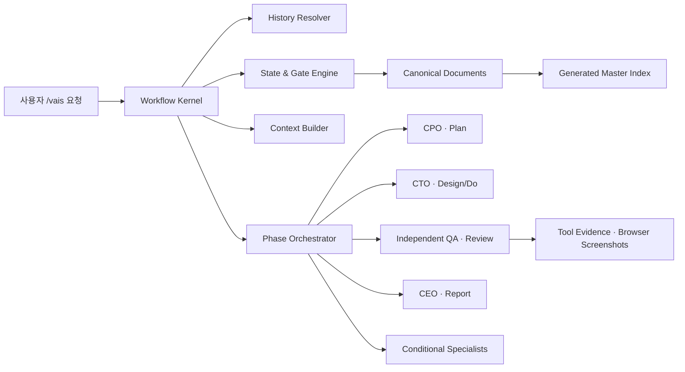

# Design — VAIS workflow redesign

## 1. 설계 원칙

1. 모든 규모에서 Plan·Design·Do·Review·Report를 유지한다.
2. 사용자는 하나의 VAIS와 대화하고 내부 Agent 호출은 VAIS가 책임진다.
3. 문서는 단계의 판단과 이력을 남기되 Agent별 사고 과정을 복제하지 않는다.
4. 상태·승인·권한·반복 제한은 런타임이 강제한다.
5. 기존 엔진을 기준선으로 보존하고 새 엔진은 검증 후 전환한다.

## 2. 전체 구조



Workflow Kernel이 현재 Work item과 event를 기준으로 다음 행동을 결정한다. Agent Markdown의 자연어 해석은 판단에만 사용하고, 상태 전이와 쓰기 권한의 정본으로 사용하지 않는다.

## 3. 사용자 명령 계약

### 3.1 진입 규칙

- VAIS에 반영할 모든 요청, 피드백과 승인은 `/vais`로 시작한다.
- `/vais {자연어}`는 새 작업 생성 명령이 아니라 현재 프로젝트 상태를 고려하는 단일 진입점이다.
- `/vais status|pause|resume|cancel`은 자주 쓰는 제어의 단축 표현이다.
- 기존 `/vais cto plan ...` 형식은 호환 계층에서 같은 Workflow Kernel로 라우팅하며 Gate를 우회하지 못한다.
- 일반 도움말에서는 C-Level 직접 호출을 노출하지 않는다.

### 3.2 `/vais`가 없는 요청

- 일반 질문은 읽기 전용으로 답할 수 있다.
- 활성 Work item과 관련된 변경 요청은 `/vais`를 붙이라는 안내만 반환한다.
- VAIS 상태, 정본 문서, 제품 코드의 mutation 권한을 발급하지 않는다.
- 지원되는 Claude Code 쓰기 도구는 Hook이 차단한다. 사용자 편집기와 외부 프로세스는 차단 대상으로 과장하지 않고 다음 실행의 drift 검사로 다룬다.

### 3.3 응답 상태선

모든 `/vais` 응답 첫 부분에는 다음 한 줄을 표시한다.

```text
[authentication/password-reset · Design · 사용자 승인 대기]
```

상세 이력, 대기 요청, Agent 참여와 재시도 횟수는 `/vais status`에서만 펼친다.

## 4. 문서 모델

```text
docs/
  README.md
  features/
    authentication/
      main.md
      password-reset/main.md
  work-items/
    authentication/
      2026-08-29-password-reset/
        main.md
        01-plan/main.md
        01-plan/revisions/v1.md
        02-design/main.md
        02-design/revisions/v1.md
        03-do/main.md
        04-review/main.md
        04-review/evidence/
          checks/manifest.json
          logs/
          screenshots/
        05-report/main.md
```

### 4.1 정본과 파생 문서

- Work item 루트 `main.md`가 현재 상태와 관계의 정본이다.
- Phase `main.md`가 해당 단계 내용의 정본이다.
- `docs/README.md`와 Feature 인덱스는 Report 완료 과정에서 정본 메타데이터로부터 갱신한다.
- specialist는 정본 Markdown을 직접 쓰지 않는다.
- raw tool log와 screenshot은 Review evidence이며 별도 판단 문서가 아니다.

### 4.2 Work item 메타데이터

필수 필드는 다음과 같다.

```yaml
schema: vais-work-item/v1
id: WI-YYYY-MM-DD-slug
title: human readable title
primary_feature: stable-feature-id
affected_features: []
scale: compact | standard | extended
phase: plan | design | do | review | report
status: active | waiting-user | blocked | paused | completed | cancelled
plan_revision: 1
design_revision: 1
readiness_not_ready_count: 0
qa_repair_count: 0
created_at: YYYY-MM-DD
updated_at: YYYY-MM-DD
approvals:
  plan: pending | approved
  design: pending | approved
  final: pending | approved
report_frozen: false
```

상태 필드는 frontmatter가 정본이며 본문 상태 표시는 여기서 생성한다. 경로 slug는 Plan 승인 전 조정할 수 있지만 Work item ID는 유지한다. Plan 승인 후 경로는 고정한다.

### 4.3 Revision

- `main.md`는 최신본이다.
- 승인된 기존 내용이 실질적으로 바뀔 때만 기존본을 `revisions/vN.md`로 snapshot한다.
- 최초 미승인 draft 수정, 오탈자, Design 재확인은 revision을 늘리지 않는다.
- Review 실패 후 기술 설계가 실질적으로 달라지면 Design revision을 만든다.

### 4.4 Report 불변성

완료 순서는 다음으로 고정한다.

```text
사용자 최종 승인
→ Report 작성
→ Feature 문서 갱신
→ Master 갱신
→ 링크·스키마 검증
→ completed
→ Report write lock
```

완료 후 Report 수정 요청은 거부하고 새 Work item을 제안한다. 미완료·취소·차단 작업은 루트 상태와 Master에 남지만 완료 Report를 만들지 않는다.

## 5. Feature와 Work item 탐색

- Feature는 장기 capability이며 계층형 ID를 허용한다. 예: `authentication/password-reset`.
- Work item은 한 번의 변경이며 상위 Feature 폴더 아래 `YYYY-MM-DD-slug`로 저장한다.
- 하나의 Work item은 primary Feature 하나와 affected Feature 여러 개를 가진다.
- 본문은 canonical Work item 한 곳에만 두고 affected Feature에는 링크만 둔다.
- 새 요청 시 active, waiting, blocked, paused, completed, cancelled 및 Legacy 문서를 모두 검색한다.
- v1 검색은 metadata, 제목, REQ, 관련 코드 경로의 결정적 검색을 사용한다. Graph/Vector DB는 사용하지 않는다.
- VAIS는 “지난 작업과 비슷합니다. 이 작업의 후속으로 진행할까요?”라고 제안하고 Plan 승인으로 관계를 확정한다.

## 6. 규모 판정

| 규모 | 판단 기준 | 문서와 실행 차이 |
|---|---|---|
| Compact | 한두 surface, 계약 변경 없음, 낮은 위험, 쉽게 되돌림 | 같은 섹션을 짧게 작성하고 최소 specialist/check만 사용 |
| Standard | 여러 파일 또는 UI/API/data 중 둘 이상, 중간 위험 | 일반 깊이와 영향 회귀 검사를 사용 |
| Extended | 다영역, 공개 계약·데이터·인프라·보안, 높은 불확실성 | 대안·rollback·전문 검토·평가를 강화 |

규모는 변경 surface, 공개 계약, 데이터, 인프라, 보안 위험, 되돌릴 수 있는 정도와 불확실성으로 판정한다. 규모는 Phase 존재 여부에 영향을 주지 않는다.

## 7. 상태 머신

### 7.1 정상 전이

| 현재 | event | 다음 | 조건 |
|---|---|---|---|
| plan/active | `plan.presented` | plan/waiting-user | Plan Gate의 기계 조건 충족 |
| plan/waiting-user | `user.plan.approved` | design/active | 명시적 `/vais` 승인 |
| plan/waiting-user | `user.plan.revised` | plan/active | 사용자 수정 요청 |
| design/active | `design.presented` | design/waiting-user | Design Gate의 기계 조건 충족 |
| design/waiting-user | `user.design.approved` | do/active | 명시적 `/vais` 승인 |
| design/waiting-user | `user.design.revised` | design/active 또는 plan/active | 요구사항 변경 여부에 따라 결정 |
| do/active | `readiness.ready` | review/active | 모든 required readiness check 성공 |
| do/active | `readiness.not-ready` | do/active | 수정 가능한 준비 실패, 연속 3회 미만 |
| do/active | `readiness.blocked` | do/blocked | 환경·권한 등으로 검증 불가능 |
| review/active | `qa.pass` | review/waiting-user | 모든 required Review check 성공 |
| review/active | `qa.fail` | design/active | 자동 보완 3회 이하 |
| review/active | `qa.blocked` | review/blocked | 필수 검증 불가능 |
| review/waiting-user | `user.final.approved` | report/active | 명시적 최종 승인 |
| review/waiting-user | `user.final.rejected` | design/active 또는 plan/active | 피드백 성격에 따라 결정 |
| report/active | `report.validated` | report/completed | Report·Feature·Master·링크 검증 성공 |
| report/active | `report.failed` | report/blocked | 완료 기록 검증 실패 |

### 7.2 제어 전이

- `user.pause`: terminal이 아닌 작업을 paused로 만들고 진행 슬롯을 해제한다.
- `user.resume`: 진행 슬롯이 비었고 drift 검사가 끝난 경우 이전 Phase로 복귀한다.
- `user.cancel`: cancelled terminal로 전환한다. 다시 수행하면 새 Work item이다.
- blocked는 슬롯을 유지한다. 다른 작업을 진행하려면 사용자가 pause 또는 cancel한다.
- `superseded`는 별도 상태가 아니라 cancelled 사유와 `replaced_by` 관계로 표현한다.

### 7.3 불변 조건

- 프로젝트 전체에 `active`, `waiting-user`, `blocked`인 진행 Work item은 최대 하나다.
- 승인된 Plan 없이 Design, 승인된 Design 없이 Do에 들어갈 수 없다.
- Review에서 제품 코드를 수정할 수 없다.
- Review FAIL은 Do로 직접 이동할 수 없다.
- AI QA PASS 없이 사용자 최종 승인을 받을 수 없다.
- 사용자 최종 승인 없이 Report를 만들 수 없다.
- completed Report는 수정할 수 없다.

## 8. Gate 설계

모든 항목은 `required`, `conditional`, `not-applicable` 중 하나로 분류한다. required 하나라도 실패하면 통과하지 못한다. 임의의 80%·90% 점수는 사용하지 않는다.

### 8.1 Plan Gate

- 원 요청, 과거 작업 검색, Feature 관계
- 목표·결과 미리보기, 범위·제외 범위
- 안정적인 REQ, 사용자 흐름, 엣지 케이스, 완료 조건
- 영향과 규모 판단
- 중요한 미결정 사항 해소
- 사용자 승인

### 8.2 Design Gate

- 각 REQ의 동작, 입력, 출력, 오류와 구현 결정
- UI가 있으면 화면·상태·흐름·반응형·접근성 기준
- API, backend, data, infra, security와 운영 설계 중 해당 영역
- 영역별 필요/불필요/불확실 판정과 triage
- TC의 조건·입력·기대 결과
- 구현 Agent·순서·write scope·병렬성
- readiness check와 Review check 구분
- rollback과 실패 대응
- 사용자 승인

### 8.3 QA 준비 확인

런타임 소유 Gate이며 구현 Agent의 자기평가를 신뢰하지 않는다.

```text
Do → READY → 독립 AI QA
   → NOT_READY → Do 보완
   → BLOCKED → do/blocked
```

필수 조건은 승인된 구현 작업 완료, 범위 준수, 해당 build/compile/typecheck, 변경 기능 테스트, 앱 또는 검증 환경 실행, 병렬 결과 통합, 필요한 데이터·설정 처리와 증거다. 연속 세 번째 `NOT_READY`에서 `do/blocked`가 된다. 이 횟수는 AI QA 보완 횟수와 별도다.

### 8.4 AI QA Gate

- 모든 REQ와 TC 검증
- 관련 회귀 검사
- Design과 코드 차이 검사
- 테스트 삭제·약화 검사
- UI의 브라우저 동작과 시각 증거
- 필요한 보안·성능·운영 검사
- 미검증·제한 공개
- evidence manifest 완전성

결과는 PASS/FAIL/BLOCKED뿐이다. 최초 QA 후 최대 3회의 자동 보완을 허용하므로 QA 실행은 최대 4회다. 각 보완은 Design checkpoint→Do→준비 확인→Review를 거친다. 승인된 UX·공개 계약·데이터·보안·비용·범위를 바꾸지 않는 기술 보완은 자동 진행할 수 있고, 그 경계를 바꾸면 사용자 재승인을 받는다.

### 8.5 사용자 최종 승인과 Report Gate

사용자에게 REQ별 결과, 실제 흐름, 설계/실제 화면 비교, 엣지 케이스, 알려진 제한과 스크린샷을 제시한다. 모호한 긍정은 승인으로 간주하지 않는다. Report Gate는 최종 승인 기록, 문서 링크, Feature/Master 반영과 freeze 가능 여부를 검사한다.

## 9. 요구사항과 QA 사례

| TC | 관련 REQ | 입력/상황 | 기대 결과 |
|---|---|---|---|
| TC-001 | 001,002,013 | Compact 요청 | 다섯 Phase가 존재하고 내용만 간결하다. |
| TC-002 | 004,005 | Plan/Design 승인 없이 다음 단계 요청 | 전이가 차단되고 필요한 승인을 안내한다. |
| TC-003 | 006 | 활성 작업 중 `/vais` 없는 수정 요청 | 읽기 전용 안내, 상태·코드 변경 없음 |
| TC-004 | 007,008 | 과거 authentication 작업과 유사한 요청 | 기존 Feature/Work item 관계를 제안하고 사용자 승인 전 확정하지 않는다. |
| TC-005 | 010 | 허용되지 않은 phase/status 전이 | 런타임이 거부하고 audit event를 남긴다. |
| TC-006 | 011,012 | 두 세션이 서로 다른 작업을 시작 | 하나만 lease를 얻고 다른 요청은 pending에 남는다. |
| TC-007 | 016 | 인증과 배포가 없는 UI 문구 변경 | CSO/COO 불필요 사유가 있으며 호출되지 않는다. |
| TC-008 | 016 | 로그인 또는 비밀번호 재설정 | CSO가 필요한 보안 판단을 제공한다. |
| TC-009 | 017,018 | frontend/backend 구현이 필요한 Design | 담당·질문·write scope가 있는 handoff만 dispatch된다. |
| TC-010 | 019 | Do 중 승인되지 않은 DB 변경 발견 | 쓰기를 중단하고 Design으로 복귀한다. |
| TC-011 | 020 | 빌드 실패가 세 번 반복 | QA 횟수를 쓰지 않고 do/blocked가 된다. |
| TC-012 | 021,022 | AI QA에서 결함 발견 | QA는 코드를 수정하지 않고 Design→Do 경로로 보낸다. |
| TC-013 | 022 | 세 번의 자동 보완 후에도 QA 실패 | review/blocked, 사용자 승인 요청 없음 |
| TC-014 | 023 | 모바일 예약 UI | 브라우저 실행과 요구 viewport 스크린샷이 evidence에 존재한다. |
| TC-015 | 024 | 사용자가 screenshot 피드백 제공 | 원문/이미지 참조와 구조화 해석이 보존되고 Design으로 이동한다. |
| TC-016 | 025 | completed Report 수정 시도 | 쓰기를 거부하고 새 Work item을 제안한다. |
| TC-017 | 026 | 승인된 Design의 실질 변경 | 이전 v1 snapshot과 revision 2가 생성된다. |
| TC-018 | 027 | specialist dispatch | 역할에 필요한 최소 Context View만 제공되고 추가 검색 출처가 기록된다. |
| TC-019 | 028 | secret/dependency/plugin 검사 | Tool 결과와 Agent 판단이 별도 계약으로 기록된다. |
| TC-020 | 029 | 사용자가 Do 중 파일을 직접 변경 | drift를 감지하고 범위에 맞게 Do/Design/Plan으로 분기한다. |
| TC-021 | 030 | 동일 Mini Booking 요청을 구/신 엔진으로 실행 | 안전 불변 조건과 품질을 유지하며 문서·컨텍스트·중복 호출이 감소한다. |
| TC-022 | 003 | 한 Work item의 전체 Phase 실행 기록 | CPO·CTO·Independent QA·CEO의 고정 책임이 각 Phase에서 확인된다. |
| TC-023 | 009 | 사용자 최종 승인 후 Report 완료 | Feature 관계와 전체 Work item 상태가 생성된 Master에서 조회된다. |
| TC-024 | 014 | 목적만 있고 세부사항이 부족한 새 요청 | Plan에 문제·목표·범위·REQ·흐름·엣지 케이스·완료 조건·영향이 채워진 뒤 승인 요청이 나온다. |
| TC-025 | 015 | 여러 UI/API 오류 상태가 있는 Design | 모든 REQ에 동작·입력·출력·오류·기술 결정과 하나 이상의 TC가 연결된다. |

## 10. Agent 오케스트레이션

### 10.1 Phase 책임

| 역할 | 항상 맡는 책임 | 코드 쓰기 |
|---|---|---|
| CEO | 시작 조정, 이력 탐색, 단일 VAIS 응답, 상태 종료, Report | 제품 코드 금지 |
| CPO | 모든 Plan | 금지 |
| CTO | 모든 통합 Design과 Do 지휘 | Do에서 승인 범위만 |
| Independent QA | 모든 Review와 최종 QA 판정 | 제품 코드 금지 |
| CSO | 조건부 보안 판단 | Review에서는 금지 |
| COO | 조건부 배포·운영 판단 | Do에서 승인 범위만 |
| CBO | 조건부 사업·가격·시장 판단 | 제품 코드 금지 |

### 10.2 Coverage 판단

모든 Design은 UI, backend/API, data, infrastructure, security/compliance, operations, business 영역을 `필요`, `불필요`, `불확실`로 표시한다.

- 필요: 해당 specialist를 호출한다.
- 불필요: 한 줄 근거를 기록한다.
- 불확실: 해당 C-Level이 짧은 triage를 수행해 불필요/조언/필수로 결정한다.
- Do 또는 Review에서 새 surface가 발견되면 Design으로 돌아간다.

이 Work item의 최초 분류는 다음과 같다.

| 영역 | 판단 | 이유 |
|---|---|---|
| UI/UX | 필요 | `/vais` 상태선과 Mini Booking 화면 검증이 있음 |
| Backend/runtime | 필요 | Node 기반 상태·Gate·dispatch·hook 변경 |
| Data | 필요 | 파일 기반 Work item, lease, event와 schema 변경 |
| Infrastructure | 불필요 | cloud/network/runtime topology를 새로 만들지 않음 |
| Security | 필요 | 쓰기 권한, prompt 경계, secret redaction, multi-session lock |
| Operations | 불확실→조건부 불필요 | packaging/install surface가 생길 때만 COO triage를 다시 수행 |
| Business | 불필요 | 가격·시장·수익 모델 변경이 아님 |

### 10.3 Specialist handoff

```yaml
schema: specialist-handoff/v1
status: completed | blocked
judgment: concise conclusion
decisions: []
behavior:
  inputs: []
  outputs: []
  errors: []
evidence: []
affected_requirements: []
risks: []
unverified: []
recommended_checks: []
```

실제 output contract 전체와 Phase assignment를 함께 주입한다. assignment에는 `phase`, `mode`, `code_write`, `write_scope`, 구체적 질문과 완료 조건이 포함된다. 결과가 중복되거나 정본에 사용되지 않는 호출은 금지한다.

### 10.4 Agent 역할 카드

Agent 파일은 공통 PDCA·문서·안전 규칙을 반복하지 않고 고유 판단 책임, 경계, 품질 기준과 escalation만 가진다. frontmatter는 name, description, kind, delegated_by, capabilities, modes, model, tools, knowledge를 사용한다. 공통 실행 규칙과 권한은 runtime assignment가 제공한다.

## 11. Context View

Context Builder는 다음 순서로 역할별 최소 컨텍스트를 만든다.

1. 현재 승인 Plan과 Design에서 관련 REQ/TC 추출
2. primary/affected Feature와 관련 Report 링크 선택
3. 변경 대상 코드와 직접 consumer 선택
4. 역할 카드와 필요한 knowledge만 lazy load
5. 추가 검색 시 path·이유·hash를 receipt로 기록

구현 Agent에게 다른 Agent의 장문 사고 과정을 전달하지 않는다. QA에는 구현 Agent의 자기평가를 제외한 clean-room view와 실제 diff, Plan, Design, check evidence를 제공한다. 재시도에는 전체 컨텍스트 대신 실패 이후 delta를 추가한다.

## 12. Tool 계약과 Evidence

```yaml
check: build
execution: succeeded | errored | unavailable
verdict: pass | fail | blocked
required: true
scope: []
requirements: []
summary: concise result
findings: []
evidence: []
```

- build, lint, test, schema/frontmatter, link, secret, dependency, plugin, SEO technical 검사는 Tool adapter로 수행한다.
- Tool은 Review에서 자동 수정하지 않는다.
- 판단이 필요한 보안·성능·운영·UX 결과는 specialist 또는 QA가 해석한다.
- required Tool이 unavailable이면 BLOCKED다.
- Design이 readiness용 검사와 Review용 검사를 구분한다.
- baseline 실패가 새 변경과 무관하면 warning이지만 필수 검증을 가리면 BLOCKED다.

## 13. 병렬 실행과 쓰기 권한

### 13.1 실행 파동

Design이 안정된 인터페이스, 비중복 write scope, 의존성 부재를 증명한 작업만 병렬로 묶는다. 불확실하면 순차 실행한다. 여러 Agent를 한꺼번에 호출해 각자 설계와 코드를 만들게 하지 않는다.

### 13.2 Phase 권한

| Phase | 허용된 쓰기 |
|---|---|
| Plan | Work item 루트와 Plan |
| Design | Work item 루트와 Design |
| Do | 승인된 제품 코드·테스트·Do 기록 |
| Review | Review와 evidence만, 제품 코드 금지 |
| Report | Report·Feature·Master만, 제품 코드 금지 |
| unmanaged | VAIS 상태와 코드 쓰기 금지 |

Hook은 `run authorization`, 현재 phase, lease, allowed path를 함께 검증한다. Shell처럼 복합 쓰기가 가능한 도구는 명령 분석과 사후 diff를 함께 사용한다.

### 13.3 외부 변경

각 Phase 진입과 `/vais` turn 시작 시 repo snapshot을 비교한다.

- 승인된 Design과 write scope 안의 변경: CTO가 검토하고 Do를 계속한다.
- 새 기술 surface 또는 계약 변경: Design으로 이동한다.
- 목표·범위·요구사항 변경: Plan으로 이동한다.
- 외부 변경을 자동 restore하거나 삭제하지 않는다.

## 14. 세션과 대기 요청

- 프로젝트 상태는 session이 아니라 repository에 귀속된다.
- 하나의 session만 짧은 mutation lease를 보유한다.
- lease 만료나 이전 session 비활성 확인 후 다른 session이 같은 Work item을 이어받을 수 있다.
- status/read-only 조회는 여러 session에서 가능하다.
- active/waiting-user/blocked는 진행 슬롯을 차지한다.
- paused/cancelled/completed는 슬롯을 해제한다.
- pending request는 원 요청, 시각, session reference, redaction 여부만 내부 상태에 저장한다.
- pending request는 자동으로 Work item이나 문서를 만들지 않는다.

## 15. 현재 코드 개편 지도

### 유지·확장

- `lib/core/state-store.js`: atomic write와 lock 기반
- `lib/observability/`: event, integrity, rotation
- `lib/evaluation/`, `scripts/workflow-evaluation.js`: baseline과 비교 평가
- plugin/template/doc validator와 기존 auditor: Tool adapter 기반
- `vendor/ui-ux-pro-max/`, `design-system/`, 선별된 `agents/*/knowledge/`: lazy knowledge

### 교체

- `lib/core/state-machine.js`: event 기반 phase/status 머신
- `lib/workflow/workflow-compiler.js`: 고정 5단계 + scale depth
- `lib/quality/gate-manager.js`: 점수 대신 binary required conditions
- `lib/ceo-algorithm.js`: keyword 강제 라우팅 대신 history/surface/coverage 판단
- subagent dispatcher와 conversation orchestrator: assignment + structured handoff + Phase synthesis
- paths, status, doc/template validator: 새 Feature/Work item 모델

### 호환 후 폐기

- 별도 ideation Phase와 template/guard
- sub-agent 직접 Markdown, subdoc/clevel-main guard
- Patch/Feature/Initiative에 따른 Phase 생략
- matchRate와 임의 percentage Gate
- QA Agent의 직접 수정
- frontend/backend/test 고정 병렬 실행
- 사용자의 C-Level 직접 호출을 전제로 한 기본 UX

Legacy 파일을 즉시 삭제하지 않는다. 새 engine/schema를 병행 추가하고 Shadow Mode와 예제 평가가 통과한 뒤 기본값을 바꾼다.

## 16. Do 실행 계획

| Wave | 내용 | 주 책임 | write scope | 선행 조건 |
|---|---|---|---|---|
| 0 | Legacy baseline과 평가 fixture 고정 | CTO + test-engineer | `lib/evaluation/`, `scripts/`, `tests/fixtures/` | Design 승인 |
| 1 | v2 schema, Work item store, event 상태 머신, Gate | backend-engineer | `schemas/`, `lib/core/`, `lib/quality/`, 관련 tests | Wave 0 |
| 2 | `/vais` router, lease, pending, hook write guard | backend-engineer + security review | `skills/vais/`, `hooks/`, orchestration lib, tests | Wave 1 |
| 3 | 정본 docs/index/revision, Context View, handoff | backend-engineer | `lib/`, `scripts/`, `templates/`, tests | Wave 1 |
| 4 | C-Level/specialist 역할 카드와 Tool adapter | CTO + 해당 specialist | `agents/`, `scripts/`, config, tests | Wave 2~3 contract 안정화 |
| 5 | Mini Booking UI fixture와 browser QA | ui-designer + frontend-engineer + test-engineer | 평가 fixture 전용 경로 | Wave 2~4 |
| 6 | Shadow 비교, 호환 경로, 기본값 전환 판단 | CTO + Independent QA | evaluation result/evidence, 필요한 integration code | Wave 5 |

Wave 내부에서도 write scope가 겹치면 순차 실행한다. Wave 6의 결과가 승인 기준에 미달하면 기존 기본 엔진을 유지한다.

## 17. QA 준비 확인 계획

Do 완료 시 최소 다음 검사를 실행한다.

- 변경 schema와 frontmatter validation
- state transition, approval, retry, lease, path permission 단위 테스트
- lint와 전체 기존 test suite
- plugin structure validator
- 새 문서 path/link/revision/freeze 검사
- Mini Booking fixture build와 실행
- 병렬 작업 결과의 integration 확인
- 승인 범위 밖 변경 유무 확인

세 번 연속 정식 readiness 실패 시 `do/blocked`로 전환한다. Do 중 개별 formatter/test 반복은 정식 횟수에 포함하지 않고, 구현 완료를 선언한 뒤 실행한 Gate만 계산한다.

## 18. Review 계획

Mini Booking 클래스 예약 앱의 동일 snapshot과 동일 요청을 Legacy와 v2 엔진에 적용한다.

| 시나리오 | 검증 목적 |
|---|---|
| 이메일 로그인 신규 기능 | 전체 Plan/Design, security 참여 |
| 로그인 버튼 문구·크기 변경 | Compact 깊이와 UI QA |
| 비밀번호 재설정 추가 | 기존 Feature 연결 |
| 재설정 링크 유효시간 후속 수정 | 시간차 Work item 검색 |
| 로그인 사용자만 예약 | authentication/booking 교차 영향 |
| screenshot 기반 UI 피드백 | Review→Design feedback loop |
| seeded 구현 결함 | AI QA 보완과 3회 제한 |
| build/server 실패 | readiness 차단 |
| 진행 중 새 요청과 다른 session | pending과 단일 lease |
| `/vais` 없는 변경 요청 | unmanaged write 차단 |
| 배포·상태 확인 요청 | 조건부 COO 참여 |

### 성공 조건

- 불법 상태 전환, 승인 누락, unmanaged AI write, 범위 밖 write, 다중 진행 Work item이 0건이다.
- 의도적으로 넣은 중대한 결함을 모두 탐지한다.
- retry 제한, Report freeze, REQ→Design→TC→Evidence 연결이 모두 통과한다.
- Legacy보다 Agent instruction load, 중복 Agent 호출, 생성 문서 수와 크기가 감소한다.
- 위 효율 개선 때문에 과업 성공, 결함 탐지 또는 사용자 이해 가능성이 낮아지지 않는다.
- 개발 중 각 시나리오는 1회, 최종 후보의 핵심 시나리오는 독립적으로 3회 실행한다.

## 19. Rollback

- Legacy engine/schema/docs reader를 평가 완료까지 유지한다.
- v2 engine은 feature flag와 Shadow Mode로 시작한다.
- 기존 완료 문서는 `legacy`로 인덱싱할 뿐 내용을 다시 쓰지 않는다.
- 진행 중 Legacy 작업은 자동 완료하지 않고 사용자 확인이 필요한 import 상태로 둔다.
- v2 실패 시 기본 engine 설정만 Legacy로 되돌리고 생성된 v2 Work item과 evidence는 진단 자료로 보존한다.

## 20. Design Gate 결과

| 조건 | 결과 |
|---|---|
| 모든 REQ의 구현 영역과 TC 연결 | PASS |
| UI/backend/data/infra/security/operations/business coverage | PASS |
| Agent·순서·병렬성·write scope | PASS |
| readiness와 Review 검사 분리 | PASS |
| 상태·승인·retry·rollback | PASS |
| 중요한 미결정 사항 | 없음 |
| 사용자 승인 | PASS — 2026-08-31 설계 동결 |

## 21. QA repair 3 Design checkpoint

실제 Claude Code Opus로 동일한 `booking-cancellation` 전체 여정을 Legacy/v2 각각 3회 실행한 결과, 제품 기능은 통과했지만 v2 runtime 제어가 동결된 설계를 지키지 못했다. 아래 보완은 사용자 기능·범위·공개 계약을 바꾸지 않는 비실질적 Design checkpoint다.

| ID | 관찰된 결함 | 확정 설계 |
|---|---|---|
| R3-01 | 내부 CLI가 갱신한 Work item 정본을 다음 turn의 외부 drift로 오인 | 모든 성공한 prompt control event와 내부 workflow CLI mutation이 끝난 **후** snapshot을 다시 잡는다. 정본 경로를 전역 제외하지 않아 실제 외부 편집은 계속 탐지한다. |
| R3-02 | `/vais 작업을 재개하고…`가 새 요청으로 분류되고 paused 작업이 복구되지 않음 | paused 후보를 routing context에 포함하고 문장형 resume intent를 인식한다. resume 전이는 lease 선검사 없이 적용한 뒤 하나의 제어 경로에서 lease를 획득한다. |
| R3-03 | 여러 문장으로 된 명시적 최종 승인이 `reject-final`로 분류 | 문두의 명시적 Plan/Design/최종 승인 표현을 인식하되 부정 표현은 제외한다. Review의 미분류 자연어는 거절이 아니라 읽기 전용 clarification으로 둔다. 명시적 거절만 `user.final.rejected`가 된다. |
| R3-04 | `03-do/main.md` 없이 readiness READY 가능 | readiness required set에 runtime이 재계산한 `do-document`를 항상 포함한다. 누락·불완전 정본은 READY를 거부한다. |
| R3-05 | Design이 frontend specialist를 선택했지만 main agent가 직접 구현 | Design state에 phase별 required specialist를 구조화해 저장한다. readiness 전 현재 Design revision과 결합된 assignment가 실제 Agent hook에서 소비되고 structured handoff가 완료됐는지 검사한다. 발급만 하고 호출하지 않은 assignment는 인정하지 않는다. |
| R3-06 | 신규 Feature가 같은 입력에서 `booking` 또는 `booking-cancellation`로 흔들림 | Plan CLI에 확인된 관계 유형을 요구한다. `new` 관계는 Work item slug와 primary Feature가 같아야 하며, 다른 Feature 연결은 `existing` 관계와 명시된 Feature를 사용한다. |
| R3-07 | 유효한 live 실패가 전체 `BLOCKED`, 미완료 실행의 적은 문서가 효율 개선으로 계산 | live evidence가 없거나 유효하지 않을 때만 BLOCKED, 유효하고 기준을 못 채우면 FAIL이다. terminal completed·quality PASS인 쌍만 효율을 계산하고, agent-authored Phase 문서와 machine-derived Root/Feature/Master를 분리하며 문서 byte도 기록한다. |
| R3-08 | 필수 Agent를 전부 생략한 Legacy의 호출 수 0을 효율 기준으로 삼으면 올바른 v2 실행이 구조적으로 실패 | `agentCalls` 총수는 관찰값으로 남기되 효율 판정은 `requiredAgentCalls`, `agentPlanSatisfied`, `duplicateAgentCalls`로 한다. 설계상 필수 역할을 모두 완료하지 않으면 quality/efficiency 표본에서 제외하고, 완료한 실행끼리는 중복 호출 중앙값을 비교한다. |
| R3-09 | 실제 Opus Do에서 첫 specialist 완료 후 5분 authorization이 만료되어 둘째 assignment receipt 소비가 거부되고, Agent 변경 snapshot 부재로 정상 변경을 drift로 오인 | authorization은 phase/session/write-scope 재검증과 60초 mutation lease를 유지한 채 30분 sliding window로 늘리고, 성공한 mutation마다 갱신한다. `PostToolUse`의 snapshot 대상에 `Agent`를 포함해 다음 specialist가 직전 handoff와 승인 범위 코드 변경을 외부 drift로 오인하지 않게 한다. |
| R3-10 | Opus가 fixture 하위 디렉터리에서 CLI를 실행하자 hook은 상위 프로젝트를 찾았지만 CLI는 현재 디렉터리에 별도 상태와 docs를 생성 | hook과 CLI가 동일한 `resolveProjectRoot`를 사용한다. CLI가 하위 어느 경로에서 실행돼도 가장 가까운 상위 `vais.config.json` 프로젝트에 `.vais/v2`와 정본을 기록하며, 설정이 전혀 없을 때만 현재 디렉터리로 fallback한다. |
| R3-11 | Opus가 발급된 JSON envelope 앞뒤에 실행 설명을 붙이자 exact parse가 거부했고, deny 응답의 `hookEventName` 누락 때문에 Claude Code 2.1이 차단 자체를 무효화 | PreToolUse deny/allow는 반드시 `hookEventName: PreToolUse`를 포함한다. Agent prompt에서 유일한 발급 envelope를 추출해 receipt/digest/role/scope를 검증하고, 허용 시 `updatedInput.prompt`를 정본 JSON 하나로 치환한다. envelope가 없거나 둘 이상이면 fail-closed한다. |
| R3-12 | Claude의 Bash 환경에는 `${CLAUDE_PLUGIN_ROOT}`가 없어 안내된 workflow CLI가 `/scripts/...`로 확장됨 | 런타임 안내와 authorization은 placeholder가 아니라 현재 로드된 plugin script의 실제 절대경로(`__filename`)를 동일한 quoted prefix로 사용한다. source/staged/installed 위치가 달라도 해당 plugin 복사본만 실행되며 환경변수 주입이나 shell composition이 필요 없다. |
| R3-13 | 내부 `check --output`을 일반 도구의 임의 파일 출력 옵션으로 오인해 CLI receipt 생성이 차단됨 | shell 조합·redirection은 먼저 fail-closed한다. 그 뒤 현재 session authorization에 저장된 정확한 workflow CLI prefix만 control command로 인정해 `--output`을 허용하고, 일반 git/eslint/test의 output·cache·fix 옵션 차단은 유지한다. |
| R3-14 | Opus가 긴 assignment JSON을 복사하면서 outputContract와 receipt digest를 누락해 실제 Agent가 정당하게 차단됨 | assignment 발급 시 정본 assignment를 내부 registry receipt에 함께 저장한다. Agent prompt는 고유한 `AS-...` ID 하나만 요구하고, PreToolUse가 현재 Work item/phase/Design revision의 저장된 정본을 조회해 rolePrompt+assignment+receipt JSON으로 `updatedInput`한다. ID 누락·복수·stale은 거부한다. |
| R3-15 | 변경이 없는 Bash/Agent 뒤에도 PostToolUse가 같은 snapshot을 다시 쓰고 event를 추가해 상태와 다음 turn context를 불필요하게 키움 | 최초 baseline이 없거나 실제 diff가 있을 때만 snapshot을 기록한다. diff 0건이면 상태 파일을 전혀 쓰지 않고 event도 추가하지 않는다. drift 탐지와 승인 범위 변경의 snapshot 갱신은 유지한다. |
| R3-16 | 실제 independent-qa가 Design이 요구한 Chrome 시나리오와 새 스크린샷을 실행할 고정 Tool 경로가 없어 5가지 직접 명령이 모두 차단됨 | 웹 검증용 `e2e` Tool adapter를 추가한다. Design이 `reviewChecks`에 명시한 경우에만 `package.json`의 `test:e2e`→`e2e`→`test:browser` 첫 스크립트를 shell 없이 실행한다. `VAIS_EVIDENCE_DIR`는 현재 Review의 canonical `evidence/artifacts/e2e`로 고정하고 결과·로그·artifact 경로를 runtime receipt에 결합한다. 스크립트가 없거나 브라우저가 없으면 BLOCKED다. |
| R3-17 | 독립 QA가 정직하게 `status: blocked` handoff를 남기면 `qa.blocked`도 completed handoff만 요구해 합법적인 Gate event가 존재하지 않음 | `qa.pass`와 `qa.fail`은 completed QA handoff를 유지한다. `qa.blocked`만 consumed current-Design independent-qa의 completed 또는 blocked handoff를 수용하고, Tool Gate 자체가 BLOCKED인지 별도로 재계산한다. blocked handoff로 PASS/FAIL은 불가능하다. |
| R3-18 | 실제 사용자가 `Design rev2를 승인합니다. ...`라고 버전과 후속 지시를 붙이자 승인 대신 revise-design으로 분류 | Plan/Design 대상명 뒤의 `rev2`, `revision 2`, `v2`, `개정 2`를 승인 대상의 비의미적 버전 표기로 허용한다. 첫 문장이 명시적 승인이고 이후 문장이 이어져도 현재 waiting Gate 승인으로 라우팅하되, 다른 Gate 대상·부정·모호한 긍정은 계속 거부한다. |
| R3-19 | e2e 5/5는 PASS했지만 기존 프로젝트 러너가 새 `VAIS_EVIDENCE_DIR` 계약을 몰라 이미지를 `/tmp`에 써 canonical artifact 폴더가 비어 있음 | e2e adapter는 canonical artifact 절대경로를 `VAIS_EVIDENCE_DIR`와 `npm run <script> -- <path>` 첫 positional 인자로 동시에 전달한다. 새 러너는 env, 기존 러너는 argv를 사용하며 둘이 같은 경로다. 로그의 PASS만으로 이미지 존재를 과장하지 않고 Review가 canonical artifact를 확인한다. |
| R3-20 | independent-qa가 canonical artifact 부재를 발견했지만 `/tmp` 이미지 mtime이 최신이라는 재량 판단으로 QA PASS를 기록 | e2e adapter 성공은 exit 0만으로 부족하다. canonical evidence artifact directory 아래 실제 파일이 최소 1개 있어야 pass이며, 누락·빈 폴더는 deterministic fail이다. 따라서 Agent가 위치 계약을 완화하거나 존재하지 않는 evidence 경로를 인용해도 Review Gate가 PASS할 수 없다. |
| R3-21 | 동일 요청의 정식 Plan 3회가 `booking-cancel`과 `mini-booking-cancel-toggle` 두 신규 Feature로 갈려 표본과 이후 history 연결이 불안정 | 첫 `/vais` turn에서 런타임이 정규화된 요청으로 deterministic slug를 발급한다. 흔한 제품 기능은 사람이 읽는 고정 사전, 그 외 영어 핵심어 또는 hash fallback을 쓴다. new 관계의 Plan CLI는 발급 slug와 다른 `--slug`를 거부하고 feature도 같은 값을 요구한다. existing 관계는 History Resolver가 확인한 Feature 연결을 유지한다. raw 요청은 저장하지 않고 발급 slug만 session authorization에 보존한다. |

### Repair 3 Gate와 테스트

- 실제 A/B에서 사용한 한국어 승인·resume 원문을 router 회귀 테스트로 고정한다.
- 연속 prompt/CLI 전이 뒤 self-drift 0건, 별도 외부 정본 편집 뒤 drift 1건을 입증한다.
- Do 정본 누락, required specialist 미호출, 발급만 된 assignment, stale Design revision handoff를 각각 거부한다.
- 같은 신규 관계 입력은 항상 slug와 같은 Feature를 만든다.
- live evidence available 실패는 `FAIL`, incomplete run은 efficiency 대상에서 제외한다.
- 필수 Agent 생략은 호출 절감으로 인정하지 않고, 중복 호출만 효율 개선 대상으로 센다.
- 5분을 넘는 실제 specialist turn과 연속 Agent handoff에서도 authorization이 살아 있고 self-drift가 0인지 검증한다.
- 하위 애플리케이션 디렉터리에서 CLI를 실행해도 상태와 문서가 프로젝트 루트 하나에만 생성되는지 검증한다.
- 설명이 붙은 유효 envelope는 정본 JSON으로 정규화하고, 변조·누락 envelope의 PreToolUse deny가 Claude Code 2.1 schema에 맞는지 검증한다.
- staged plugin 안내에 현재 stage의 실제 CLI 절대경로가 주입되고 같은 prefix만 authorization되는지 검증한다.
- 승인된 workflow CLI의 `check --output`은 허용하지만 같은 명령에 shell 조합이 붙거나 다른 실행 파일의 output 옵션이면 거부되는지 검증한다.
- receipt ID 하나만 있는 Agent 호출이 저장된 정본 envelope로 바뀌고, 복수 ID나 stale ID는 차단되는지 검증한다.
- 변경 없는 PostToolUse 관찰은 registry bytes와 event 수를 그대로 유지하는지 검증한다.
- e2e adapter가 지원되는 package script만 shell 없이 실행하고 canonical Review artifact 경로를 환경으로 전달하며, 스크립트 부재는 BLOCKED인지 검증한다.
- blocked independent-qa handoff는 QA_BLOCKED에만 허용되고 QA PASS/FAIL에는 계속 거부되는지 검증한다.
- 버전 표기가 붙은 실제 다문장 Design 승인 원문이 approve-design으로 결정되는지 검증한다.
- e2e canonical 경로가 환경변수와 positional 인자로 동일하게 전달되어 구형 runner도 정본 폴더에 artifact를 쓰는지 검증한다.
- exit 0인 e2e가 canonical artifact를 하나도 만들지 않으면 Tool receipt가 fail-closed하는지 검증한다.
- 같은 예약 취소 요청의 표현 변형이 `booking-cancellation` 하나로 수렴하고 new Plan이 다른 slug를 제출하면 거부되는지 검증한다.
- 전체 회귀와 실제 Chrome 이후 수정된 staged v2 전체 여정을 재실행한다. 이전 Legacy 3회 기준선은 변경하지 않는다.
