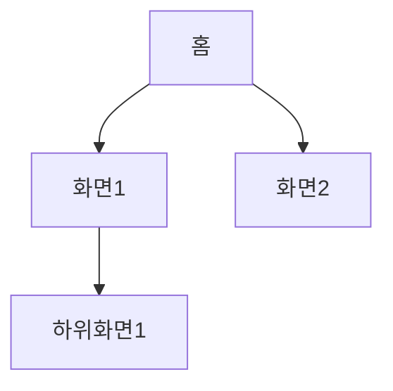
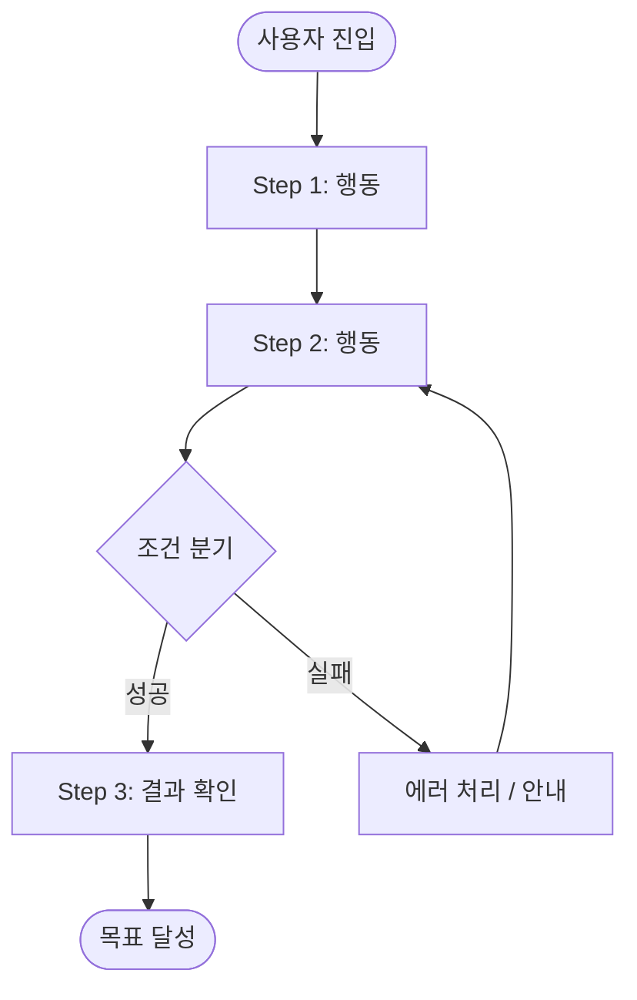
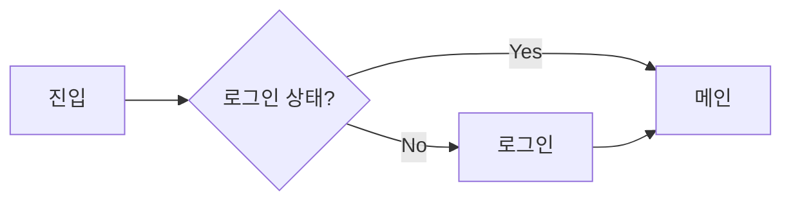

# {feature} - Information Architecture

## 1. 사이트맵

## 2. 네비게이션 구조

### 2.1 GNB (Global Navigation)
| 메뉴 | 경로 | 권한 | 비고 |
|------|------|------|------|
| | | | |

### 2.2 LNB (Local Navigation)
| 상위 메뉴 | 하위 메뉴 | 경로 |
|-----------|----------|------|
| | | |

## 3. 태스크 플로우 (Task-based User Flow)

사용자가 **핵심 목표를 달성하는 전체 여정**을 태스크 단위로 정의합니다.
와이어프레임·설계·구현 단계에서 이 플로우를 기준으로 누락 여부를 검증합니다.

### 3.1 태스크 목록

| # | 태스크 | 사용자 목표 | 시작점 | 종료 조건 | 우선순위 |
|---|--------|-----------|--------|----------|---------|
| T1 | | "~을 하고 싶다" | | 성공 시 사용자가 보는 결과 | Must/Should/Could |
| T2 | | | | | |

### 3.2 태스크 플로우 다이어그램

> 태스크별로 사용자 행동 → 시스템 반응 → 분기(성공/실패/예외)를 Mermaid로 작성합니다.

**T1: {태스크명}**

| Step | 사용자 행동 | 시스템 반응 | 화면 | 예외/엣지 케이스 |
|------|-----------|-----------|------|----------------|
| 1 | | | | |
| 2 | | | | |

### 3.3 크로스 태스크 의존성

태스크 간 선후 관계나 공유 상태가 있으면 기록합니다.

| 선행 태스크 | 후행 태스크 | 공유 데이터/상태 | 비고 |
|-----------|-----------|---------------|------|
| | | | |

## 4. 화면 흐름도 (Screen Flow)

화면 간 이동 경로를 정리합니다. 위 태스크 플로우와 대응됩니다.

## 5. 화면 목록

> 각 화면의 상세 정의(레이아웃, 컴포넌트, 인터랙션)는 설계 문서(`docs/05-design/`)의 "화면별 상세 정의"에서 통합 관리합니다.

| # | 화면 ID | 화면명 | 유형 | URL 패턴 | 설명 |
|---|---------|--------|------|----------|------|
| 1 | | | page/modal/drawer | | |
| 2 | | | | | |

## 6. 데이터 흐름 (전체)

| 화면 | 입력 데이터 | 출력 데이터 | API 호출 |
|------|------------|------------|----------|
| | | | |

## 7. 상태 관리 포인트

| 상태 | 범위 | 변경 시점 | 영향 화면 |
|------|------|----------|----------|
| | global/local | | |

---

## 변경 이력

| version | date | change |
|---------|------|--------|
| v1.0 | | 초기 작성 |

<!-- template version: v0.14.1 -->
