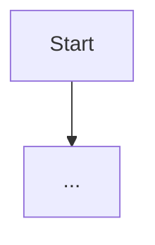

# {feature} — {Phase 이름} (합성문, v2)

> Phase: {icon} {phase} | Synthesizer (도메인 리드): **{C-Level}** | Date: {date}
> Lazy Consensus: {draft|review-window|consensus-reached|timeout}
> 입력: {이전 phase main.md 링크 또는 — 없으면 생략}

## 1. Executive Summary

| Perspective | Content |
|-------------|---------|
| **Problem** | {1~2문장} |
| **Solution** | {1~2문장} |
| **Effect** | {사용자 체감 변화} |
| **Core Value** | {핵심 가치} |

## 2. 결정 (Synthesizer 합성, Lazy Consensus)

> 모든 결정은 도메인 리드가 합성. Owner 컬럼 = 제기자 (다른 C-Level 의견 반영 시 명시).

| # | Decision | 합성자 추론 / 근거 | Owner 제기 / 합의 |
|---|----------|--------------------|--------------------|
| 1 | {결정 한 줄} | {근거} | {제기 C-Level} → {합의 C-Level 또는 timeout} |

## 3. 핵심 알고리즘 (optional)

> 알고리즘이 필요한 phase (design/do) 만. mermaid + 의사 코드.



```javascript
function example() {
  // 의사 코드
}
```

## 4. State Machine (optional)

> FSM 필요한 case 만. 상태 전이 표.

| From | Event | To | 박제 |
|------|-------|-----|------|
| ... | ... | ... | ... |

## 5. 인터페이스 계약 (optional)

> config schema / API signature / data schema.

## 6. Success Criteria

| ID | Criterion | Verification |
|----|-----------|--------------|
| SC-01 | {측정 가능한 성공 기준} | {검증 방법} |

> QA 에서 ✅ Met / ⚠️ Partial / ❌ Not Met 평가.

## 7. 위협 / 위험 (도메인 리드 영역 시 detailed)

| ID | 위협 | Mitigation |
|----|------|-----------|
| T1 | {STRIDE category} | {대응} |

## 8. 관찰 (Out-of-scope 후속)

> 자발 감지 확장 후보는 여기 기록만. 다음 phase 자동 승계 X.

- (없으면 "없음")

## 9. Do 작업 / Next Phase 매핑

| # | 작업 | 신규/수정 | 파일 | Owner sub-agent |
|---|------|----------|------|-----------------|
| 1 | {작업} | create/modify | {경로} | {sub-agent} |

> 본 표를 그대로 다음 phase 작업 시퀀스로 사용.

---

## 변경 이력

| version | date | change |
|---------|------|--------|
| v1.0 | {date} | 초기 작성 — {간단 설명} |

<!-- synthesis template version: v2.0 (model: 대화-합성, owner: cto, feature: agent-teams-orchestration) -->
